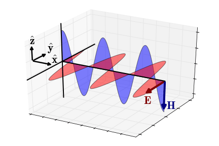

.. _harmonic_planewaves_homogeneous_impedancephase:

Wave Impedance and Phase
========================

Wave Impedance
--------------

Wave impedance defines the ratio between transverse components of the electric and magnetic fields supported by an EM planewave. For the downward propagating EM planewave shown in :numref:`planewavedown_impedance_1`, the impedance is given by:

.. figure:: images/planewavedown.png
   :align: right
   :figwidth: 50%
   :name: planewavedown_impedance_1

   Geometry of an EM planewave propagating downwards.

.. math::
	Z_{xy} = -\frac{E_x}{H_y} = \frac{\omega \mu}{k}
  :name:

where :math:`\mu` is the :ref:`magnetic permeability<magnetic_permeability_index>` and :math:`k` is the :ref:`complex wavenumber<harmonic_planewaves_homogeneous_wavenumber>`. From the previous equation, we see that the wave impedance depends on the frequency and physical properties of the medium. Thus in a homogeneous isotropic medium, a single wave impedance can be used to characterize EM waves propagating in any direction. However if the physical properties are :ref:`anisotropic<physical_properties_index>` (direction dependent), waves propagating in different directions are characterized by separate impedances.

Phase
-----

The wave impedance can be used to obtain the phase difference between the electric and magnetic fields supported by a planewave. The phase difference between the electric and magnetic fields shown in :numref:`planewavedown_impedance_1`:

.. math::
    \phi_{Z_{xy}} = \textrm{tan}^{-1} \Bigg ( \frac{\textrm{Im}[Z_{xy}]}{\textrm{Re}[Z_{xy}]} \Bigg )

where :math:`0 \leq \phi_{xy} \leq \pi/4`. According the above expression, the electric field lags the magnetic field.

Approximations
--------------

   Electric and magnetic fields of an EM wave propagating in the x-direction (quasi-static regime).

Quasi-Static Approximation
^^^^^^^^^^^^^^^^^^^^^^^^^^

In the quasi-static regime (:math:`\epsilon \omega \ll \sigma`), the wavenumber becomes :math:`\sqrt{-i\omega\mu\sigma}` and the impedance simplifies to:

.. math::
    Z_{xy} = \frac{\omega \mu}{\sqrt{-i\omega\mu\sigma}}
    = \sqrt{\frac{i \omega \mu}{\sigma}}

The phase of the impedance is given by:

.. math::
    \phi_{Z_{xy}} = \textrm{tan}^{-1} \Bigg ( \frac{\textrm{Im}[Z_{xy}]}{\textrm{Re}[Z_{xy}]} \Bigg ) = \frac{\pi}{4}

In this case, the electric field lags the magnetic field by :math:`\pi/4` radians.

.. figure:: images/EHwave.gif
   :align: right
   :figwidth: 50%
   :name: waves_homogeneous_freq_EHwave

   Electric and magnetic fields of an EM wave propagating in the x-direction (wave regime).

Wave Regime Approximation
^^^^^^^^^^^^^^^^^^^^^^^^^

In the wave regime (:math:`\epsilon \omega \gg \sigma`), the wavenumber simplifies to :math:`\omega \sqrt{\mu\epsilon}` and the impedance simplifies to:

.. math::
    Z_{xy} = \frac{\omega \mu}{\omega \sqrt{\mu\epsilon}}
    = \sqrt{\frac{\mu}{\epsilon}}

where the phase is equal to:

.. math::
    \phi_{Z_{xy}} = \textrm{tan}^{-1} \Bigg ( \frac{\textrm{Im}[Z_{xy}]}{\textrm{Re}[Z_{xy}]} \Bigg ) = 0

In this case, the electric and magnetic fields are in phase with one another.
