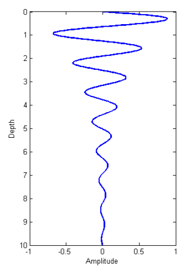

.. _harmonic_planewaves_homogeneous_wavelength:

Wavelength
==========

        A plane harmonic wave as it propagates into the earth.

Wavelength defines the physical distance a wave travels during a single oscillation. As it turns out, the wavelength for EM waves depends on the real component of the wavenumber (:math:`\alpha`) and is given by:

.. math::
	\lambda = \frac{2\pi}{\alpha} = \frac{2\pi}{\omega} \left ( \frac{\mu \epsilon}{2} \left [ \left ( 1 + \frac{\sigma^2}{\epsilon^2 \omega^2} \right )^{1/2} + 1 \right ] \right )^{-1/2}

As we can see from the previous equation, higher frequencies correspond waves with to shorter wavelengths.

EM Wavelengths for Various Materials
------------------------------------

The table below shows wavelengths for EM waves travelling in certain rocks at various frequencies. This is meant to serve as a general guide, as rock types are classified by a range of physical properties values which can lead to order of magnitude differences in wavelength.

+-----------------+-------------------+-------------+------------------+---------------------+----------------------+----------------------+----------------------+
|Type             |:math:`\sigma`     |:math:`\mu_r`|:math:`\epsilon_r`|:math:`\lambda` (1Hz)|:math:`\lambda` (1kHz)|:math:`\lambda` (1MHz)|:math:`\lambda` (1GHz)|
+=================+===================+=============+==================+=====================+======================+======================+======================+
|Air              | 0 S/m             | 1           | 1                |    299,800 km       |   299,800 m          |  299.8 m             |  0.2998 m            |
+-----------------+-------------------+-------------+------------------+---------------------+----------------------+----------------------+----------------------+
|Sea Water        | 3.3 S/m           | 1           | 80               | 1.7 km              |  55 m                | 1.7 m                | 0.032 m              |
+-----------------+-------------------+-------------+------------------+---------------------+----------------------+----------------------+----------------------+
|Igneous          |:math:`10^{-4}` S/m| 1           | 5                | 316 km              | 10,000 m             | 132 m                | 0.13 m               |
+-----------------+-------------------+-------------+------------------+---------------------+----------------------+----------------------+----------------------+
|Sedimentary (dry)|:math:`10^{-3}` S/m| 1           | 4                | 100 km              | 3,200 m              | 90 m                 | 0.15 m               |
+-----------------+-------------------+-------------+------------------+---------------------+----------------------+----------------------+----------------------+
|Sedimentary (wet)|:math:`10^{-2}` S/m| 1           | 25               |  32 km              | 1,000 m              | 30 m                 | 0.06 m               |
+-----------------+-------------------+-------------+------------------+---------------------+----------------------+----------------------+----------------------+
|Sulphide Skarn   |:math:`10^{2}` S/m | 1           | 5                | 0.32 km             | 10 m                 | 0.32 m               | 0.01 m               |
+-----------------+-------------------+-------------+------------------+---------------------+----------------------+----------------------+----------------------+
|Magnetite Skarn  |:math:`10^{2}` S/m | 2           | 5                | 0.22 km             | 7 m                  | 0.22 m               | 0.007 m              |
+-----------------+-------------------+-------------+------------------+---------------------+----------------------+----------------------+----------------------+

Approximations
--------------

Quasi-Static Approximation
^^^^^^^^^^^^^^^^^^^^^^^^^^

.. _harmonic_planewaves_homogeneous_wavelength_formula:

In quasi-static regime (:math:`\epsilon\omega \ll \sigma`), the wavelength simplifies to:

.. math:: \lambda = 2\pi\sqrt{ \frac{2}{\omega \mu \sigma} } = 2\pi\delta

Wave Regime Approximation
^^^^^^^^^^^^^^^^^^^^^^^^^

In the wave regime ( :math:`\epsilon \omega \gg \sigma` ), the wavelength simplifies to:

.. math:: \lambda = \frac{1}{\omega \sqrt{\mu \epsilon}}

