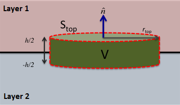
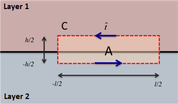

.. _maxwell1_fundamentals_interface_conditions_derivation:

Derivation of Interface Conditions
==================================

Here, we derive interface conditions for the electric field and the electric displacement. 

Components Normal to the Interface
----------------------------------

Here, we consider components of the fields and fluxes which are normal to the interface. For this, we use Gauss's law for electric fields:

.. math::
  \oint_S \mathbf{d} \cdot d \mathbf{a} = Q_f
  :label: GaussEint

and Gauss's law for magnetic fields:

.. math::
  \oint_S \mathbf{b} \cdot d \mathbf{a} = 0
  :label: GaussMint

where :math:`Q_f` is the total enclosed free charge and :math:`d\mathbf{a}` is an infinitessimal unit of surface area with vector direction perpendicula to the surface.

Electric Displacement
^^^^^^^^^^^^^^^^^^^^^

    Gaussian pillbox. 

Although it may seem counter-intuitive, we will first derive the interface condition for normal components of the electric displacement. Consider an extremely small Gaussian pillbox of height :math:`h` and cross-sectional area :math:`S_{\text{top}} = \pi r_{\text{top}}^2` (:numref:`pillbox`). By applying Eq. :eq:`pillbox` to our Gaussian pillbox, we obtain:

.. math::
  \int_0^{2\pi}\int_0^{r_{\text{top}}} d_1^\perp ~drd\theta - \int_0^{2\pi}\int_0^{r_{\text{top}}} d_2^\perp ~ dr d \theta + \int\limits_{-h/2}^{h/2}\int\limits_0^{2\pi} d^\parallel ~ d \theta dz = Q_f
  :name:

where :math:`d_{1}^\perp` and :math:`d_{2}^\perp` are the components of the electric
displacement normal to the top and bottom of the pillbox, respectively, and
:math:`d^\parallel` is the radial component (parallel to the interface). Since the pillbox is extremely small, we can assume that :math:`d_{1}^\perp` and :math:`d_{2}^\perp` are constant over the top and bottom of the pillbox, respectively. Under this assumption, the previous expression can be simplified to:

.. math::
  d_{1}^\perp S_{\text{top}} - d_{2}^\perp S_{\text{top}} + \int\limits_{-h/2}^{h/2}\int\limits_0^{2\pi} d^\parallel ~ d \theta dz = Q_f.
  :name: eq_d_perp_pillbox

If we take the limit as :math:`h\rightarrow 0` while :math:`S_{\text{top}}` remains
fixed, the integral term on the left hand side of Eq. :eq:`eq_d_perp_pillbox` vanishes. Additionally, as the vertical dimension of the pillbox goes to zero, the total enclosed free charge :math:`Q_f` becomes a free surface charge density :math:`\tau_f` times the area of the top of the pillbox; assuming the distribution of surface charges is constant. This results in the following expression:

.. math::
  d_{1}^\perp S_{\text{top}} - d_{2}^\perp S_{\text{top}} = \tau_f S_{\text{top}}
  :name:

Dividing both sides by the top area of the pillbox, the interface conditions for normal components of the electric displacement are given by:

.. math::
  d_{1}^\perp - d_{2}^\perp = \tau_f
  :name: interface_d_n

Thus, the normal component the electric displacement is discontinuous at the interface.

Electric Field
^^^^^^^^^^^^^^

To obtain the interface condition for normal components of the electric field, we can use the following constitutive relationship:

.. math::
  \mathbf{d} = \varepsilon \mathbf{e}
  :name: DepsE

According to Eqs. :eq:`interface_d_n` and :eq:`DepsE`, the normal component of the electric field has the following interface condition:

.. math::
  \varepsilon_1 e_{1}^\perp -\varepsilon_2 e_{2}^\perp = \tau_f
  :name:

Magnetic Flux Density
^^^^^^^^^^^^^^^^^^^^^

The interface condition on the normal component of the magnetic flux is derived from the integral form of Gauss's law for the magnetic flux (Eq. :eq:`GaussMint`). For this, we may follow the exact same argument used to obtain interface conditions for the electric displacement. However, since the right hand side of Eq. :eq:`GaussMint` is always zero, the interface
condition for the normal component of the magnetic flux density is given by:

.. math::
  b_{1}^\perp - b_{2}^\perp = 0
  :name: interface_b_n
  
Therefore, normal components of the magnetic flux density are continuous across interfaces.

Magnetic Field
^^^^^^^^^^^^^^

To obtain the interface condition for normal components of the magnetic field, we can use the following constitutive relationship:

.. math::
  \mathbf{b} = \mu \mathbf{h}
  :name: BmuH

According to Eqs. :eq:`interface_b_n` and :eq:`BmuH`, the normal component of the magnetic field has the following interface condition:

.. math::
  \mu_1 h_{1}^\perp -\mu_2 h_{2}^\perp = 0
  :name:

Components Tangential to the Interface
--------------------------------------

    Gaussian rectangle. 

.. [#f1]_ comment out footnote to patch pdf

The interface condition on the tangential component of the electric field,
denoted as :math:`e_{t}`, is derived from :ref:`Faraday's law<faraday>` in
integral form :eq:`faradays_law_int_time`. Consider Faraday's law applied to
the extremely small rectangle of height :math:`h`, width :math:`l` and area
:math:`A` shown in :numref:`rectangle`, with surface normal parallel to the
interface. As with the Gaussian pillbox in the electric displacement
derivation, we assume the rectangle to be small enough that the tangential
electric field is constant on both horizontal edges. This allows us to
evaluate the components of the contour integral on the top and bottom edges of
the rectangle, giving

.. math::
  \oint_C \mathbf{e}\cdot \mathbf {d}\mathbf{l} = e_{1t}l - e_{2t}l + \int_{-h/2}^{h/2} e_n(x=-l/2) ~dz - \int_{-h/2}^{h/2} e_n(x=+l/2) ~dz = -\int_A \frac{\partial \mathbf{b}}{\partial t}\cdot \hat{\mathbf{n}}\,da,

where :math:`e_{1t}` and :math:`e_{2t}` are the tangential components of the
electric field on the top and bottom edges of the Gaussian rectangle,
respectively, and :math:`e_n` is the normal component of :math:`\mathbf{e}`.

In the limit as :math:`h` approaches 0 while holding :math:`l` constant, the
remaining integral terms vanish, leaving

.. math::
   e_{1t}l - e_{2t}l = 0.

Dividing by :math:`l` the previous expression yields the interface condition

.. math::
  e_{1t} - e_{2t} = 0.

That is, the tangential component of the electric field is continuous at the
interface.

Tangential Component of the Magnetic Field
------------------------------------------

The interface condition on the tangential component of the magnetic field,
denoted as :math:`h_t`, is derived from the integral form of the :ref:`Ampere-
Maxwell equation<ampere_maxwell>` :eq:`AmpMaxInt` applied to the same Gaussian
rectangle as for the tangential electric field (:numref:`rectangle`). Using
the same reasoning as for the tangential electric field (see previous
section), we have

.. math::
  \oint_C \mathbf{h}\cdot \mathbf{d}\mathbf{l} = h_{1t}l - h_{2t}l = I_{\text{enclosed}}.

In the limit, when the height of the Gaussian rectangle approaches zero, the
current enclosed by the rectangle, :math:`I_{\text{enclosed}}`, can be
represented as a surface current density on the interface
:math:`j_{\text{surf}}` times the width of the rectangle :math:`l`. This gives

.. math::
  h_{1t}l - h_{2t}l = j_{\text{surf}} l.

The above expression yields the interface condition on the tangential
component of the magnetic field

.. math::
  h_{1t}- h_{2t} = j_{\text{surf}}.
  
That is, the tangential component of the magnetic field is discontinuous at
the interface.

.. .. rubric:: Footnotes
.. .. [#f1] Figures were created by `Luz`_ and are licenced under `CC BY 2.0`_

.. note::
  Figures were created by `Luz`_ and are licenced under `CC BY 2.0`_

.. _Luz: https://github.com/lacmajedrez

.. _CC BY 2.0: https://creativecommons.org/licenses/by/2.0/

