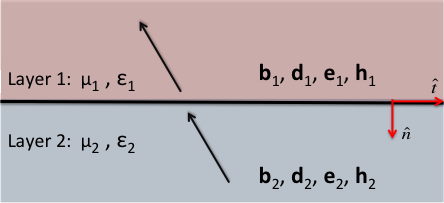

.. _maxwell1_fundamentals_interface_conditions_index:

Interface Conditions
====================

.. purpose::

    Here, we define the interface conditions for fields :math:`\mathbf{e}` and :math:`\mathbf{h}` as well as for fluxes :math:`\mathbf{j}`, :math:`\mathbf{d}` and :math:`\mathbf{b}` according to Griffiths (:cite:`griffiths1999`). As we will show, the interface conditions in each case can be derived directly from Maxwell's equations in :ref:`integral form<integral_equations_time>`.

    Fields and fluxes across a horizontal physical property interface. 

Electromagnetic fields and fluxes are discontinuous across physical property interfaces. Before solving Maxwell's equations for general cases, we must have appropriate interface conditions for :math:`\mathbf{e}`, :math:`\mathbf{h}`, :math:`\mathbf{j}`, :math:`\mathbf{d}` and :math:`\mathbf{b}`. Here, we show the most general representations of interface conditions for electromagnetic fields and fluxes. These are tabulated below and are valid in both the time domain and the frequency domain. The physical properties in each layer are ....

+---------------------------------+------------------------------------------------------------+---------------------------------------------------------------+
|Property                         | Normal Component                                           | Tangential Component                                          |
+=================================+============================================================+===============================================================+
|:math:`\mathbf{e}`               |:math:`\varepsilon_1e_1^\perp-\varepsilon_2e_2^\perp=\tau_f`|:math:`e_1^\parallel-e_2^\parallel=0`                          |
+---------------------------------+------------------------------------------------------------+---------------------------------------------------------------+
|:math:`\mathbf{d}`               | :math:`d_1^\perp-d_2^\perp=\tau_f`                         |:math:`\varepsilon_2d_1^\parallel-\varepsilon_1d_2^\parallel=0`|
+---------------------------------+------------------------------------------------------------+---------------------------------------------------------------+
|:math:`\mathbf{j}` (steady-state)| :math:`j_1^\perp=j_2^\perp`                                |:math:`\rho_1j_1^\parallel-\rho_2 j_2^\parallel=0`             |
+---------------------------------+------------------------------------------------------------+---------------------------------------------------------------+
|:math:`\mathbf{h}`               |:math:`\mu_1h_1^\perp-\mu_2h_2^\perp=0`                     |:math:`h_1^\parallel-h_2^\parallel=K_f`                        |
+---------------------------------+------------------------------------------------------------+---------------------------------------------------------------+
|:math:`\mathbf{b}`               | :math:`b_1^\perp-b_2^\perp=0`                              |:math:`\mu_1^{-1} b_1^\perp- \mu_2^{-1}b_2^\perp=K_f`          |
+---------------------------------+------------------------------------------------------------+---------------------------------------------------------------+

	- **Normal Component** (:math:`\perp`): Components of fields or fluxes perpendicular to the interface.
	- **Tangential Component** (:math:`\parallel`): Components of fields or fluxes parallel to the interface.
	- **Free Surface Charge Density** (:math:`\tau_f`): The free surface charge per unit area on the interface. Occurs due to discontinuities in the normal component of the electric displacement across the interface.
	- **Free Surface Current Density** (:math:`K_f`): The free surface current per unit area on the interface. Occurs due to discontinuities in the tangential component of the magnetic field across the interface.

**Contents**

.. toctree::
    :maxdepth: 2

    derivation
    

