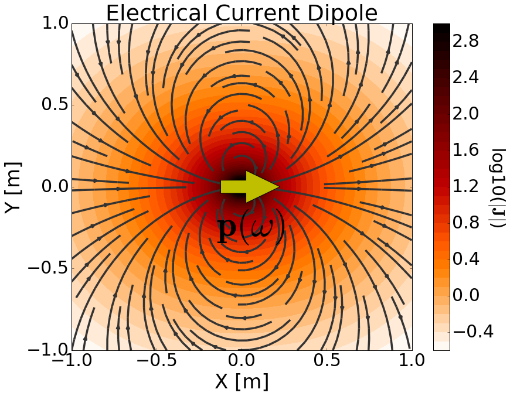
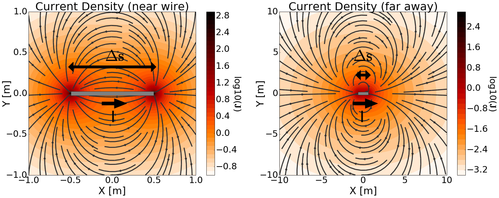

.. _frequency_domain_electric_dipole_index:

Harmonic Electrical Current Dipole
==================================

.. Purpose::

    Here, we provide a physical description of the harmonic electrical current dipole.
    This is used to develop a mathematical expression which can be used to replace the electrical source term in Maxwell's equations. 

        	Physical representation of the electrical current dipole source.

The harmonic electrical current dipole source can be thought of as an infinitesimally short length of wire which carries a harmonic current.
This source current is responsible for generating a current density in the surrounding region; secondary electric and magnetic fields are discussed later.
The strength of the source is defined by its dipole moment (:math:`\mathbf{p}`).
In many cases, this type of source is referred to as the 'electric dipole source'.
However a true electric dipole represents the polarization of electrical charges of opposite sign.

**Primary Current Density from a Finite Wire**

In order to develop a proper definition for the electrical current dipole, let us first consider the source current from a wire of finite length.
Assume the wire has length :math:`\Delta s` and carries a current :math:`I` which flows in the :math:`\hat x` direction along the wire.
The source current density :math:`\mathbf{J_e (r)}` for the wire segment is given by:

.. math::
	\mathbf{J_e (r)} = \hat x I \Delta s \Bigg [ \frac{\textrm{u}\big (x + \frac{\Delta s}{2} \big ) - \textrm{u} \big ( x - \frac{\Delta s}{2} \big )}{\Delta s} \Bigg ] \delta (y) \delta (z)

where :math:`u(x)` is the unit step function and :math:`\delta (x)` is the Dirac delta function.
In Maxwell's equations, :math:`\mathbf{J_e (r)}` defines the electrical source term.

As we can see from :numref:`FiniteWire`, the source generates a current density (:math:`\mathbf{J}`) in the surrounding region.
Notice how the current flows out one end of the wire and into the other :numref:`FiniteWire` (left).
When the wire segment is much smaller than the scale of observation, then it appears as though the current density converges at a single point; which we see in :numref:`FiniteWire` (right).
The purpose of the electrical current dipole is to approximate a finite wire segment when observation scales are much larger than the wire's length. 
The electrical current dipole accomplishes this by defining a source term which exists at a single point in space.

        	Electrical current density due to a finite current-carrying wire. Near the wire (left). Far away from the wire (right).

**Defining the Electrical Current Dipole**

The electrical current dipole source is defined by letting :math:`\Delta s \rightarrow ds` in the previous equation; making it a wire of infinitessimal length.
As a result, the source current density for a harmonic electrical current dipole in the :math:`\hat x` direction is given by:

        	Primary electrical current density due to an electrical current dipole.

.. math::
	\mathbf{J_e(r)} = \hat x I ds \delta (x) \delta (y) \delta (z)

By examining :numref:`CurrentDipole`, we see that the current density in the surrounding region converges to a single point; just like in :numref:`FiniteWire` (right).
However like a wire segment, current still flows outwards from one side of the source and into the other.

If we consider an electrical current dipole oriented in an arbitrary direction, the source current becomes a vector (:math:`\mathbf{I}`).
Thus, the source current density for an electrical current dipole is given by:

.. math::
	\mathbf{J_e (r)} = \mathbf{I}ds \, \delta (x) \delta (y) \delta (z) 

The strength of the electrical current dipole source is defined by its **dipole moment** (:math:`p`).
As we can see from the previous equation, the source term depends on the product :math:`\mathbf{I} ds`.
Thus the dipole moment for an electrical current dipole source is given by:

.. math::
	\mathbf{p} = \mathbf{I}ds
	

and

.. math::
	\mathbf{J_e (r)} = \mathbf{p} \, \delta (x) \delta (y) \delta (z) 

**Contents**

.. toctree::
    :maxdepth: 2

    analytic_solution
    asymptotics
    fields

