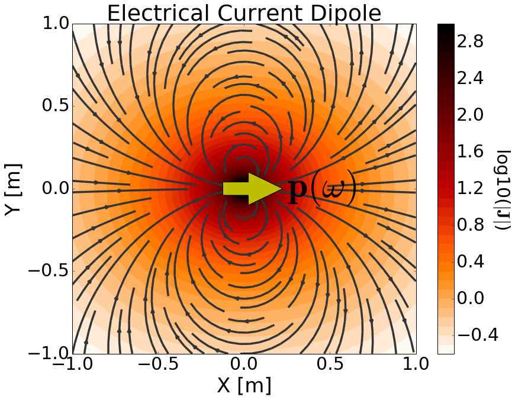

.. _frequency_domain_electric_dipole_index:

Harmonic Electrical Current Dipole
==================================

.. Purpose::

    Here, we provide a physical description of the harmonic electrical current dipole.
    This is used to develop a mathematical expression which can be used to replace the electrical source term in Maxwell's equations. 

**General Description**

The harmonic electrical current dipole can be thought of as an infinitesimally short length of wire which carries a harmonic current.
The strength of the source is therefore defined by a harmonic dipole moment :math:`\mathbf{p}(\omega)`.
For a harmonic current dipole defined by length :math:`ds` and harmonic current :math:`\mathbf{I} (\omega) = \mathbf{I}e^{i\omega t}`, the dipole moment is given by:

        	Physical representation of the harmonic electrical current dipole source where :math:`\mathbf{p}` = 1 Am.

.. math::
	\mathbf{p}(\omega) = \mathbf{p} \, e^{i\omega t} = \mathbf{I} ds \, e^{i\omega t}

where :math:`\mathbf{p} = \mathbf{I}ds` is the vector amplitude of the dipole moment.
When formulating Maxwell's equations in the frequency domain, :math:`e^{i\omega t}` is generally suppressed.
As a result, the source term for the harmonic electrical current dipole is given by:

.. math::
	\mathbf{J_e (r)} = \mathbf{I}ds \, \delta (x) \delta (y) \delta (z)

where :math:`\delta (x)` is the Dirac delta function.
By including the source term, Maxwell's equations in the frequency domain are given by:

.. math::
	\begin{split}
	&\nabla \times \mathbf{E} + i \omega \mu \mathbf{H} = 0  \\
	\nabla \times \mathbf{H} &- \sigma \mathbf{E} = \mathbf{I}ds \, \delta(x) \delta(y) \delta(z)
	\end{split}

The source current is responsible for generating a primary current density (and electric field) in the surrounding region (:numref:`ElecDipole`).
However, the :ref:`Ampere-Maxwell equation<ampere_maxwell_differential_frequency>` states that time-varying electric fields and the movement of free current generates magnetic fields.
In addition, the harmonic nature of the magnetic fields should produce secondary electric fields according to :ref:`Faraday's law<faraday_differential_frequency>`.
In the following section, we solve Maxwell's equations for a harmonic electrical current dipole source and provide analytic expressions for the electric and magnetic fields within a homogeneous medium.

**Contents**

.. toctree::
    :maxdepth: 2

    analytic_solution
    asymptotics
    fields

