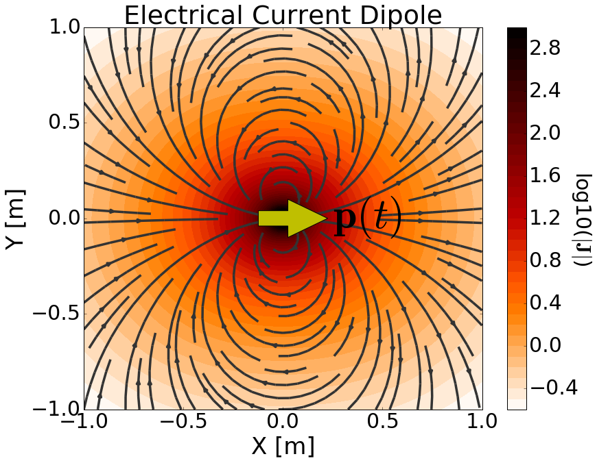

.. _time_domain_electric_dipole_index:

Transient Electric Dipole
=========================

.. Purpose::

    Here, we provide a physical description of the time-dependent electrical current dipole.
    This is used to develop a mathematical expression which can be used to replace the electrical source term in Maxwell's equations. 
    We then consider a transient electrical current dipole; which represents a more commonly used geophysical source.

**General Definition**

        	Physical representation of the time-dependent electrical current dipole source.

The time-dependent electrical current dipole can be thought of as an infinitesimally short length of wire which carries a time-dependent current.
The strength of the source is therefore defined by a time-dependent dipole moment :math:`\mathbf{p}(t)`.
For a time-dependent current dipole defined by length :math:`ds` and current vector :math:`\mathbf{I} (t)`, the dipole moment is given by:

.. math::
	\mathbf{p}(t) = \mathbf{I}(t) ds

As a result, the source term for the time-depedent electrical current dipole is given by:

.. math::
	\mathbf{j_e^s} = \mathbf{I}(t) ds \, \delta (x) \delta (y) \delta (z)

where :math:`\delta (x)` is the Dirac delta function.
By including the source term, Maxwell's equations in the time domain are given by:

.. math::
	\begin{split}
	&\nabla \times \mathbf{e} + \dfrac{\partial \big [ \mu \mathbf{h} \big ]}{\partial t} = 0  \\
	\nabla \times \mathbf{h} - \sigma \mathbf{e} & - \dfrac{\partial \big [ \varepsilon \mathbf{e} \big ]}{\partial t} = \mathbf{I}(t)ds \, \delta(x) \delta(y) \delta(z)
	\end{split}

The source current is responsible for generating a primary current density (and thus an electric field) in the surrounding region (:numref:`ElecDipoleTime`).
The :ref:`Ampere-Maxwell equation<ampere_maxwell_differential_time>` states that time-varying electric fields and the movement of free current generates magnetic fields.
In addition, the time-dependent nature of these magnetic fields should produce secondary electric fields according to :ref:`Faraday's law<faraday_differential_time>`.

**Transient Electrical Current Dipole**

The transient response represents the response of a system to step-off excitation.
For a transient electrical current dipole with infinitessimal length :math:`ds`, the electromagnetic response results from a step-off current of the form :math:`\mathbf{I} (t) = \mathbf{I} u(-t)`.
Thus the dipole moment is given by:

.. math::
	\mathbf{p}(t) = \mathbf{I}u(-t) ds

where :math:`u(t)` is the unit step function.
The source term for the corresponding electrical current dipole is given by:

.. math::
	\mathbf{j_e (r)} = \mathbf{I}u(-t) ds \, \delta (x) \delta (y) \delta (z)

where :math:`\delta (x)` is the Dirac delta function.
By including the source term, Maxwell's equations in the time domain are given by:

.. math::
	\begin{split}
	&\nabla \times \mathbf{e} + \dfrac{\partial \big [ \mu \mathbf{h} \big ]}{\partial t} = 0  \\
	\nabla \times \mathbf{h} - \sigma \mathbf{e} & - \dfrac{\partial \big [ \varepsilon \mathbf{e} \big ]}{\partial t} = \mathbf{I}u(-t)ds \, \delta(x) \delta(y) \delta(z)
	\end{split}

It is possible to solve this system to obtain analytic solutions for the transient electric and magnetic fields.
However, we will apply a different approach using the inverse Laplace transform.

**Contents**

In the following section, we solve Maxwell's equations for a transient electrical current dipole source and provide analytic expressions for the electric and magnetic fields within a homogeneous medium.
Asymptotic expressions are then provided for several cases.
Numerical modeling tools are made available for investigating the dependency of the electric and magnetic fields on various parameters.

.. toctree::
    :maxdepth: 2

    analytic_solution
    asymptotics
    fields

