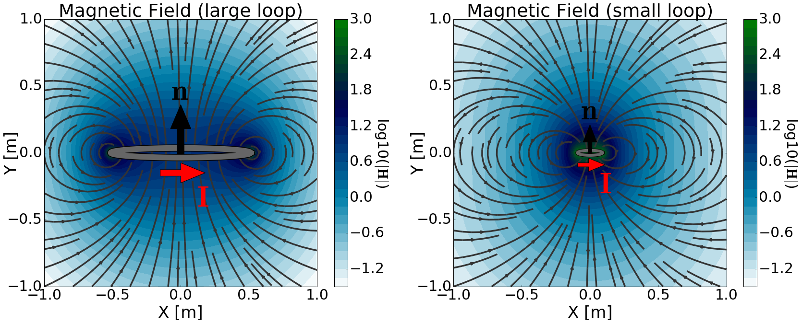

.. _definition_magnetic_dipole_index:

Defining the Magnetic Dipole
============================

.. Purpose::

    Here, we provide a physical description of the magnetic dipole.
    This is used to develop a mathematical expression which can be used to replace the magnetic source term in Maxwell's equations.

**General Description**

.. figure:: images/H_source_magnetic_dipole.png
		:align: right
		:figwidth: 50%
		:name: MagDipole
		
		Physical representation of the magnetic dipole source where :math:`\mathbf{m}` = 1 Am :math:`\!^2`.

There are two commonly used models for the magnetic dipole.
The first model describes the magnetic dipole as an infinitessimally small volume of magnetized material (i.e. a very small bar magnet).
The second model describes the magnetic dipole using an infinitessimally small current loop.
In both cases, the strength of the magnetic dipole source is defined by a dipole moment (:math:`\mathbf{m}`).
This leads to a magnetic source term (:math:`\mathbf{J_m^s}`) of the form:

.. math::
	\mathbf{J_m^s} = - i\omega \mu \mathbf{m} \delta (x) \delta (y) \delta (z)
	:name: Jm_def

where :math:`\delta (x)` is the Dirac delta function.
The magnetic dipole source is responsible for generating a primary magnetic field in the surrounding region; secondary electric and magnetic fields are discussed later.
This is illustrated in :numref:`MagDipole`.

**Magnetized Volume Model**

This model derives the magnetic dipole source by considering a volume of uniformly magnetized material; in other words, a bar magnet.
Let us assume the volume has uniform magnetization (:math:`\mathbf{M}`) and has dimensions :math:`\Delta x`, :math:`\Delta y` and :math:`\Delta z`; giving it a volume of :math:`\Delta V`.
The resulting magnetic source term (:math:`\mathbf{J_m^s}`) is given by:

.. math::
	\mathbf{J_m^s} = - i\omega \mu \mathbf{M (r)}
	:name: Jm_M
	

where

.. math::
	\begin{split}
	\mathbf{M (r)}\! =\! \mathbf{M} \Delta V & \!\Bigg [ \! \frac{u \big ( x \! +\!\frac{\Delta x}{2} \big ) \! - \! u \big ( x \! -\!\frac{\Delta x}{2} \big )}{\Delta x} \! \Bigg ] ... \\ 
	& \;\;\;\;\;\;\;\;\;\;\;\;\;\;\;\;\;\;\;\;\;\; \! \Bigg [ \! \frac{u \big ( y \! +\!\frac{\Delta y}{2} \big ) \! - \! u \big ( y \! -\!\frac{\Delta y}{2} \big )}{\Delta y} \! \Bigg ] \! 
	\! \Bigg [ \! \frac{u \big ( z \! +\!\frac{\Delta z}{2} \big ) \! - \! u \big ( z \! -\!\frac{\Delta z}{2} \big )}{\Delta z} \! \Bigg ]
	\end{split}
	:name: M_def

and :math:`u(x)` is the unit step function.
Recall that :math:`\mathbf{J_m^s}` defines a :ref:`magnetic current density <ampere_maxwell_differential_frequency>` and has units V/m :math:`\!^2`.
Thus :math:`\mathbf{J_m^s}` can be used to replace the magnetic source term in Maxwell's equations for a uniformly magnetized block.

In :numref:`BarMagnet`, we consider a uniformly magnetized volume where :math:`\mathbf{M} = M\hat y`.
As we can see, the magnetization contained within the volume generates a primary magnetic field in the surrounding region.
Notice how the field lines seem to begin at the north end of the magnetized volume and terminate at the south (:numref:`BarMagnet` left).
However, when the volume is much smaller than the scale of observation (:math:`\Delta x, \Delta y, \Delta z \ll r`), then it appears as though the magnetic field lines converge at a single point; see :numref:`BarMagnet` (right).

.. figure:: images/H_source_bar_magnet.png
	:align: center
	:name: BarMagnet
	:figwidth: 100%

        Magnetic field due to a uniformly magnetized volume. Large volume (left). Small volume (right). For both volumes, the magnetization was adjusted such that :math:`M \Delta V` = 1 Am :math:`\!^2`.

Magnetic dipoles can be used to approximate fields due to very small magnetized volumes when the scale of observation is sufficiently large.
This accomplished by defining a source term which exists at a single point in space.
From the previous expression, the magnetic dipole source is obtained by letting :math:`\Delta x , \, \Delta y , \, \Delta z \rightarrow dx, \, dy , \, dz` ; in other words by letting :math:`\Delta V \rightarrow dV`.
Thus the source term for a magnetic dipole is given by:

.. math::
	\mathbf{J_m^s} = - i \omega \mu \mathbf{M} dV \delta (x) \delta (y) \delta (z)
	:name: Jm_dip_bar
	

The strength of the magnetic dipole source is defined by its dipole moment (:math:`\mathbf{m}`).
As we can see from the previous expression, the source term depends on the product :math:`\mathbf{M} dV`.
Thus the dipole moment which defines the magnetic dipole source is given by:

.. math::
	\mathbf{m} = \mathbf{M} dV
	:name: dip_moment_def

From our definition of the magnetic dipole, :math:`\mathbf{m}` has units Am :math:`\!^2`.
Each Dirac delta function carries units m :math:`\!^{-1}`, :math:`\omega` has units s :math:`\!^{-1}` and :math:`\mu` has units H/m.
Where 1 H = 1 V :math:`\!\cdot\!` s/A, the magnetic source term (:math:`\mathbf{J_m}`) has units V/m :math:`\!^2`.

For a magnetized rectangular block (:numref:`BarMagnet` left), the magnetic field outside the source region can be calculated according to Sharma (1966); a cleaner formulation can be found in Varga.
By taking the limit as :math:`\Delta x , \, \Delta y , \, \Delta z \rightarrow dx, \, dy , \, dz`, the magnetic field generated by a magnetized rectangular block reduces to (:numref:`BarMagnet` right):

.. math::
	\mathbf{H_{dip}(r)} = \frac{1}{4\pi} \Bigg [ \frac{3 \mathbf{r (m \cdot r)} }{r^5} - \frac{\mathbf{m}}{r^3} \Bigg ]
	:name: dip_field_bar

**Current Loop Model**

Magnetic fields are generated by the movement of electrical charges (i.e. electric current).
Because of this, a magnetized volume in itself does not represent a physical source.
Here, we will demonstrate how the magnetic dipole moment can be represented by an infinitessimally small loop of current.

First, let us consider a large circular loop of current with radius  :math:`a` and current :math:`I` (:numref:`CurrentLoop` left).
To obtain the primary magnetic field from the loop, we can use the :ref:`Biot-Savart law<biot_savart>`:

.. math::
	\mathbf{H (r)} = \frac{1}{4\pi} \int_C \frac{I \, d\mathbf{l} \times \mathbf{\hat r}}{r^2}
	:name: Biot_Savart

The analytic solution for the Biot-Savart law in this case is rather complicated and contains several elliptic integral functions; for solution see here (link).
If the radius of the loop is much smaller than the scale of observation (:math:`a \ll r`), then the primary magnetic field due to the loop can be simplified to:

.. math::
	\mathbf{H(r)} = \frac{1}{4\pi} \Bigg [ \frac{3 \mathbf{r} (\pi a^2 I \hat n \cdot \mathbf{r)} }{r^5} - \frac{\mathbf{\pi a^2 I \hat n}}{r^3} \Bigg ]
	:name: dip_field_loop

where :math:`\hat n` is the unit vector normal to the area within the loop.
The primary magnetic field for a small loop is shown in :numref:`CurrentLoop` (right).

        	Magnetic field due to a loop of current. Large current loop (left). Small current loop (right). For both loops, the current is adjust such that :math:`IS` = 1 Am :math:`\!^2`.

Notice how the primary field for a small loop is effectively identical to that of a magnetic dipole source.
Additionally, the strength of the field depends on the product of loop's current and its area (:math:`S = \pi a^2` ).
Therefore, if we define the dipole moment of the loop as:

.. math::
	\mathbf{m} = I \mathbf{S}
	:name: dip_moment_loop

where :math:`\mathbf{S} = \pi a^2 I \hat n`, then the primary magnetic field due to a small current loop is given by:

.. math::
	\mathbf{H_{dip}(r)} = \frac{1}{4\pi} \Bigg [ \frac{3 \mathbf{r (m \cdot r)} }{r^5} - \frac{\mathbf{m}}{r^3} \Bigg ]
	:name: dip_field_loop2

The previous expression tells us that if the scale of observation is significantly larger than the radius of the loop, then the loop can be represented by a magnetic dipole source.
It must also follow that the loop can be represented by a corresponding magnetic dipole source term (:math:`\mathbf{J_m^s}`) equal to:

.. math::
	\mathbf{J_m^s} = - i \omega \mu I \mathbf{S} \delta (x) \delta (y) \delta (z)
	:name: Jm_def_loop

Here, we have chosen a very simple treatment of the current loop model for a magnetic dipole source.
A more thorough derivation of the dipole moment from Maxwell's equations can be found in Griffiths (link).

