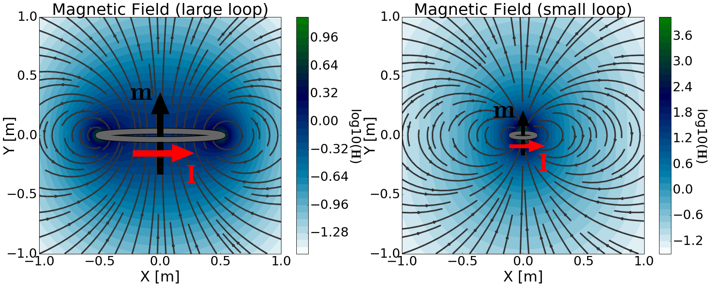

.. _frequency_domain_magnetic_dipole_index:

Harmonic Magnetic Dipole
========================

.. Purpose::

    Here, we provide a physical description of the harmonic magnetic dipole.
    This is used to develop a mathematical expression which can be used to replace the magnetic source term in Maxwell's equations.

.. figure:: images/H_source_magnetic_dipole.png
		:align: right
		:figwidth: 50%
		:name: MagDipole
		
		Physical representation of the magnetic dipole source.

There are two commonly used physical descriptions of the magnetic dipole.
The first describes the magnetic dipole as an infinitessimally small volume of magnetized material; or a very small bar magnet.
The second describes the magnetic dipole using an infinitessimally small current loop.
In both cases, the strength of the magnetic dipole source is defined by its dipole moment (:math:`\mathbf{m}`).

**Magnetized Volume Model**

This model derives the magnetic dipole source by considering a volume of uniformly magnetized material; in other words, a bar magnet.
Let us assume the bar magnetic has uniform magnetization :math:`M` in the :math:`\hat y` direction.
The dimensions of the bar magnetic are :math:`\Delta x`, :math:`\Delta y` and :math:`\Delta z`, giving it a volume of :math:`\Delta V`.
For this bar magnet, the magnetic source term is given by:

.. math::
	\mathbf{J_m (r)}\! =\!\hat y i \omega \mu M \Delta V \!\Bigg [ \! \frac{u \big ( x \! +\!\frac{\Delta x}{2} \big ) \! - \! u \big ( x \! -\!\frac{\Delta x}{2} \big )}{\Delta x} \! \Bigg ] \! 
	\! \Bigg [ \! \frac{u \big ( y \! +\!\frac{\Delta y}{2} \big ) \! - \! u \big ( y \! -\!\frac{\Delta y}{2} \big )}{\Delta y} \! \Bigg ] \! 
	\! \Bigg [ \! \frac{u \big ( z \! +\!\frac{\Delta z}{2} \big ) \! - \! u \big ( z \! -\!\frac{\Delta z}{2} \big )}{\Delta z} \! \Bigg ]

where :math:`u(x)` is the unit step function.
Thus, :math:`\mathbf{J_m (r)}` can be used to define the magnetic source term in Maxwell's equations.

As we see can see from :numref:`BarMagnet`, the magnetization contained within the volume generates magnetic fields in the surrounding region.
Notice how the field lines seem to begin at one end of the bar magnet and terminate at the other :numref:`BarMagnet` (left).
When the volume is much smaller than the scale of observation, then it appears as though the magnetic field lines converge at a single point; which we see in :numref:`BarMagnet` (right).
Using this model, we use the magnetic dipole to approximate a very small magnetized volume when the scale of observation is sufficiently large.
This is accomplished by defining a source term which exists at a single point in space.

.. figure:: images/H_source_bar_magnet.png
		:align: center
		:figwidth: 100%
		:name: BarMagnet

        	Magnetic field due to a uniformly magnetized volume. Large volume (left). Small volume (right).

For this model, the magnetic dipole source is obtained by letting :math:`\Delta x , \, \Delta y , \, \Delta z \rightarrow dx, \, dy , \, dz` ; in other words letting :math:`\Delta V \rightarrow dV`.
As a result, the source term for a harmonic magnetic dipole in the :math:`\hat y` direction is given by:

.. math::
	\mathbf{J_m (r)} = - \hat y \, i \omega \mu MdV \delta (x) \delta (y) \delta (z)
	

where :math:`\delta (x)` is the Dirac delta function.
The strength of the magnetic dipole source is defined by its **dipole moment** (:math:`m`).
As we can see from the previous equation, the source term depends on the product :math:`MdV`.
If we generalize our expression for the source term for uniform magnetization in any direction, then:

.. math::
	\mathbf{J_m (r)} = - i \omega \mu \mathbf{M} dV \delta (x) \delta (y) \delta (z)
	

where the magnetization :math:`\mathbf{M}` has both magnitude and direction, and the dipole moment is given by:

.. math::
	\mathbf{m} = \mathbf{M} dV

A physical representation of the magnetic dipole moment and resulting magnetic field are shown in :numref:`MagDipole`.

**Current Loop Model**

The magnetic dipole source term can also be obtained by considering an infinitessimally small loop of current.
For this model, let us consider a circular wire of radius :math:`a` which carried a current :math:`I`.

        	Magnetic field due to a loop of current. Large current loop (left). Small current loop (right).

**Contents**

.. toctree::
    :maxdepth: 2

    analytic_solution
    asymptotics
    fields
