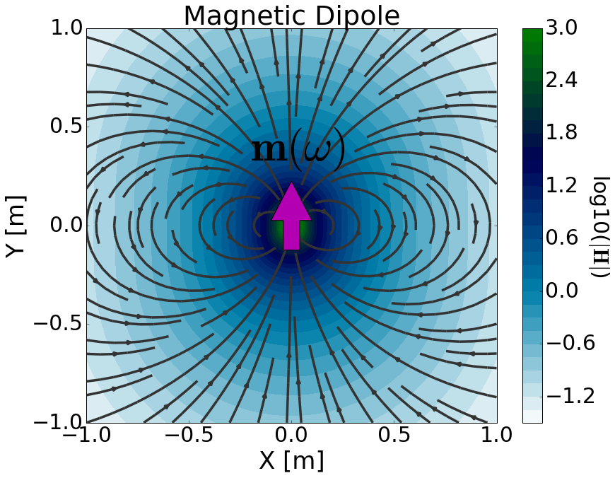

.. _frequency_domain_magnetic_dipole_index:

Harmonic Magnetic Dipole
========================

.. Purpose::

    In the frequency domain, we consider harmonic electric and magnetic fields.
    Here, we provide a physical description of the harmonic magnetic dipole.
    This is used to develop a mathematical expression which can be used to replace the magnetic source term in Maxwell's equations.

**General Definition**

The harmonic magnetic dipole can be thought of as an infinitessimally small loop which carries a harmonic current.
The strength of the source is therefore defined by a harmonic dipole moment :math:`\mathbf{m}(\omega)`.
For a harmonic magnetic dipole defined by vector surface area :math:`\mathbf{S}` and harmonic current :math:`I(\omega) = I e^{i\omega t}`, the dipole moment is given by:

		
		Physical representation of the magnetic dipole source where :math:`\mathbf{m}` = 1 Am :math:`\!^2`.

.. math::
	\mathbf{m} (\omega) = \mathbf{m} \, e^{i\omega t} = I \mathbf{S} \, e^{i\omega t}
	:name: m_harmonic_def

where :math:`\mathbf{m} = I \mathbf{S}` is the vector amplitude of the dipole moment.
When formulating Maxwell's equations in the frequency domain, :math:`e^{i\omega t}` is generally suppressed.
As a result, the source term for the harmonic magnetic dipole is given by:

.. math::
	\mathbf{J_m^s} = -i\omega \mu I\mathbf{S} \, \delta (x) \delta (y) \delta (z)
	:name: Jm_harmonic_def

where :math:`\delta (x)` is the Dirac delta function.
By including the source term, Maxwell's equations in the frequency domain are given by:

.. math::
	\begin{split}
	\nabla \times \mathbf{E_m} & + i \omega  \mu \mathbf{H_m} = - i \omega \mu I \mathbf{S} \, \delta(x) \delta(y) \delta(z)  \\
	&\nabla \times \mathbf{H_m} - ( \sigma + i \omega \varepsilon ) \mathbf{E_m} = 0
	\end{split}
	:name: Maxwells_harmonic_Jm

where subscripts :math:`_m` remind us that we are considering a magnetic source.
The source is responsible for generating a primary magnetic field in the surrounding region (:numref:`MagDipole`).
According to :ref:`Faraday's law<faraday_differential_frequency>`, the harmonic nature of the primary magnetic field generates rotational electric fields.
In matter, this leads to an induced current density which produces secondary magnetic fields according to the :ref:`Ampere-Maxwell equation<ampere_maxwell_differential_frequency>`.

**Contents**

In the following section, we solve Maxwell's equations for a harmonic magnetic dipole source and provide analytic expressions for the electric and magnetic fields within a homogeneous medium.
Asymptotic expressions are then provided for several cases.
Numerical modeling tools are made available for investigating the dependency of the electric and magnetic fields on various parameters.

.. toctree::
    :maxdepth: 2

    analytic_solution
    asymptotics
    fields
