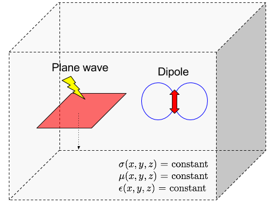

.. _maxwells_equations_in_homogeneous_media_index:

Maxwell's Equations in Homogeneous Media
========================================

.. .. raw:: html
..     :file: ../../../../underconstruction.html

.. purpose::

	From analytic expressions of Maxwell's equations in a homogeneous media, we understand fundamental behavior of electromagnetic propagation for plane wave and dipole sourcds, and obtain some insights of its use in practical EM applications (e.g. MT and CSEM).

   Conceptual diagram of plane wave and dipole sources in a homogeneous medium.

Within a homogeneous medium, the conductivity, magnetic permeability and dielectric permittivity are spatially invariant.
In this case, analytic solutions of Maxwell's equations exist, and these can provide us some fundamentals of electromagnetic wave propagation. Here, we focus our attention to two representative sources: a) plane wave and dipole. Corresponding EM application for both cases can be a) Magnetotellurics (MT) and b) Controlled-source EM (CSEM), meaning some fundamental concepts of each application can be obtained while we work through this section.

This section will be organized as planewave and dipole sources. In each case, analytic expressions for both sources will first be developed in both the frequency and time domain. In addition, numerical modeling tools will be provided in order to show propagation of EM fields, and
answer questions related their physical behavior and potential application.
Organization of this section are following:

.. In the frequency domain, the electric and magnetic fields are represented using the Helmholtz equation:

.. .. math::
.. 	\begin{split}
.. 	\nabla^2 \vec E + k^2 \vec E &= 0 \\
.. 	\nabla^2 \vec H + k^2 \vec H &= 0
.. 	\end{split}

.. where the properties of the waves are represented by the wavenumber :math:`k`:

.. .. math::
.. 	k = \sqrt{-i\omega \mu \sigma + \omega^2 \mu \varepsilon}

.. In the time domain, Maxwell's equations simplify to a wave equation with a lossy term:

.. .. math::
.. 	\begin{split}
.. 	\frac{1}{\mu \varepsilon} \nabla^2 \vec e  &= \frac{\partial^2 \vec e}{\partial t^2} + \frac{\sigma}{\varepsilon} \frac{\partial \vec e}{\partial t}  \\
.. 	\frac{1}{\mu \varepsilon} \nabla^2 \vec h  &= \frac{\partial^2 \vec h}{\partial t^2} + \frac{\sigma}{\varepsilon} \frac{\partial \vec h}{\partial t}
.. 	\end{split}

.. **Lead into plane wave and diple sources**

**Contents**

.. toctree::
    :maxdepth: 2

    plane_wave/index
    dipole_sources/index
