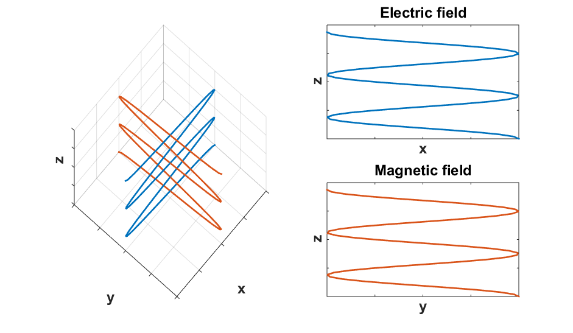
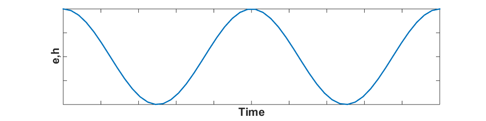

.. _em_waves_free_space:

Electromagnetic waves in free space
^^^^^^^^^^^^^^^^^^^^^^^^^^^^^^^^^^^

.. todo:: add purpose/summary

Time-domain
-----------

When electrical conductivity is zero, Maxwell's equations for :math:`\mathbf{e}` and :math:`\mathbf{h}` in the time-domain become:

.. math::  \boldsymbol{\nabla}^2 \mathbf{e} - \mu \epsilon \frac{\partial^2 \mathbf{e}}{\partial t^2}  = 0
        :name: hme13

.. math:: \boldsymbol{\nabla}^2 \mathbf{h} - \mu \epsilon \frac{\partial^2 \mathbf{h}}{\partial t^2}  = 0
        :name: hmh14

The fields satisfy a wave equation. In 1D, we can easily find an analytic solution for such a wave equation. For a wave travelling in the z direction, the :math:`\mathbf{e}`-field, written in 1D as

.. math:: \frac{\partial^2 \mathbf{e}}{\partial z^2} - \mu \epsilon \frac{\partial^2 \mathbf{e}}{\partial t^2} = 0

and has a solution as follows:

.. math:: \mathbf{e} = \mathbf{e_0} \cos \left( 2 \pi \frac{z-vt}{\lambda} \right ),
        :name: hme31

where :math:`v` is the velocity of the wave:

.. math:: v = \frac{1}{\sqrt{\epsilon \mu}}.

In free space, with properties :math:`\mu_0` and :math:`\epsilon_0`, the velocity becomes:

.. math:: c = \frac{1}{\sqrt{\epsilon \mu}} = 3 \times 10^8 m/s,

which is the speed of light. Further details about the speed of light can be found :ref:`here <speed_light_details>`.

The above solution was for the electric field but the magnetic field also has a harmonic dependence since since

.. math:: \boldsymbol{\nabla} \times \mathbf{h} = \epsilon \frac{d\mathbf{e}}{dt}

but will be 90 degrees out of phase with the electric field.

:numref:`eha` and :numref:`ehb`, motivated by those from :cite:`ward1988`, outline some of the essential elements.

        The electric and magnetic field propagate sinusoidally in the z-direction but they are 90 degrees out of phase.

        The electric and magnetic field propogate sinusoidally in time.

Frequency-domain
----------------

The same conclusions are arrived at by working in the frequency-domain. Again, for a plane wave travelling in the z-direction, the wave equation for :math:`\mathbf{E}` is 

.. math:: \frac{\partial^2 \mathbf{E}}{\partial z^2} - \mu \epsilon \omega^2 \mathbf{E} = 0.

For the frequency-domain, the solution for :math:`\mathbf{E}` can then be written as

.. math:: \mathbf{E} = E_0 e^{\pm i kz},

and if we explicitly include the time-dependence :math:`e^{iwt}`, the expression becomes

.. math:: \mathbf{e} = e_0 e^{-i(kz-\omega t)}

where :math:`k` is the circular wave number. Taking the real part yields:

.. math:: \mathbf{e} = e_0 \cos (kz - \omega t)

This is the same as Equation :eq:`hme31` where the relationships :math:`k = \frac{2\pi}{\lambda}` and :math:`v = \frac{\omega}{k}` are used. 

Throughout em.geosci, we will solve Maxwell's equations in time and frequency. The above example demonstrates how this can be done for a simple situation when waves propogates in a medium with zero conductivity. Some of these aspects carry over to conductive media but many things change.
