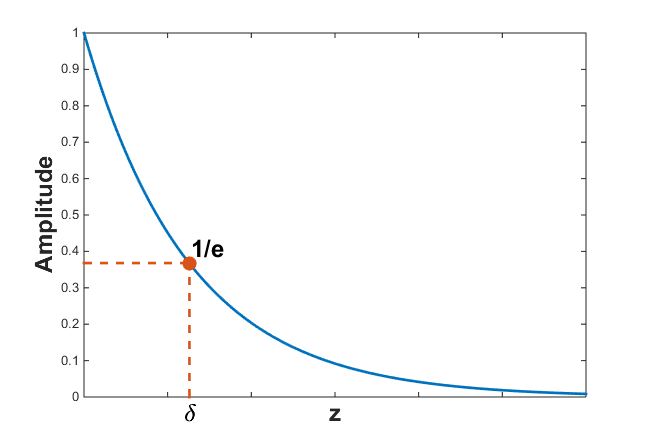

.. _wave_number:

Wavenumber and skin depth
=========================

Using plane wave solution with terms :math:`e^{\pm ikz}`, along with the time dependence :math:`e^{i\omega t}`, the electric field (and analogiceously the magnetic field) can be written as:

.. math:: \mathbf{e} = \mathbf{e}_0^+ e^{-i(kz - \omega t)} + \mathbf{e}_0^- e^{-i(k z + \omega t)}

where the wave number :math:`k` is:

.. math:: k = \sqrt{\mu \epsilon \omega^2 - i \mu \sigma \omega}.

Dividing :math:`k` into real and imaginary parts, and following :cite:`stratton1941`, we have:

.. math:: k = \alpha + i \beta

.. math:: \alpha = \omega \left ( \frac{\mu \epsilon}{2} \left [ \left ( 1 + \frac{\sigma^2}{\epsilon^2 \omega^2} \right )^{1/2} + 1 \right ] \right )^{1/2}

.. math:: \beta = \omega \left ( \frac{\mu\epsilon}{2} \left [ \left ( 1 + \frac{\sigma^2}{\epsilon^2 \omega^2} \right)^{1/2} - 1 \right ] \right ) ^{1/2}
        :name: wn1

The wave travelling in the positive z-direction has the form:

.. math:: \mathbf{e} = \mathbf{e}_0^+ e^{-\beta z}e^{-i(\alpha z - \omega t)}.
        :name: wn2

The real and positive quantity :math:`\beta` controls how quickly the wave decays with :math:`z`.

From this, we can define the concept of skin depth. The skin depth :math:`\delta` is the distance the wave travels for its amplitude to have decayed by a factor of :math:`1/e` with the above notation. Skin depth is then defined as:

.. math:: \delta = \frac{1}{\beta}

:numref:`sd` illustrates the concept of skin depth.

        Skindepth is defined as the depth at which the amplitude of the wave has been reduced by :math:`1/e`.

From Equation :eq:`wn1`, it is seen that :math:`\beta`, and hence :math:`\delta`, are dependent upon the ratios of physical properties and frequency. For many geophysical surveys, we have :math:`\frac{\epsilon \omega}{\sigma} \lt \lt 1` and :math:`k` is well-approximated as:

.. math:: k = \sqrt{-i\omega \mu \sigma}.

Thus the skin depth becomes:

.. math:: \delta = \frac{1}{\beta} = \sqrt{\frac{2}{\omega \mu \sigma}}.

Assuming permeability of free space, :math:`\mu_0 = 4\pi times 10^{-7}` H/m, and writing :math:`\omega=2\pi f`, we obtain the following useful equation for :math:`\delta` in meters:

.. math:: \delta \approx 500 \sqrt{\frac{1}{f \sigma}} = 500 \sqrt{\frac{\rho}{f}}.

For problems involving high frequencies, for example GPR surveys, or very early time transient EM problems, the displacement current may be important. Then Equation :eq:`wn1` needs to be invoked.

To see how physical properties and frequencies affect skin depth, check out :ref:`this app <>`. NEED APP LINK

To see a a table of skin depths for some representative rocks and frequencies, check out :ref:`this page <>`. NEED LINK/FIGURE

.. _phase_velocity:

Phase velocity and wavelength
^^^^^^^^^^^^^^^^^^^^^^^^^^^^^

The complex sinusoidal term in Equation :eq:`wn2` represents a travelling wave. The phase velocity is expressed as:

.. math:: v_{phase} = \frac{\omega}{\alpha}.

For situations where displacement currents are negligible,

.. math:: v_{phase} = \sqrt{ \frac{2\omega}{\mu \sigma} },

so velocity decreases with frequency. Alternatively, in materials where the conductivity is zero, then:

.. math:: k = \alpha = \sqrt{\mu \epsilon \omega^2}

end

.. math:: v_{phase} = \frac{1}{\sqrt{\mu \epsilon}}.
        :name: wn3

In free space, Equation :eq:`wn3` equates to :math:`3\times 10^8` m/s, which is the speed of light. Details of the derivation can be found :ref:`here <speed_light_details>`.

Finally, the wavelength if the waves is given by:

.. math:: \lambda = \frac{v}{f}.

In free space, :math:`\lambda = \frac{3\times10^8}{f}` meters while in a conducting medium, :math:`\lambda = 2\pi \delta`.

Even though the waves have a sinusoidal description inside the earth, they have lost most of their amplitude by the time they have propagated one wavelength into the earth. The above elements are illustrated in FIGURE ??? where a plane harmonic wave in free space propagates into the earth.
