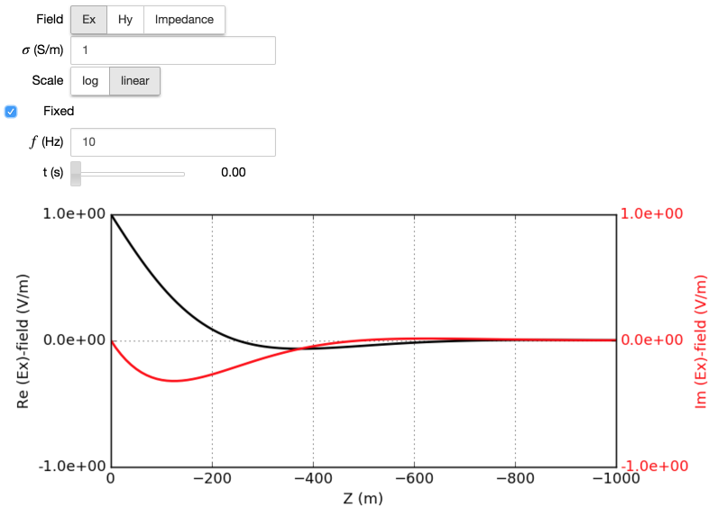

.. _frequency_domain_plane_wave_sources_simulation:

Simulation
==========

Consider a situation where infinite current sheet at :math:`z` =0 m, and plane EM wave propagating downward (negative :math:`z` direction) due to this. Only :math:`E_x` and :math:`H_y` are existing for this setup. For the frequency domain case, the sheet current can be considered alternating in time (e.g. :math:`I_x=I_0cos(\omega t)`).

.. figure:: ../images/planewavedown.png
   :align: center
   :scale: 60%

EM fields propagation due to this current excitation will be dependent upon:

- Physical properties: :math:`\sigma`, :math:`\epsilon`, and :math:`\mu`

- Time (:math:`t`) or Frequency (:math:`f`)

- Spatial location (:math:`z`)

Therefore, arbitrary plane EM fields in frequency domain can be

.. math::
    \mathbf{F}(\sigma, \epsilon, \mu; z; \omega).

By using the `Plane wave widget <http://mybinder.org/repo/geoscixyz/em_apps/notebooks/notebooks/maxwell1_fundamentals/PlanewaveWidget.ipynb>`_, we enable exploration of plane EM fields by altering physical property, frequency, and depth.

.. image:: http://mybinder.org/badge.svg
   :target: http://mybinder.org/repo/geoscixyz/em_apps/notebooks/notebooks/maxwell1_fundamentals/PlanewaveWidget.ipynb
   :align: center

Electric field will be on x-z plane, and by using the app, we can visualize real part of the electric field.

.. figure:: ../images/simulation_Ex.png
   :target: http://mybinder.org/repo/geoscixyz/em_apps/notebooks/notebooks/maxwell1_fundamentals/PlanewaveWidget.ipynb
   :align: center
   :scale: 60%

Depth profiles of real and imaginary parts can be visualized.

