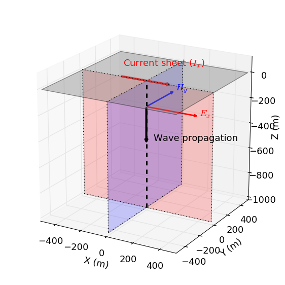

.. _time_domain_plane_wave_sources_analytic_solution:

Analytic Solution (Time Domain)
===============================

.. purpose::

    We provide solutions of Plane wave equations in time domain for the homogeneous medium with intial impulse electric fields. And from the solutions, we extract meaningful physical principles: peak time, peak distance, and peak velocity.

   Geometry of an EM plane wave propagating downwards.

:ref:`Maxwell's equations in the time domain <time_domain_equations>`, without source terms, are:

.. math:: \boldsymbol{\nabla}^2 \mathbf{e} - \mu\epsilon \frac{\partial^2 \mathbf{e}}{\partial t^2} - \mu\sigma \frac{\partial \mathbf{e}}{\partial t}    = 0

Initial condition at :math:`t=0` should be defined, hence we let impulse electric field at this time:

- :math:`\mathbf{e}(t=0)=\mathbf{e}_0\delta(t)`

where :math:`\delta(t)` is a Dirac-Delta function at :math:`t=0`. Solution of above systems can be obtained by applying inverse Fourier transfrom to the frequency domain solutions for downward propagating plane wave:

.. math:: \mathbf{E} =  \mathbf{E}_0^- e^{ikz}.

Time domain solution with impulse excitation can be written as

.. math:: \mathbf{e}(t) = \mathcal{F}^{-1}[\mathbf{E}(\omega)],

where :math:`\mathcal{F}[\cdot]` stands for Fourier transform.

.. .. math:: \boldsymbol{\nabla}^2 \mathbf{h} - \mu\epsilon \frac{\partial^2 \mathbf{h}}{\partial t^2} - \mu\sigma \frac{\partial \mathbf{h}}{\partial t}    = 0

.. - :math:`\mathbf{h}(t=0)=\mathbf{h}_0\delta(t)`

.. .. math:: \mathbf{H} =  \mathbf{h}_0^- e^{ikz}.

.. .. math:: \mathbf{h}(t) = \mathcal{F}^{-1}[\mathbf{H}(\omega)],

Modified from :cite:`ward1988`, time domain solution can be written as

.. math::
    \mathbf{e}(t) = \mathbf{e}_0^- \Bigg( e^{a(z/c)} \delta(t+\frac{z}{c})
    -\frac{a\frac{z}{c}e^{-at}}{(t^2-\frac{z^2}{c^2})^{1/2}}
    I_1\Big[a(t^2-\frac{z^2}{c^2})^{1/2}\Big] u(t+\frac{z}{c}) \Bigg),

where

- :math:`a=\frac{\sigma}{2\epsilon}`

- :math:`c=\frac{1}{\sqrt{\mu\epsilon}}`: velocity of the EM wave in vacuum space

- :math:`u(t)`: Heaviside step function

The first and second term indicates wave and diffusion term, respectively.
Note that the sign of :math:`z` is negative, hence even the wave term decays exponentially (:math:`\sim e^{a(z/c)}`).

.. Similarly, solution of the magnetic field can be

.. .. math::
..     \mathbf{h}(t) = \mathbf{h}_0^- \Bigg( e^{a(z/c)} \delta(t+\frac{z}{c})
..     -\frac{a\frac{z}{c}e^{-at}}{(t^2-\frac{z^2}{c^2})^{1/2}}
..     I_1\Big[a(t^2-\frac{z^2}{c^2})^{1/2}\Big] u(t+\frac{z}{c}) \Bigg),
..     :label: e_impulse_full

.. which is exactly same with an assumption that both :math:`\mathbf{e}_0^-` and :math:`\mathbf{h}_0^-` are given. Considering they are exactly same, we only limit our attention to electric field from now.

.. _time_domain_plane_wave_sources_fundamental_physics:

Fundamental physics
-------------------

Since we are inverse Fourier transforming frequency domain solution to time domain, similar to the frequency domain case, both wave and quasi-static approximation can be made:

- :math:`\epsilon \omega \gg \sigma` : "Wave" approximation
- :math:`\epsilon \omega \ll \sigma` : "Quasi-static" approximation

In the wave regime, solution of the electric field can be reduced to

.. math::
    \mathbf{e}(t) = \mathbf{e}_0^- \delta(t+\frac{z}{c}),

Therefore the electric field propagate with the speed of light, :math:`c`; this does not decay with :math:`z`.

In the quasi-static regime, solution of the electric field can be simplified to

.. math::
    \mathbf{e}(t) = -\frac{(\mu\sigma)^{1/2}z}{2 \pi^{1/2}t^{3/2}} e^{-\mu\sigma z^2 / (4t)}.
    :label: e_impulse_quasistatic

This is a simplified form of the diffusion term shown in Eq. :eq:`e_impulse_full`, which was only defined after :math:`t=-\frac{z}{c}`. :numref:`Ward1988Fig1_2` a and b show electric field as a function of time and depth, respectively. Both peak time and peak depth can be recognized in this figure.

From the approximate form show in Eq. :eq:`e_impulse_quasistatic`, we derive peak time, depth, and velocity describing trasient plane EM wave propagation.

.. figure:: ../images/Ward1988Fig1_2.png
   :align: center
   :scale: 40%
   :name: Ward1988Fig1_2

   Electric field as a function of time 100 m from a 1D impulse in the field in a 0.01 S/m whole space (a). Electric field at t = 0.03 ms as a function of distance (Modifed from :cite:`ward1988`) (b).

.. _time_domain_planewave_sources_peaktime:

Peak time
^^^^^^^^^

Since there is only one peak point in time as shown in :numref:`Ward1988Fig1_2` a, the peak time, :math:`t_{max}` can be dervied by setting the time derivative of Eq. :eq:`e_impulse_quasistatic` to zero.

.. math::
    t_{max} = \frac{\mu\sigma z^2}{6}
    :label: tmax

.. _time_domain_planewave_sources_diffusiondistance:

Peak depth (Diffusion distance)
^^^^^^^^^^^^^^^^^^^^^^^^^^^^^^^

Similarly by setting the depth derivative of Eq. :eq:`e_impulse_quasistatic` to zero, we obtain the peak depth, :math: `z_{max}` as

.. math::
    z_{max} = \sqrt{\frac{2 t}{\mu\sigma}} \approx 1260 \sqrt{\frac{ t}{\sigma}}.
    :label: zmax

This basically corresponds to the :ref:`frequency_domain_plane_wave_sources_skindepth` from the harmonic plane wave, and this often called diffusion distance.

.. _time_domain_planewave_sources_peakvelocity:

Peak velocity
^^^^^^^^^^^^^

This peak depth travels in time, hence by taking time derivative to Eq. :eq:`zmax` we obtain the peak velocity, :math:`v_{max}` as

.. math::
    v_{max} = \frac{d z_{max}}{dt} = \frac{1}{\sqrt{2\mu\sigma t}}

