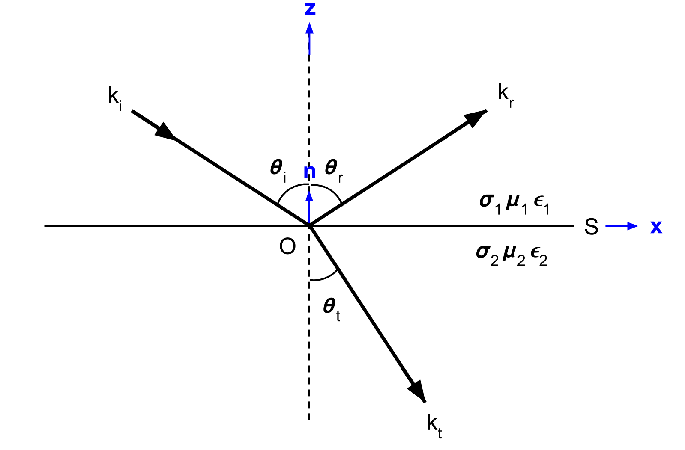
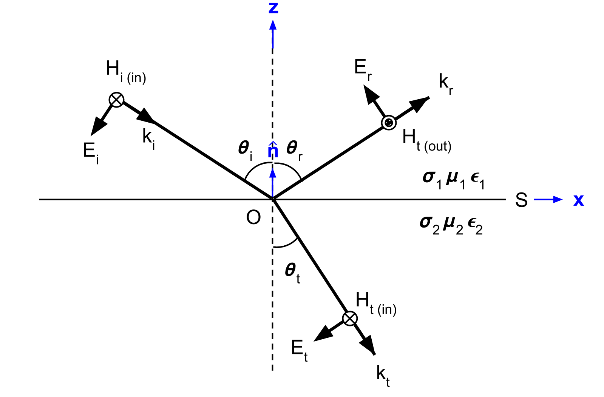

.. _Fresnel_equations:

Fresnel Equations
=================

.. purpose::

    Here, we present mathematical expressions which relate the geometry and amplitudes of EM waves at interfaces. This is accomplished by separating the incident wave into two modes: the TE mode and the TM mode. A physical description of each mode is presented along with subsequent derivation. The resulting Fresnel equations allow us to interrelate the amplitudes of the :math:`\mathbf{E}` and :math:`\mathbf{H}` across the interface.

Setup
-----

Here, we will consider the reflection and transmission of a uniform, linearly polarized, homogeneous plane wave at a horizontal interface (:numref:`fresnel_law_setup`). The incident wave is confined to the xz-plane. The interface is denoted by :math:`S`, has a normal vector :math:`\mathbf{\hat n}` and separates two homogeneous media with physical properties :math:`\sigma_1`, :math:`\mu _1`, :math:`\epsilon_1` and :math:`\sigma_2`, :math:`\mu _2`, :math:`\epsilon_2`.

For the setup in :numref:`fresnel_law_setup`, the incident wave (:math:`k_i`) arrives at angle :math:`\theta_i`. Once this wave reaches the interface, it breaks into two parts, a reflected wave (:math:`k_r`) and a transmitted wave (:math:`k_t`). The reflected and transmitted waves travel in directions characterized by angles :math:`\theta_r` and :math:`\theta_t`, respectively.

   Geometry for Snell's law. Modified from :cite:`ward1988` Figure 3.1.

Electromagnetic waves follow the superposition principle. In order to simplify the math associate with our problem and derive the Fresnel equation, we split the incoming EM wave into two modes. The **TE mode** represents the portion of the wave associated with electric field components parallel to the surface (:numref:`fresnel_setup_TE`). The **TM mode** represents the portion of the wave associated with magnetic field components coming parallel to the surface (:numref:`fresnel_setup_TM`).

.. note::

    The modes are often called the "transverse electric" (denoted by TE or TE :sub:`z`) mode and the tranverse magnetic (denoted by TM or TM  :sub:`z`) mode because either electric or magnetic field is transverse to :math:`z`-direction.

.. _Fresnel_equations_TE:

Fresnel Equation for TE Mode
----------------------------

.. figure:: images/fresnel_setup_TE.png
   :align: right
   :figwidth: 55%
   :name: fresnel_setup_TE

   the relative orientations of the :math:`\mathbf{E}`, :math:`\mathbf{H}`, and :math:`\mathbf{k}` vectors for relflection at a plane interface when :math:`\mathbf{E}_i` is normal to the plane of incidence (parallel to surface S).

The geometry, as it relates to the TE mode, is shown in :numref:`fresnel_setup_TE`. For the TE mode, the reflection and transmission coefficients are given by:

.. math::
    r_{TE} = \frac{\mathbf{E}_r}{\mathbf{E}_i} = \frac{\mu_2 u_1 - \mu_1 u_2}
    {\mu_2 u_1 + \mu_1 u_2}

.. math::
    t_{TE} = \frac{\mathbf{E}_t}{\mathbf{E}_i} = \frac{2\mu_2 u_1}
    {\mu_2 u_1 + \mu_1 u_2}

where

.. math::
    u_1 = k_1 \text{cos} \theta_i

and

.. math::
    u_2 = (k_2^2-k_1^2 \text{sin}^2 \theta_i)^{1/2}

**Derivation**

In order to relate the amplitude of the reflected and transmitted waves to that of the incident wave, we required reflection and transmission coefficients for the TE mode, where:

.. math::
    r_{TE} = \frac{\mathbf{E}_r}{\mathbf{E}_i}

.. math::
    t_{TE} = \frac{\mathbf{E}_t}{\mathbf{E}_i}

According to the geometry illustrated in :numref:`fresnel_setup_TE`, there are no components of :math:`\mathbf{E}` along :math:`\mathbf{k}` and no components of :math:`\mathbf{E}` along :math:`\mathbf{\hat n}`. Thus:

.. math::
    \hat{\mathbf{n}} \cdot \mathbf{E_i} = \mathbf{k_i} \cdot \mathbf{E_i} = 0
    :label: eq_1_TE

and

.. math::
    \hat{\mathbf{n}} \cdot \mathbf{E_t} = \mathbf{\hat n} \cdot \mathbf{E_r} = 0
    :label: eq_2_TE

According to the :ref:`interface conditions<maxwell1_fundamentals_interface_conditions_index>` stated in constitutive relationships, components of the electric field parallel to surface :math:`S` are continuous across the interface. Thus:

.. math::
    \mathbf{E}_i + \mathbf{E}_r = \mathbf{E}_t
    :label: TE_fresnel1

By applying :ref:`Snell's law<Snells_law>` to Eqs. :eq:`eq_1_TE` and :eq:`eq_2_TE`, we obtain:

.. math::
	\text{cos} \theta_i \mathbf{E}_i - \text{cos} \theta_r \mathbf{E}_r
    = \frac{\mu_1 k_2}{\mu_2 k_1} \text{cos} \theta_t \mathbf{E}_t
    :label: TE_fresnel2

Rearranging Eqs. :eq:`TE_fresnel1` and :eq:`TE_fresnel2`, we obtain:

.. math::
    \mathbf{E}_r = \frac{\mu_2 k_1 \text{cos} \theta_i - \mu_1(k_2^2-k_1^2 \text{sin}^2 \theta_i)^{1/2}}
    {\mu_2 k_1 \text{cos} \theta_i + \mu_1(k_2^2-k_1^2 \text{sin}^2 \theta_i)^{1/2}} \mathbf{E}_i
    :label: TE_EiandEr

and

.. math::
    \mathbf{E}_t = \frac{2\mu_2 k_1 \text{cos} \theta_i}
    {\mu_2 k_1 \text{cos} \theta_i + \mu_1(k_2^2-k_1^2 \text{sin}^2 \theta_i)^{1/2}} \mathbf{E}_t
    :label: TE_EiandEt

where

.. math::
    \text{cos}^2 \theta_t  = 1 - \text{sin}^2 \theta_t = 1-\Big(\frac{k_1}{k_2}\Big) \text{sin}^2 \theta_i

The reflection and transmission coefficients for the TE mode can be written as:

.. math::
    r_{TE} = \frac{\mathbf{E}_r}{\mathbf{E}_i}
           = \frac{\mu_2 k_1 \text{cos} \theta_i - \mu_1(k_2^2-k_1^2 \text{sin}^2 \theta_i)^{1/2}}
    {\mu_2 k_1 \text{cos} \theta_i + \mu_1(k_2^2-k_1^2 \text{sin}^2 \theta_i)^{1/2}}
    :label: rTE_theta

.. math::
    t_{TE} = \frac{\mathbf{E}_t}{\mathbf{E}_i}
           = \frac{2\mu_2 k_1 \text{cos} \theta_i}
    {\mu_2 k_1 \text{cos} \theta_i + \mu_1(k_2^2-k_1^2 \text{sin}^2 \theta_i)^{1/2}}
    :label: tTE_theta

Substituting the following:

.. math::
    u_1 = k_1 \text{cos} \theta_i
    :label: u1

.. math::
    u_2 = (k_2^2-k_1^2 \text{sin}^2 \theta_i)^{1/2}
    :label: u2

:math:`r_{TE}` and :math:`t_{TE}` can ultimately be written as:

.. math::
    r_{TE} = \frac{\mu_2 u_1 - \mu_1 u_2}
    {\mu_2 u_1 + \mu_1 u_2}
    :label: rTE_u

.. math::
    t_{TE} = \frac{2\mu_2 u_1}
    {\mu_2 u_1 + \mu_1 u_2}
    :label: tTE_u

.. note::

    In the final form of :math:`r_{TE}` and :math:`t_{TE}` shown in Eqs :eq:`rTE_u` and :eq:`tTE_u`, angular information is merged into :math:`u_1` and :math:`u_2`, which are scalar wavenumbers in :math:`z`-direction. Namely, horizontal component of the wavenumber do not make any impact to determine :math:`r_{TE}` and :math:`t_{TE}`, and this is driven by transverse electic field to :math:`z`-direction.

.. _Fresnel_equations_TM:

Fresnel Equation for TM Mode
----------------------------

The geometry, as it relates to the TM mode, is shown in :numref:`fresnel_setup_TM`. For the TM mode, the reflection and transmission coefficients are given by:

   the relative orientations of the :math:`\mathbf{E}`, :math:`\mathbf{H}`, and :math:`\mathbf{k}` vectors for reflection at a plane interface when :math:`\mathbf{H}_i` is parallel to the surface.

.. math::
    r_{TM} = \frac{\mu_2 u_2 k_1^2 - \mu_1 u_1 k_2^2}
    {\mu_2 u_2 k_1^2 + \mu_1 u_1 k_2^2}

.. math::
    t_{TM} = \frac{2\mu_1 u_1 k_2^2}
    {\mu_2 u_2 k_1^2 + \mu_1 u_1 k_2^2}

where

.. math::
    u_1 = k_1 \text{cos} \theta_i

and

.. math::
    u_2 = (k_2^2-k_1^2 \text{sin}^2 \theta_i)^{1/2}

**Derivation**

In order to relate the amplitude of the reflected and transmitted waves to that of the incident wave, we required reflection and transmission coefficients for the TM mode, where:

.. math::
    r_{TM} = \frac{\mathbf{H_r}}{\mathbf{H_i}} = \frac{\hat{\mathbf{n}}\times \mathbf{E}_r}{\hat{\mathbf{n}}\times \mathbf{E}_i}
    :label: rTM

.. math::
    t_{TM} = \frac{\mathbf{H_t}}{\mathbf{H_i}} = \frac{\hat{\mathbf{n}}\times \mathbf{E}_t}{\hat{\mathbf{n}}\times \mathbf{E}_i}
    :label: tTM

According to the geometry illustrated in :numref:`fresnel_setup_TM`, there are no components of :math:`\mathbf{H}` along :math:`\mathbf{k}` and no components of :math:`\mathbf{H}` along :math:`\mathbf{\hat n}`. Thus:

.. math::
    \hat{\mathbf{n}} \cdot \mathbf{H}_i = \mathbf{k}_i \cdot \mathbf{H}_i = 0
    :label: eq_1_TM

and

.. math::
    \hat{\mathbf{n}} \cdot \mathbf{H}_t = \hat{\mathbf{n}} \cdot \mathbf{H}_r = 0
    :label: eq_2_TM

According to the :ref:`interface conditions<maxwell1_fundamentals_interface_conditions_index>` stated in constitutive relationships, components of the magnetic field parallel to surface :math:`S` are continuous across the interface. Thus:

.. math::
    \mathbf{H}_i + \mathbf{H}_r = \mathbf{H}_t
    :label: TM_fresnel1

And by applying :ref:`Snell's law<Snells_law>` to Eqs. :eq:`eq_1_TM` and :eq:`eq_2_TM`, we obtain:

.. math::
    \text{cos} \theta_i \mathbf{H}_i - \text{cos} \theta_r \mathbf{H}_r
    = \frac{\mu_1 k_2}{\mu_2 k_1} \text{cos} \theta_t \mathbf{H}_t
    :label: TM_fresnel2

Rearranging Eqs. :eq:`TM_fresnel1` and :eq:`TM_fresnel2`, we obtain:

.. math::
    \mathbf{H}_r = -\frac{\mu_2 k_1(k_2^2-k_1^2 \text{sin}^2 \theta_i)^{1/2}  - \mu_1k_2^2 \text{cos} \theta_i}
    {\mu_2 k_1(k_2^2-k_1^2 \text{sin}^2 \theta_i)^{1/2}  + \mu_1k_2^2 \text{cos} \theta_i} \mathbf{H}_i
    :label: TM_HiandHr

.. math::
    \mathbf{H}_t = \frac{2 \mu_1k_2^2 \text{cos} \theta_i}
    {\mu_2 k_1(k_2^2-k_1^2 \text{sin}^2 \theta_i)^{1/2}  + \mu_1k_2^2 \text{cos} \theta_i} \mathbf{H}_i
    :label: TM_HiandHt

where

.. math::
    \text{cos}^2 \theta_t  = 1 - \text{sin}^2 \theta_t = 1-\Big(\frac{k_1}{k_2}\Big) \text{sin}^2 \theta_i

Thus the reflection and transmission coefficients for TM mode can be written as:

.. math::
    r_{TM} = \frac{\hat{\mathbf{n}}\times \mathbf{E}_t}{\hat{\mathbf{n}}\times \mathbf{E}_i}
           = - \frac{\mathbf{H}_r}{\mathbf{H}_i}
           = \frac{\mu_2 k_1(k_2^2-k_1^2 \text{sin}^2 \theta_i)^{1/2}  - \mu_1k_2^2 \text{cos} \theta_i}{\mu_2 k_1(k_2^2-k_1^2 \text{sin}^2 \theta_i)^{1/2}  + \mu_1k_2^2 \text{cos} \theta_i}
    :label: rTM_theta

.. math::
    t_{TM} = \frac{\hat{\mathbf{n}}\times \mathbf{E}_t}{\hat{\mathbf{n}}\times \mathbf{E}_i}
           = \frac{\mathbf{H}_t}{\mathbf{H}_i}
           = \frac{2 \mu_1k_2^2 \text{cos} \theta_i}{\mu_2 k_1(k_2^2-k_1^2 \text{sin}^2 \theta_i)^{1/2}  + \mu_1k_2^2 \text{cos} \theta_i}
    :label: tTM_theta

Substituting these with Eqs. :eq:`u1` and :eq:`u2` yields:

.. math::
    r_{TM} = \frac{\mu_2 u_2 k_1^2 - \mu_1 u_1 k_2^2}
    {\mu_2 u_2 k_1^2 + \mu_1 u_1 k_2^2}
    :label: rTM_u

.. math::
    t_{TM} = \frac{2\mu_1 u_1 k_2^2}
    {\mu_2 u_2 k_1^2 + \mu_1 u_1 k_2^2}
    :label: tTM_u

.. question::

   -  We defined reflection coefficient of TM mode :math:`r_{TM}` as ratio between tangential electric field of incidence and reflection as shown in Eq. :eq:`rTM`. However, we derived ratio of :math:`\mathbf{H}_i` and :math:`\mathbf{H}_r` then multipy -1 to obtain :math:`r_{TM}`, why is that? (Hint: See direction of :math:`\mathbf{E}` and :math:`\mathbf{H}` in :numref:`fresnel_setup_TM`)

Fresnel Equations for Normal Incidence
^^^^^^^^^^^^^^^^^^^^^^^^^^^^^^^^^^^^^^

When incidence is normal (:math:`\theta_i` =0), Eqs. :eq:`rTE_u` and :eq:`rTM_u` can be reduced to:

.. math::

    r_{TE} = r_{TM} = \frac{\mu_2 k_1 - \mu_1 k_2} {\mu_2 k_1 + \mu_1 k_2}

