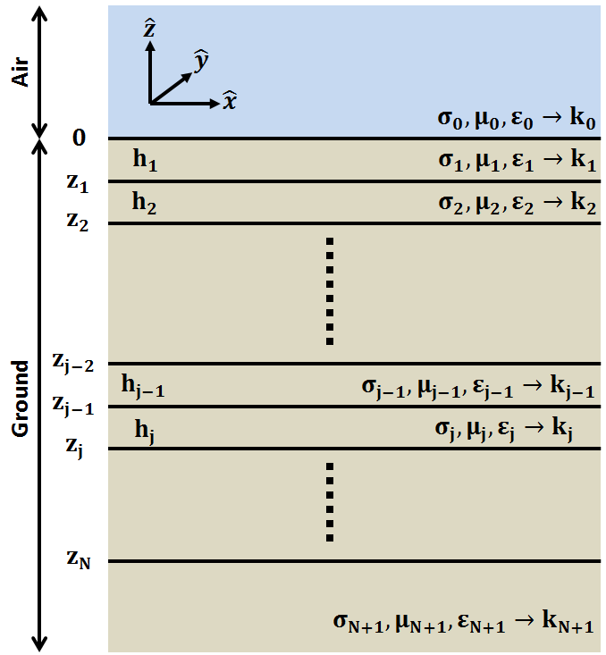
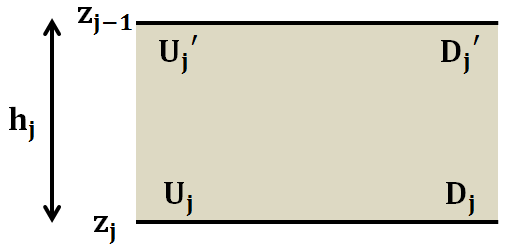

.. _impedance_layeredearth:

Plane Waves within an N-Layered Earth
=====================================

.. purpose::

    Here, we consider a special case of the plane wave solution for an N-layered Earth. Our derivation follows that found in :cite:`ward1988`. This example is a first step to understanding how the Earth's structure and physical properties impact electric and magnetic fields measured at the surface.

   Geometry for N-layer case.

Consider up-going and down-going plane waves which are normally incident to an N-layered, isotropic Earth. We will assume that the electric fields associated with these waves are polarized along the x-direction; thus the magnetic fields are polarized along the y-direcion. Below, we will develope a scheme for determining the electric and magnetic fields in any of the layers. Morever, we will characterize the relationship between perpendicular components of the electric and magnetic field at the Earth's surface.

Fields in the j-th Layer
------------------------

In the j-th layer, we have both up-going and down-going waves resulting from transmissions and reflections within the Earth. The electric field has the following form:

   Notation for up-going and down-going waves in the j-th layer.

.. math::
	E_{x,j}(\omega ,z) = U_j e^{-ik_j (z-z_j)} + D_j e^{ik_j (z-z_j)}
	:name: E_j

where :math:`z_j` denotes the bottom location of the j-th layer. :math:`U_j` and :math:`D_j` are electric field amplitudes of the up-going and down-going wave at the bottom of the j-th layer, respectively. According to the theory presented for :ref:`EM waves in homogeneous media<harmonic_planewaves_homogeneous_derivation>`, the relationship between the electric field and the magnetic field is given by:

.. math::
	\frac{\partial E_x}{\partial z} + i\omega \mu H_y = 0
	:name:

As a result, the associated magnetic field in the j-th layer is given by:

.. math::
	H_{y,j} (\omega ,z) = \frac{1}{Z_j} \bigg [ U_j e^{-ik_j (z-z_j)} - D_j e^{ik_j (z-z_j)} \bigg ]
	:name: H_j

where the :ref:`wave impedance<harmonic_planewaves_homogeneous_impedancephase>` for the j-th layer is given by:

.. math::
	Z_j = \frac{\omega \mu_j}{k_j}
	:name:

Using Eqs. :eq:`E_j` and :eq:`H_j`, the electric and magnetic fields at the bottom of the j-th layer can be represented using the folling system. Where :math:`z = z_j`:

.. math::
	\begin{bmatrix} E_{x,j} \\ H_{y,j} \end{bmatrix} \Bigg |_{z=z_j} = \begin{bmatrix} 1 & 1 \\ \frac{1}{Z_j} & -\frac{1}{Z_j} \end{bmatrix} \begin{bmatrix} U_j \\ D_j \end{bmatrix} = \mathbf{P_j} \begin{bmatrix} U_j \\ D_j \end{bmatrix}
	:name: Fields_bottom

At any location within the layer, the electric and magnetic fields are given by:

.. math::
	\begin{bmatrix} E_{x,j} \\ H_{y,j} \end{bmatrix} = \begin{bmatrix} 1 & 1 \\ \frac{1}{Z_j} & -\frac{1}{Z_j} \end{bmatrix} \begin{bmatrix} e^{-ik_j (z-z_j)} & 0 \\ 0 & e^{ik_j(z-z_j)} \end{bmatrix} \begin{bmatrix} U_j \\ D_j \end{bmatrix}
	:name: Fields_j

The electric field amplitudes at the top of the j-th layer (:math:`U_j^\prime` and :math:`D_j^\prime`), can be determined from :math:`U_j` and :math:`D_j` by using the following expression:

.. math::
	\begin{bmatrix} U_j^\prime \\ D_j^\prime \end{bmatrix} = \begin{bmatrix} e^{-ik_j h_j} & 0 \\ 0 & e^{ik_j h_j} \end{bmatrix} \begin{bmatrix} U_j \\ D_j \end{bmatrix} = \boldsymbol{\Lambda_j} \begin{bmatrix} U_j \\ D_j \end{bmatrix}
	:name: Amps_layer

where :math:`h_j` is the thickness of the j-th layer. Now that we have related the fields and amplitudes to one another within a particular layer, how can we solve for the fields in one layer if only the fields in a different layer are known.

Interface Conditions
--------------------

Let us assume we know the electric field amplitudes :math:`U_{j+1}` and :math:`D_{j+1}`. We want to find the wave amplitudes in the j-th layer (:math:`U_{j}` and :math:`D_{j}`) so that we can find the fields according to Eq. :eq:`Fields_j`. 

According to the interface conditions corresponding to plane waves, components of the :ref:`electric field<Fresnel_equations_TE>` parallel to the interface are continuous. The same is true for the :ref:`magnetic field<Fresnel_equations_TM>`. Thus at :math:`z = z_j`:

.. math::
	\begin{bmatrix} E_{x,j} \\ H_{y,j} \end{bmatrix} \Bigg |_{z=z_j} = \mathbf{P_j} \begin{bmatrix} U_j \\ D_j \end{bmatrix} = \mathbf{P_{j+1}} \begin{bmatrix} U_{j+1}^\prime \\ D_{j+1}^\prime \end{bmatrix}
	:name: Uj

Using Eqs. :eq:`Fields_bottom`, :eq:`Amps_layer` and :eq:`Uj`, we can relate the electric and magnetic fields at the top of layer j+1 to those at the top of layer j:

.. math::
	\begin{bmatrix} E_{x,j} \\ H_{y,j} \end{bmatrix} \Bigg |_{z=z_{j-1}} = \mathbf{P_j} \boldsymbol{\Lambda_j} \mathbf{P_j^{-1}} \begin{bmatrix} E_{x,j+1} \\ H_{y,j+1} \end{bmatrix} = \mathbf{T_j} \begin{bmatrix} E_{x,j+1} \\ H_{y,j+1} \end{bmatrix} \Bigg |_{z=z_j}
	:name:

Similarly, the electric field amplitudes at the top of layer j and the top of layer j+1 are related by:

.. math::
	\begin{bmatrix} U_j^\prime \\ D_j^\prime \end{bmatrix} = \boldsymbol{\Lambda_j} \mathbf{P_j^{-1}} \mathbf{P_{j+1}} \begin{bmatrix} U_{j+1}^\prime \\ D_{j+1}^\prime \end{bmatrix} = \mathbf{S_j} \begin{bmatrix} U_{j+1}^\prime \\ D_{j+1}^\prime \end{bmatrix}
	:name:

Recursive Solution for N-Layers
-------------------------------

Let us consider the case where we are at the Earth's surface and we measure perpendicular components of the electric and magnetic fields; i.e. :math:`E_{x,0}` and :math:`H_{y,0}` at :math:`z=0`. According to the interface conditions, these are identical to the electric and and magnetic fields at the top of layer 1; i.e. :math:`E_{x,1}` and :math:`H_{y,1}` at :math:`z=0`. In terms of the up-going and down-going electric field ampliutde:

.. math::
	\begin{bmatrix} E_{x} \\ H_{y} \end{bmatrix} \Bigg |_{z=0} = \mathbf{P_1} \begin{bmatrix} U_1^\prime \\ D_1^{\, \prime} \end{bmatrix}
	:name:

In terms of the up-going and down-going waves in layer 2, the previous expression can be rewritten as:

.. math::
	\begin{bmatrix} E_{x} \\ H_{y} \end{bmatrix} \Bigg |_{z=0} = \mathbf{P_1 S_1} \begin{bmatrix} U_2^\prime \\ D_2^{\, \prime} \end{bmatrix}
	:name:

This process can be repeated for each layer. Ultimately, the electric and magnetic fields at the Earth surface can be expressed as:

.. math::
	\begin{bmatrix} E_{x} \\ H_{y} \end{bmatrix} \Bigg |_{z=0} = \mathbf{P_1} \prod_{j=1}^N \mathbf{S_j} \begin{bmatrix} 0 \\ D_{N+1}^{\, \prime} \end{bmatrix} = \mathbf{M} \begin{bmatrix} 0 \\ D_{N+1}^{\, \prime} \end{bmatrix} 
	:name:

Notice how there is no up-going wave in lowermost medium. This makes sense assuming there is no source or reflector capable of creating a returning signal. If we amalgamate the product of all matricies into a single matrix :math:`\mathbf{M}`, then:

.. math::
	E_x \big |_{z=0} = M_{12} D_{N+1}^{\, \prime}
	:name:

and

.. math::
	H_y \big |_{z=0} = M_{22} D_{N+1}^{\, \prime}
	:name:

The relationship between :math:`E_x` and :math:`H_y` at the Earth's surface is therefore given by:

.. math::
	Z = \frac{E_x}{H_y} = \frac{M_{12}}{M_{22}}
	:name: impedance_Earth

Eq. :eq:`impedance_Earth` tells us that the relationship between perpendicular components of the electric and magnetic fields at the Earth's surface, at a particular frequency, depend on the physical properties of all layers. However, the exponential nature of matricies :math:`\boldsymbol{\Lambda_j}` within :math:`\mathbf{S_j}` suggests that the impact of deeper layers on :math:`Z` is smaller than it is for shallow layers. This result is very important when considering :ref:`magnetotelluric (MT) methods<mt_index>`.

**Impedance for a Half-Space**

In the case where the Earth is a homogeneous half-space:

.. math::
	\mathbf{M} = \mathbf{P_1} = \begin{bmatrix} 1 & 1 \\ \frac{1}{Z_1} & -\frac{1}{Z_1} \end{bmatrix}
	:name:

where

.. math::
	Z_1 = \frac{\omega \mu_1}{k_1}
	:name:

and thus:

.. math::
	\frac{E_x}{H_y} = \frac{M_{12}}{M_{22}} = - \frac{\omega\mu_1}{k_1} = -\frac{\omega \mu_1}{\sqrt{-i\omega\mu_1\sigma_1 + \omega^2\mu_1\varepsilon_1}} = \begin{cases} -\sqrt{\dfrac{i\omega\mu_1}{\sigma_1}} \;\; \textrm{for} \;\; \sigma \gg \omega\varepsilon \\ -\sqrt{\dfrac{\mu_1}{\varepsilon_1}} \;\;\;\;\,\;\; \textrm{for} \;\; \sigma \ll \omega\varepsilon \end{cases}
	:name:

The physical significance of this was explained during the material on :ref:`impedance and phase<harmonic_planewaves_homogeneous_impedancephase>` for plane waves in homogeneous media.

