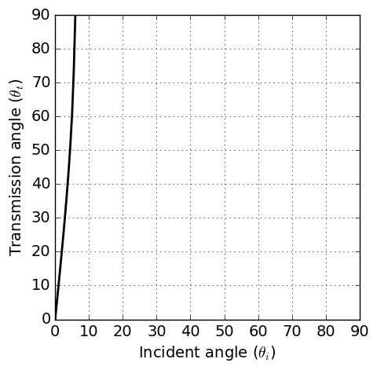
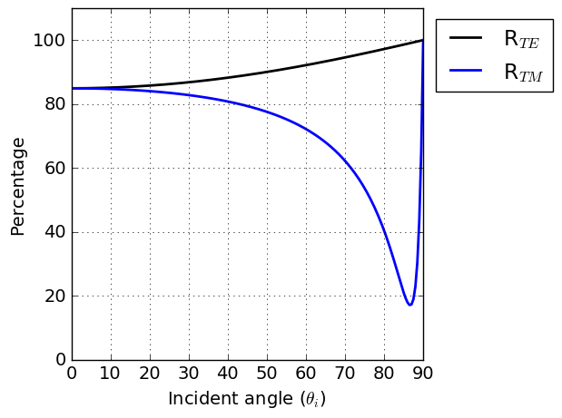
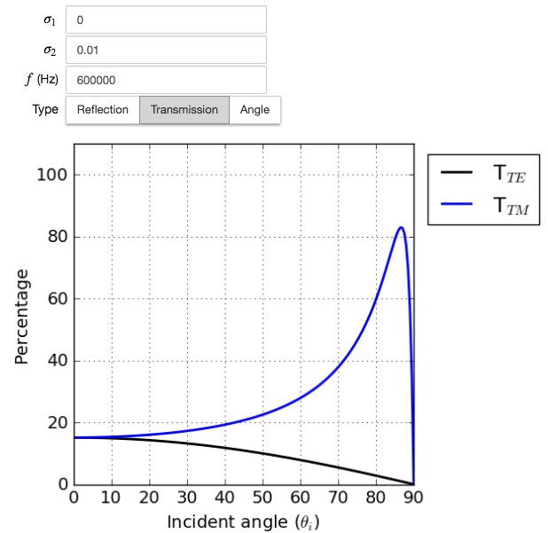

.. _totalrefl_and_brewsterangl:

Total reflection and Brewster angle
===================================

.. purpose::

    We first identify total reflection and brewster angle for a dielectric media, then relate them to conductive medium.

Total reflection
----------------

For a perfect dielectric, the conductivity is zero and the permeability is that of free space that is, :math:`\mu_1=\mu_2=\mu_0`. In this case, Snell's law reduces to:

.. math::
    \frac{\text{sin} \theta_i}{\text{sin} \theta_t} = \frac{k_1}{k_2} = \Big(\frac{\epsilon_2}{\epsilon_1}\Big)^{1/2} = n_{12}
    :label: snells_law2_dielectric

where :math:`n_{12}` is the relative index of refraction. If :math:`\epsilon_2 > \epsilon_1` then :math:`n_{12} > 1`. Under this situation, for any angle of incidence :math:`\theta_i` there is a real angle of transimission :math:`\theta_t`. On the other hand, if :math:`\epsilon_2 < \epsilon_1` then :math:`\theta_t` is real only when :math:`n_{12} \text{sin} \theta_t \leq 1`. Total reflection occurs when :math:`n_{12}\text{sin} \theta_t > 1`, and indicates that the wave cannot pass through and is entirely reflected. For the reflection from a conductive surface, a total reflection occurs when :math:`\sigma_1 > \sigma_2`. :numref:`totalreflection_angle` illustrate this.

   Tranmission angle :math:`\theta_t` as a function of the incident angle :math:`\theta_i` when :math:`\sigma_1` = 1 S/m and :math:`\sigma_2` = 0.1 S/m. Magnetic permeability and dielectric permittivitivy assumed to be those of free-space (:math:`\epsilon = \epsilon_0` and :math:`\mu = \mu_0`)

Brewster angle
--------------

From derived reflection coefficients for TE mode in :ref:`fresnel_equations`, the reflection coefficient for perfect dielectric can be written as

.. math::
    r_{TE} = \frac{(\epsilon_1)^{1/2} \text{cos} \theta_i - (\epsilon_2)^{1/2} \text{cos} \theta_t}{(\epsilon_1)^{1/2} \text{cos} \theta_i + (\epsilon_2)^{1/2} \text{cos} \theta_t}

With Snell's law of refraction shown in Eq. :eq:`snells_law2_dielectric`, above equation can be modified as

.. math::
    r_{TE} = \frac{\text{cos} \theta_i \text {sin} \theta_t - \text{cos} \theta_t \text {sin} \theta_i}{\text{cos} \theta_i \text {sin} \theta_t + \text{cos} \theta_t \text {sin} \theta_i}
           = \frac{\text {sin} (\theta_t - \theta_i)}{\text {sin}(\theta_t + \theta_i)}

Similarly, the reflection coefficient for TM mode can be obtained as

.. math::
    r_{TM} = \frac{\text {tan} (\theta_t - \theta_i)}{\text {tan}(\theta_t + \theta_i)}

Power reflection coefficient for TE and TM mode can be

.. math::
    R_{TE} \equiv |r_{TE}|^2 = \frac{\text {sin}^2 (\theta_t - \theta_i)}{\text {sin}^2(\theta_t + \theta_i)}

.. math::
    R_{TM} \equiv |r_{TM}|^2 = \frac{\text {tan}^2 (\theta_t - \theta_i)}{\text {tan}^2(\theta_t + \theta_i)}

Accordingly, power transmission coefficient will be

.. math::
    T_{TE} \equiv 1-|r_{TE}|^2

.. math::
    T_{TM} \equiv 1-|r_{TM}|^2

If :math:`(\theta_t + \theta_i) \rightarrow \pi/2`, then :math:`\text{tan}(\theta_t + \theta_i) \rightarrow \infty`, and :math:`r_{TM} \rightarrow 0`. The reflected and refracted waves are normal to one another, and

.. math::
    \text {sin} \theta_t = \text {sin} (\pi/2 - \theta_i) = \text {cos} \theta_i

so that Eq. :eq:`snells_law2_dielectric` becomes

.. math::
    \text {tan} \theta_i = \Big(\frac{\epsilon_2}{\epsilon_1}\Big)^{1/2} = n_{12}

The angle that this equation satisfies is known as the Brewster angle. The reflection from a conductive surface, there will be a minimum in :math:`R_{TM}`, analogous to the Brewster angle, for some particular angle of incidence. No such minimul occurs in :math:`R_{TE}`. :numref:`WHfig3_3` illustrate this.

   The power reflection coefficient :math:`R_{TE}` and :math:`R_{TM}` versus angle of incidence for plane wave at air-earth interface. The conductivity and dielectric permitivity of earth are taken to be 0.01 S/m, and :math:`\epsilon = \epsilon_0`, respectively. The frequency is 6 x 10 :sup:`5` Hz.

App
---

:numref:`totalreflection_angle` and :numref:`WHfig3_3` are generated by the Reflection and Refraction app that you can adjust conductivity of each medium, and obtain corresponding transmission angle, power reflection and transmission coefficients as a function of incident angle. Below link will direct you to the app:

.. image:: http://mybinder.org/badge.svg
   :target: http://mybinder.org/repo/geoscixyz/em_apps/notebooks/notebooks/maxwell1_fundamentals/Reflection_and_Refraction.ipynb
   :align: center

|

