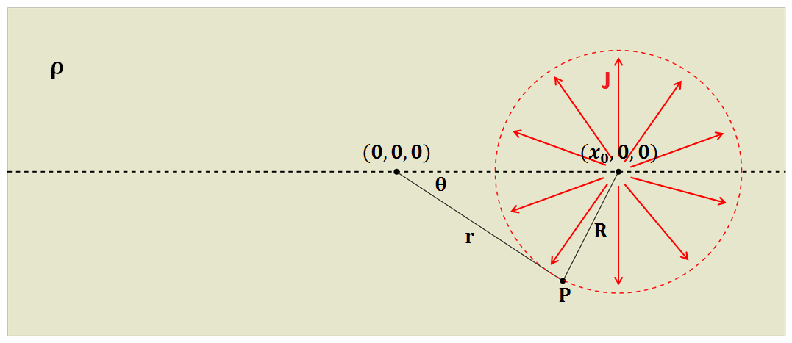

.. _point_current_source_and_sphere:

Point current source and a conducting sphere
============================================

In this section, we build up an analytical solution for a conducting sphere in the presence of a point current source. This is accomplished in two steps:

1. A solution for the electric scalar potential, due to a point current source
within a wholespace of resistivity :math:`\rho`, is solved. This solution is then
re-expressed within a polar coordinate system and decomposed into a sum of spherical
harmonic modes.

2. The solution for a conducting sphere within a wholespace is then
determined by solving a boundary value problem for each spherical harmonic.

This solution is built upon in :ref:`effects_of_topography` to investigate the
effects of of a hemispherical depression at the Earth's surface on the
behaviour of currents and potentials in a direct current resistivity
experiment.

Electric Potential from a Current Source within a Wholespace
------------------------------------------------------------

Let us consider the case where an electrical current :math:`I` is being
injected into a wholespace with resistivity :math:`\rho`, at location
(:math:`x,y,z`) = (:math:`x_0,0,0`). Assuming the medium is lossless,
this results in a current density :math:`J` which flows radially
outwards from the source, with magnitude:

.. math:: J = \frac{I}{4 \pi R^2}

   Diagram showing the setup for computing the potential due to a wholespace.

where :math:`R` is the distance from the source to a point of measure
:math:`P`, and :math:`4\pi R^2` is the area of a ball centered at the
source. Because our problem is electrostatic,
:math:`\vec E = - \nabla \phi` according to Faraday’s law. The scalar
electric potential :math:`\phi` can be obtained by integrating the
electric field from :math:`R` to :math:`\infty`. By substituting Ohm’s
law (:math:`\vec E = \rho \vec J`) into the path integral:

.. math:: 
   \phi = - \int_R^\infty \vec E \cdot d\vec l = - \int_R^\infty \frac{\rho I}{4 \pi r^2} dr = \frac{\rho I}{4\pi R}

For reasons which will becomes apparent in the next section, we would
like to re-express :math:`\phi` in terms of a radial coordinate system
(:math:`r,\theta,\phi`), centered at (:math:`x,y,z`) = (0,0,0). Because
the points which represent the problem geometry do not necessarily form
a right-triangle, :math:`R` must be expressed using the cosine law:

.. math:: 
   R = \sqrt{x_0^2 + r^2 - 2rx_0 cos \theta \;}

For solutions where :math:`r<x_0`, :math:`1/R` can be split into a sum
of spherical harmonic modes using the binomial theorem:

.. math::
   \frac{1}{R} &= \frac{1}{x_0} \Bigg [ 1 + \Bigg ( \frac{r}{x_0} \Bigg )^2 - 2 \frac{r}{x_0} cos \theta \Bigg ]^{-1/2} \\
               &= \frac{1}{x_0} \Bigg [ 1 + \frac{r}{x_0}cos \theta + \Bigg ( \frac{r}{x_0} \Bigg )^2 \Bigg ( \frac{3}{2} cos^2 \theta - \frac{1}{2} \Bigg ) + \; \dotsb \; \Bigg ] \\
               &= \frac{1}{x_0} \sum_{n=0}^\infty \Bigg ( \frac{r}{x_0} \Bigg )^n P_n \big (cos \theta \big)
   :label: RSol1

where :math:`P_n \big (cos \theta \big )` is the Legendre polynomial of
order :math:`n`. Because Legendre polynomials have magnitudes less than
unity for :math:`n>0`, and :math:`r<x_0`, the infinite series in Eq.
:eq:`RSol1` is bounded and converges as :math:`n \rightarrow \infty`. A
similar approach for :math:`r < x_0` can be expressed as follows:

.. math::
   \frac{1}{R} &= \frac{1}{r} \Bigg [ 1 + \Bigg ( \frac{x_0}{r} \Bigg )^2 - 2 \frac{x_0}{r} cos \theta \Bigg ]^{-1/2} \\
               &= \Bigg [ 1 + \frac{x_0}{r}cos \theta + \Bigg ( \frac{x_0}{r} \Bigg )^2 \Bigg ( \frac{3}{2} cos^2 \theta - \frac{1}{2} \Bigg ) + \; \dotsb \; \Bigg ] \\
               &= \sum_{n=0}^\infty \Bigg ( \frac{x_0}{r} \Bigg )^n P_n \big ( cos \theta \big )
   :label: RSol2

Similar to Eq. :eq:`RSol1`, since :math:`x_0<r`, the infinite series in
Eq. :eq:`RSol2` is also boundary and conveges as
:math:`n\rightarrow\infty`. Therefore using Eqs. :eq:`RSol1` and
:eq:`RSol2`, the electric scalar potential :math:`\phi` can be
expressed as an infinite sum of spherical harmonic modes, where:

.. math::
   \phi = \frac{I\rho}{4 \pi} \sum_{n=0}^\infty \frac{r^n \, P_n \big (cos \theta \big )}{x_0^{n+1}} \; \; \; \textrm{for} \; \; \; r<x_0
   :label: PsiWholespace1

and

.. math::
   \phi = \frac{I\rho}{4 \pi} \sum_{n=0}^\infty \frac{x_0^n \, P_n \big (cos \theta \big )}{r^{n+1}} \; \; \; \textrm{for} \; \; \; x_0<r
   :label: PsiWholespace2

Unfortunately, this method cannot be used to find a bounded and
convergent series for :math:`r=x_0`.

Electric Potential for a Conducting Sphere in a Wholespace
----------------------------------------------------------

Let us now consider the electrical scalar potential at :math:`P` in the
presence of a conducting sphere of radius :math:`a` and resistivity
:math:`\rho_1`, centered at the origin. Once again, a current of
:math:`I` is injected at (:math:`x_0,0,0`).
Due to the radial symmetry of the problem,
:math:`\partial /\partial \phi = 0`. Away from the source, the electric
field is divergence free. As a result, :math:`\phi` can be expressed in
terms of the following 2d Poisson’s equation:

.. math::
   \nabla^2 \phi = \frac{1}{r} \frac{\partial }{\partial r} \big ( r^2 \big ) \frac{\partial \phi}{\partial r} + \frac{1}{r^2 sin \theta} \frac{\partial}{\partial \theta}
   \Bigg ( sin \theta \frac{\partial \phi}{\partial \theta} \Bigg ) = 0
   :label: PoissonEq2d

The boundary conditions for our problem state that :math:`\phi`, and
current flow normal to the sphere’s surface, are continuous at
:math:`r=a`. Therefore:

.. math::
   \phi = \phi_1 \; \; \; \textrm{and} \; \; \; \frac{1}{\rho} \frac{\partial \phi}{\partial r} = \frac{1}{\rho_1} \frac{\partial \phi_1}{\partial r} \; \; \; \textrm{at} \; \; \; r=a
   :label: BoundaryConditions

For a source which is outside the sphere (:math:`a < x_0`), the desired
solution for the potential is:

.. math::
   \phi = \frac{I \rho}{4\pi R} + \sum_{n=0}^\infty A_n \frac{1}{r^{n+1}} P_n \big ( cos \theta \big ) \; \; \; \textrm{for} \; \; \; r>a
   :label: PsiSolAn

and

.. math::
   \phi_1 = \sum_{n=0}^\infty B_n r^n P_n \big ( cos \theta \big ) \; \; \; \textrm{for} \; \; \; r<a
   :label: Psi1SolBn

This makes sense considering :math:`1/r` terms within the sphere would
be infinite as :math:`r \rightarrow 0`, and :math:`r` terms outside the
sphere would be infinite as :math:`r \rightarrow \infty`. Because
Legendre polynomials can be used to form an orthogonal set of basis
functions, coefficients :math:`A_n` and :math:`B_n` may be determined
independently for each :math:`n`. Using locations :math:`r<x_0`, Eq. :eq:`PsiWholespace1`
can be substituted into Eq. :eq:`PsiSolAn`. This
can be use to solve Eq. :eq:`PoissonEq2d`, using boundary conditions
from :eq:`BoundaryConditions` for each harmonic mode :math:`n`. The
resulting coefficients are given by:

.. math:: A_n = \frac{I \rho}{4\pi} \Bigg ( \frac{a^{2n+1}}{x_0^{n+1}} \Bigg ) \Bigg ( \frac{n \big ( \rho_1 - \rho \big )}{n\rho + \big (n+1 \big )\rho_1} \Bigg )

and

.. math:: B_n = \frac{I\rho}{4\pi} \Bigg ( \frac{1}{x_0^{n+1}} \Bigg ) \Bigg ( \frac{\big ( 2n+1 \big )\rho_1}{n\rho + \big ( n+1 \big )\rho_1} \Bigg )

Therefore, the electric scalar potential observed outside the sphere is
equal to:

.. math::
   \phi (r, \theta ,\phi) = \frac{I\rho}{4 \pi} \Bigg [ \frac{1}{R} +  \sum_{n=0}^\infty \frac{a^{2n+1}}{\big (x_0 \, r \big )^{n+1}} \Bigg ( \frac{n \big ( \rho_1 - \rho \big )}{n\rho + \big (n+1 \big )\rho_1} \Bigg ) P_n \big ( cos \theta \big ) \Bigg ]
   :label: Potential_Sphere_WholeSpace

Eq. :eq:`Potential_Sphere_WholeSpace` can be split into two terms: the potential for a wholespace from
Eq. :eq:`PsiWholespace2`, and an anomalous potential which results from the exstence of a
conducting sphere. Python code functions which evaluate above solution is given at `DC sphere code`_.

.. _DC sphere code: https://github.com/ubcgif/em_examples/blob/master/util_codes/DCsphere.py

.. figure:: ../images/SphericalDepression_Sphere.png
   :align: center
   :name: SphericalDepression_Sphere

   Diagram showing the setup for computing the potential due to a conductive sphere in a wholespace.

Variables
*********

+---------------------+-----------------------------------------------------------------------------------------+
|:math:`\rho`         | Resistivity of the whole-space                                                          |
+---------------------+-----------------------------------------------------------------------------------------+
|:math:`\rho_1`       | Resistivity of the sphere                                                               |
+---------------------+-----------------------------------------------------------------------------------------+
|:math:`(0,0,0)`      | Origin of the coordinate and center location of the sphere                              |
+---------------------+-----------------------------------------------------------------------------------------+
|:math:`(\pm x_0,0,0)`| Location of the point current source, which has to be alined with :math:`x`-axis        |
+---------------------+-----------------------------------------------------------------------------------------+
|:math:`x_0`          | Distance from current source from the origin (a postive scalar value)                   |
+---------------------+-----------------------------------------------------------------------------------------+
|:math:`r`            | Distance from the origin to the measurement point :math:`P(x,y,z)`                      |
+---------------------+-----------------------------------------------------------------------------------------+
|:math:`R`            | Distance between the measurement point (:math:`P`) and the point current source         |
+---------------------+-----------------------------------------------------------------------------------------+
|:math:`\theta`       | Angle between the measurement point (:math:`P`) and the point current source            |
+---------------------+-----------------------------------------------------------------------------------------+
|:math:`a`            | Radius of the sphere (m)                                                                |
+---------------------+-----------------------------------------------------------------------------------------+
|:math:`I`            | Intenisty of the current                                                                |
+---------------------+-----------------------------------------------------------------------------------------+
|:math:`\phi`         | Total potential outside of the sphere (:math:`r > a`)                                   |
+---------------------+-----------------------------------------------------------------------------------------+
|:math:`\phi_1`       | Total potential inside of the sphere (:math:`r < a`)                                    |
+---------------------+-----------------------------------------------------------------------------------------+
