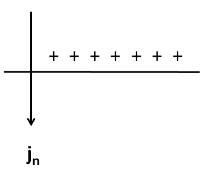

.. _maxwell2_dc_interface_conditions:

Interface Conditions
====================

.. _charge_buildup_at_boundaries: 

Charge Buildup at Boundaries
----------------------------

Consider the situation in the figure below, at a boundary between two media
with different conductivities but both with dielectric permittivity
:math:`\varepsilon = \varepsilon_0`.

.. image:: ../images/boundryChargeBuildup.PNG
   :scale: 75 %
   :align: center
   
We will show how charge buildup occurs at such an interface using conservation
of charge, Ohm's law and the interface condition on the normal component of
electric displacement. Recall the integral equation expressing conservation of
charge

.. math::
    \int_A \mathbf{j} \cdot da =  - \frac{d}{dt} \int_V \rho dv = - \frac{dQ}{dt}. 
    :label: charge_conservation_integral

In steady state, :math:`dQ/dt = 0`. Taking the surface of integration as our
standard Gaussian pillbox (see boundary conditions page), the integral can be
evaluated as

.. math::
    (\mathbf{j}_2-\mathbf{j}_1)\cdot\hat{\mathbf{n}} &= 0\
    j_{2n} &= j_{1n}. 
    :label: JnCont

where :math:`j_{1n}` and :math:`j_{2n}` are the normal components of current
density on either side of the interface. So we see that direct current is
continuous across material interfaces. If we assume, linear, isotropic earth
materials, we can apply Ohm's law (:math:`\mathbf{j}_f = \sigma\mathbf{e}`) to
this equation, yielding

.. math::
    \sigma_2\mathbf{e}_{2n} &= \sigma_1\mathbf{e}_{1n}.
    :label: ohmsLawCurCont

Since we assume that both materials have dielectric permittivity
:math:`\varepsilon = \varepsilon_0`, we can write the interface condition on
the normal component of electric displacement in terms of the electric field

.. math::
    \mathbf{e}_{2n}-\mathbf{e}_{1n}\ &= \frac{\tau_f}{\varepsilon_0},
    :label: Ebound
   
where :math:`\tau_f` is the free surface charge density on the boundary. 

combining the two previous equations we can express the charge buildup in
terms of the ratio of the two conductivities

.. math::
    \frac{\tau_f}{\varepsilon_0} &= \Big(\frac{\sigma_1}{\sigma_2}-1\Big)\mathbf{e}_{1n}.
    :label: chargeBuildup

In the case where current is flowing from a resistive layer to a more
conductive layer (i.e. :math:`\sigma_2 > \sigma_1`),

.. image:: ../images/resOnTop.PNG
   :scale: 75 %
   :align: center

.. math:: 
    \sigma_1 < \sigma_2 \implies \tau_f <0

.. image:: ../images/negChargeBuildup.PNG
   :scale: 75 %
   :align: center

We get a buildup of negative charges on the boundary, and in the case where
flow is from a resistive layer to a conductive layer (i.e. :math:`\sigma_1 >
\sigma_2`)

.. image:: ../images/condOnTop.PNG
   :scale: 75 %
   :align: center

.. math:: 
    \sigma_1 > \sigma_2 \implies \tau_f >0

We get a buildup of positive charges on the boundary.
