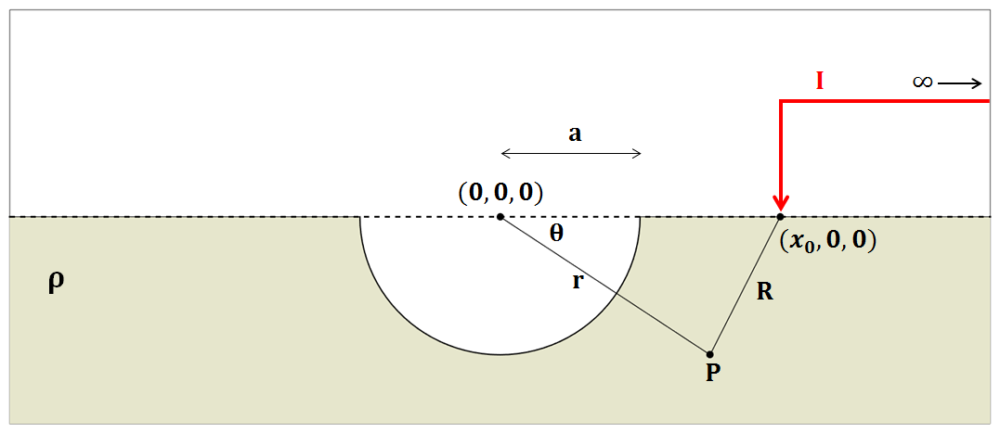
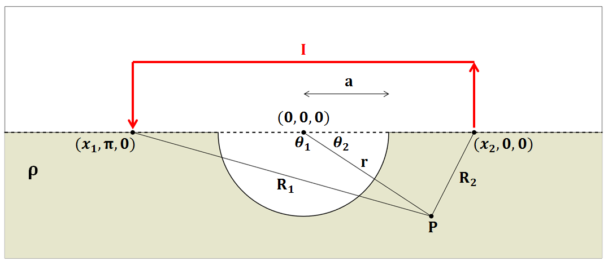
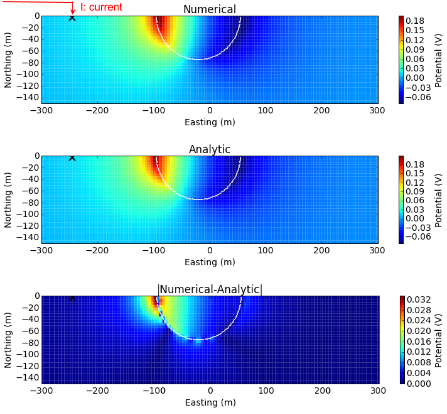
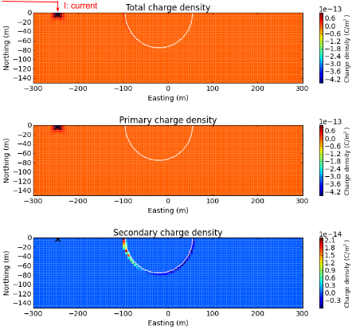

.. _effects_of_topography:

Effects of Topography
=====================

For this derivation, we will examine the effects of negative
topography by considering a hemispherical depression in the Earth’s
surface.

This builds upon the solution for :ref:`point_current_source_and_sphere`. By setting the resistivity of the sphere to infinity, and by exploiting the
symmetry, the solution for a
hemispherical depression within a halfspace is presented.

.. _effects_of_topography_electric_potential_hemispherical_depression:

Electric Potential Across a Hemispherical Depression in a Conducting Half-Space
-------------------------------------------------------------------------------

Here, we consider the electric scalar potential at :math:`P`, which
results from the injection of current near a hemispherical depression of
radius :math:`a`, centered at (:math:`0,0,0`). According to Telford, so
long as current is being injected along the axis of symmetry shown in :numref:`SphericalDepression_PoleDipole`,
and :math:`x_0>a`, we can obtain our solution from Eq. :eq:`Potential_Sphere_Pole_HemisphereDepression_Halfspace` by
replacing :math:`4\pi` with :math:`2\pi`; replacement of the constant is
done because all current flows entirely through the ground. By setting
:math:`\rho_1 = \infty`, the potential created by the injection of
current :math:`I` at (:math:`x_0,0,0`) is:

.. math::
   \phi (r, \theta, \phi) = \frac{I\rho}{2 \pi} \Bigg [ \frac{1}{R} + \sum_{n=0}^\infty \frac{a^{2n+1}}{\big (x_0 \, r \big )^{n+1}} \Bigg ( \frac{n}{n+1} \Bigg ) P_n \big ( cos \theta \big ) \Bigg ]
   :label: Potential_Sphere_Pole_HemisphereDepression_Halfspace

   Diagram showing the setup for computing the potential due to a halfspace with a hemispherical depression with a pole source.

Recall that at this point, :math:`x_0` is the radial distance from the
origin, within a spherical coordinate system relative to the axis of
symmetry. Using Eq. :eq:`Potential_Sphere_Dipole_HemisphereDepression_Halfspace`
however, we can solve the problem in :numref:`SphericalDepression_DipoleDipole`,
where a current of :math:`I` is being injected at :math:`(x_1,\pi,0`)
and a current of :math:`-I` is being injected at (:math:`x_2,0,0`):

.. math::
   \begin{split}
   \phi (r , \theta, \phi) &= \phi_{+} + \phi_{\, -}\\
   &= \frac{\rho I}{2 \pi} \Bigg [ \frac{1}{R_1} - \frac{1}{R_2} + \sum_{n=0}^\infty \Bigg ( \frac{n}{n+1} \Bigg ) \Bigg ( \frac{a^{2n+1}  P_n \big ( cos \theta_1 \big ) }{\big (x_1 \, r \big )^{n+1}} -  \frac{a^{2n+1}  P_n \big ( cos \theta_2 \big ) }{\big (x_2 \, r \big )^{n+1}} \Bigg ) \Bigg ]
   \end{split}
   :label: Potential_Sphere_Dipole_HemisphereDepression_Halfspace

where, by the cosine law:

.. math:: R_1 = \sqrt{x_1^2 + r^2 - 2r x_1 cos \theta_1 \;}

and

.. math:: R_2 = \sqrt{x_2^2 + r^2 - 2rx_2 cos \theta_2 \;}

It is important to note that Eq. :eq:`Potential_Sphere_Dipole_HemisphereDepression_Halfspace`
is only possible if current is being
injected along the axis of symmetry. In addition, :math:`\theta` refers
an azimuthal angle relative the axis of symmetry, whereas
:math:`\theta_1` and :math:`\theta_2` are strictly angles related to the
trigonometry of the problem.

   Diagram showing the setup for computing the potential due to a halfspace with a hemispherical depression with a dipole source.

.. _effects_of_topography_examples:

Examples
--------

Using the depressed hemi-sphere solution for DC problem, we want to identify effects of topography in terms of two aspects:

- Numerical accuracy of 3D DC forward modelling algorithm (UBC DCIP3D)
- Understanding charge-build up and corresponding electrical fields

First item is important since we use this forward modelleing algorithm for the
inversion of DC data. If this topographic effect is not accurately computed,
then this will generate artifacts in the recovered resistivity model. In
addition, if the numerical and analytic solution show a compatible match, this
will provide with us cross-checks for both numerical and analytic solutions.

.. note::

   There can be errors on derived analytic solutions!

Without a physical understanding of electromagnetic fields in the earth, the
proper use of EM geophysics is difficult, thus it is important to develop a
thorough understanding of electromagnetic theory. To investigate effects only
due to topography, we subtract the primary potential (:math:`\phi^p =
\frac{I\rho}{2\pi R}`) from the total potential, :math:`\phi`  which yields
the secondary potential (:math:`\phi^s`):

.. math::

   \phi^s = \phi - \phi^p

By taking the gradient, then the electric field :math:`\bf{e}` and total
charge density (:math:`\rho_T`) can be computed using equations below:

.. math::
   \bf{e}=-\nabla \phi
   :label: elec

.. math::
   \rho_T = \epsilon_0 \nabla \cdot \bf{e}
   :label: charg

Observations of total, primary, and secondary electric fields and charge
density will provide us with a comprehensive understanding of topographic
effects in the DC problem.

.. _effects_of_topography_numerical_validations:

Numerical validations
*********************

.. figure:: ../images/resismodel.png
   :align: center
   :name: resismodel

   Section view of 3D resistivity model for depressed hemi-sphere.

The above resistivity model shows a depressed hemisphere model. The
resistivity of the depressed hemi-sphere is set to :math:`10^8` ohm-m (close
to infinity) to simulate air, and the half-space is set to and :math:`10^3`
ohm-m.  To compute potentials from the above depressed hemi-sphere model, we
first use numerical solutions using DCIP3D code :cite:`oldenburg1994`. Then to check the
accuracy of our numerical algorithm we use analytic solution of a sphere
problem that we derived in Section :ref:`effects_of_topography_electric_potential_hemispherical_depression`. If you want to see  the numerical code used for evaluating the analytic solution See `DC sphere code`_. To
proceed with this validation, we consider a pole transmitter injected in the
ground. In the above figure, injected current source location is shown.

.. _DC sphere code: https://github.com/ubcgif/em_examples/blob/master/em_examples/DCsphere.py

For numerical computations, a 3D mesh with 5 m core cells is used. We compute
potentials in every cells in the 3D domain. Top and middle panels of the below
figure shows computed numerical and analytic potentials, respectively. White
lines delineate the boundary of the depressed hemi-sphere. The bottom panel of
below figure shows relative error, and blank region close to the source has
errors greater than 10 percent. Even at the boundary of the hemi-sphere, we
have less than 4 percent error. This is a reasonable accuracy considering that
our noise level is roughly 10 percent for the DC problem. This shows our
numerical solution has a capability to accurately compute those topographic
effects, although our choice of discretization is clearly important.

.. figure:: ../images/ComparisonTotFine.png
   :align: center
   :name: ComparisonTotFine

   Comparisons of numerical and analytic total potentials with topography. White line depicts the boundary of the depressed hemisphere.

For a more careful observation, we provide a similar comparison for the
secondary potential in 3D space. The top, middle and bottom panels of the
below figure correspondingly show numerical, analytic, and absolute errors of
secondary potentials. The maximum error occurs at the hemi-sphere boundary
close to the current source, but it is less than 20 percent.

   Comparisons of numerical and analytic secondary potentials with topography. White line depicts the boundary of the depressed hemisphere.

Interpretations
***************

Using Eqs. :eq:`elec` and :eq:`charg`, we can compute both electric fields and
charge density in 3D. First, we consider charge density. The below figure
shows total, primary, and secondary charge densities. From the total and
primary charge densities (top and middle panels), we clearly see secondary
charge build-up due to the topographic effects is difficult to be recognized
because of positive charges due to the input current. The secondary charge
density clearly shows the topographic effects. Positive and negative charges
are built up on  the left side of the depressed hemi-sphere, closest to the
input current. Since the air region are act as an insulator, all positive
charge cannot pass through this hemi-sphere region and accumulated on the left
side closer to the input current. The magnitude of negative charge build-up on
the right side is much smaller than the positive charge on the other side.
These positive and negative charges will generate electric fields based on
Coulomb's law (See Section :ref:`gauss_electric_equivalence_to_coulombs_law`).

   Section views of total (top panel), primary (middle panel), and secondary (bottom panel) charge densities.

A rule of thumb for understanding electric fields from charges is:

.. note::

   The electric field is coming out from a positive charge and coming into negative charge.

Based on the above principle, first imagine how electric fields are going to
be distributed in 3D, then check your conjecture with the figure below, which
shows total, primary, and secondary electric fields. From the total electric
field shown in the top panel, we recognize that the dominant electric field is
due to injected current, although we can recognize the distortion of electric
fields due to charge build-up at the hemi-spherical boundary. By subtracting
the primary from the total electric field we obtain a secondary electric field
as shown in the bottom panel. Outside of the hemi-sphere, the electric field
is dipolar in shape, while inside the hemi-sphere, the electric fields flow
straight from the positive to negative charges.

.. figure:: ../images/ComparisonSecFineEfield.png
   :align: center
   :name: ComparisonSecFineEfield

   Section views of total (top panel), primary (middle panel), and secondary (bottom panel) electric fields.

