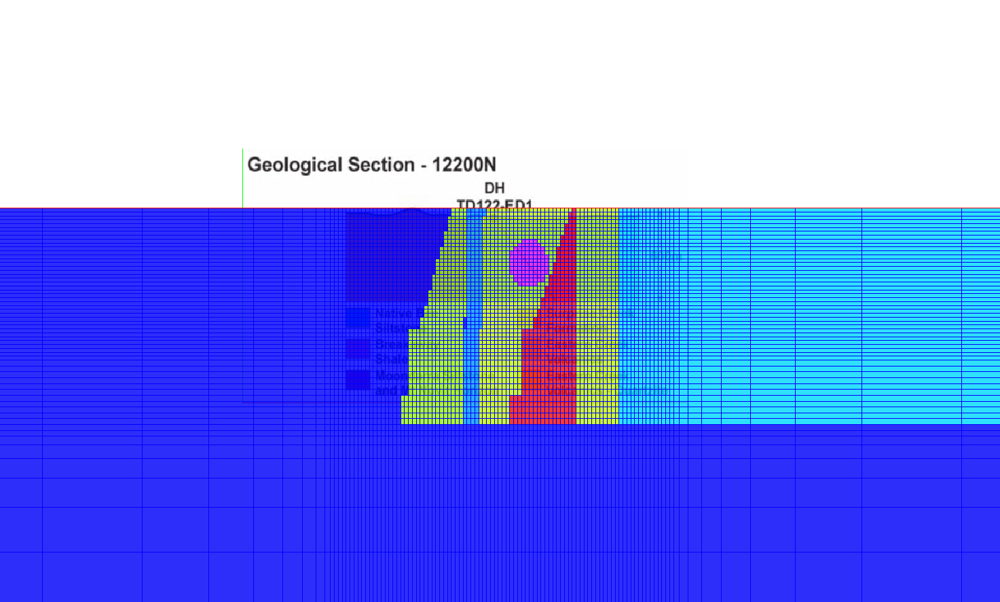

.. _Forward_Modelling:

DC Forward Modelling
====================

A DC resistivity survey is ultimately an electromagnetic phenomenon and is therefore governed by Maxwell's equations. However, the fact that the ground is energized with a time invariant direct current allows us to use a much simpler model. 

Deriving the DC Equations
-------------------------

[Insert Derivation of Div(sigma grad(phi)) equation
 Include analytic formula for the potential due to arbitrary source
 receiver geometry over a homogeneous half-space]

Boundary Conditions
--------------------------

[Content to come]

Discretization
--------------------------

For an arbitrary conductivity model, equation xx cannot be solved exactly. In order to simulate a geophysical survey over an earth with a complicated conductivity distribution we need to solve an approximate discrete form of equation xx. Equation 4 

The equation can be discretized directly using, for example, standard finite difference, finite element, or finite volume methods[need reference]. However if we use a mimetic discretization of the full Maxwell equations, we can derive a discretization of the DC equation from the discrete Maxwell equations. For a brief discussion of the discretization of Maxwell's equation, see the section :ref:`Maxwell_Discretization` on this website.Our notation follows that page.

The discrete potential field condition is :math:`\tilde{\mathbf{e}} = \mathbf{G}\tilde{\phi}`. Substituting that into the discrete time-domain quasi-static Ampere equation gives

.. math::
  \mathbf{C}^T \mathbf{M}_{\mu^{-1}}^f \tilde{\mathbf{b}} - \mathbf{M}_{\sigma}^e\mathbf{G}\tilde{\phi} = \tilde{\mathbf{s}}.
  
where the tilde symbol denotes a grid function. Using the fact that the discrete divergence operator is equal to :math:`-\mathbf{G}^T`, we take the discrete divergence of Ampere's law to get 

.. math::
  -\mathbf{G}^T\boldsymbol{\nabla \times} \mu^{-1} \tilde{\mathbf{b}} - \mathbf{G}^T\mathbf{M}_{\sigma}^e\mathbf{G}\tilde{\phi} = \tilde{\mathbf{s}}.
  :label: divAmpere

Our discretization preserves the identity :math:`\boldsymbol{\nabla\cdot}\left(\boldsymbol{\nabla\times}\mathbf{b}\right) = 0` so we can throw away the first term of equation :eq:`divAmpere` to get the discrete DC potential equation

.. math::
  \mathbf{G}^T\mathbf{M}_{\sigma}^e\mathbf{G} \tilde{\phi} = -\mathbf{G}^T\tilde{\mathbf{s}}.
  :label: DCresDiscrete

Two-Dimensional Modelling Examples
----------------------------------

We applied 2D forward modelling to a synthetic model based on a geological section from the Mt. Isa prospect. A 2D geological section from a paper was pasted onto a mesh of rectangular cells

  
  Geological section pasted onto 2D modelling mesh.

We solved a 2D version of equation :eq:`DCresDiscrete` to compute the potential on the nodes of our mesh. We can compute synthetic data by differencing the potential at surface nodes and visualize it in pseudosection form. Note that
pseudosections do not represent the true geology. Note how the two pseudosections below differ significantly depending on whether the data is collected from west to east or east to west. Here is an example for a single pole source

.. figure:: Pseudo_PDP_East.gif

  Data for pole moving east to west.
  
.. figure:: Pseudo_PDP_West.gif

  Data for pole moving west to east.

We can also visualize where current flows and where charge buildup occurs for a single pole source:

.. figure:: Efield.gif

  Current density (top figure) and charge density (bottom figure).
  