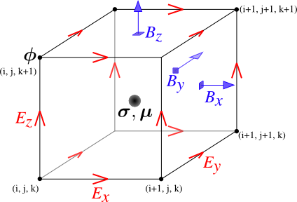

.. _Maxwell_Discretization:

A (very) brief introduction to solving Maxwell's equations on a computer
------------------------------------------------------------------------

Maxwell's equations can only be solved exactly for a few special cases where the conductivity model (and possibly the source-receiver geometry) has some special structure and symmetry. To model an arbitrary geophysical survey over an earth with topography and arbitrary conductivity, approximate methods that can be implemented in a computer are required. These methods are known as discretizations of Maxwell's equations because they break the earth into a set of discrete volumes, or cells, with the physical properties held constant in each cell. 

It is possible to construct a discretization based on either the integral or differential form of Maxwell's equations in the time and frequency domains. For simplicity, we will restrict this discussion to discretizations of the differential form of Maxwell's equations in the frequency domain. 

Discrete approximations of Maxwell's equations used in geophysical prospecting fall into three general categories based on the complexity of earth model they can represent. The simplest discretizations assume that conductivity varies only with depth but not laterally. The subsurface can then be divided into a set of flat layers, with physical properties constant in each layer.

One may model a much larger class of geoelectric structures by assuming that conductivity may vary with depth and in one lateral direction. This is known as 2D modelling and requires dividing a two-dimensional (2D) section of the earth into a set of discrete polygons, usually rectangles or triangles. This provides a compromise between the computational difficulty of full three-dimensional (3D) modelling and the limitations of 1D modelling. Of course, to model the most complex terrain and conductivity variation, 3D modelling is required. In 3D modelling the earth is divided into a set of discrete volumes, usually cuboids or tetrahedra, with physical properties constant in each cell. These three types of earth models, with their increasing complexity, are illustrated in figure 1.

.. figure:: ./images/1-2-3.png 

  Visualization of 1D, 2D, and 3D discretizations.

1D modelling methods write the electric and magnetic fields due to a source above a layered earth in terms of `Hankel transform <https://en.wikipedia.org/wiki/Hankel_transform>`_ integrals that are evaluated approximately. Two and three dimensional frequency domain discretizations transform Maxwell's equations into a system of linear algebraic equations for the electric field or magnetic flux density at discrete points in space, at a single frequency. In all these methods there is a tradeoff between solution accuracy and computational complexity. A finer mesh will lead to a more accurate solution but also to a larger linear system that must be solved to compute the fields or fluxes.

Now let us restrict our attention to three dimensions. There are several ways to discretize Maxwell's equations in 3D, including finite difference, finite element and finite volume approaches. Here we consider a mimetic finite volume approach applied to a uniform grid. For a full description see chapters 3 and 4 of [1]_. Consider Faraday's law and the quasi-static Ampere's law in the frequency domain

.. math::
  \boldsymbol{\nabla\times}\mathbf{E} = -i\omega\mathbf{B}
  :label: FaradayAnal
  
.. math::
  \boldsymbol{\nabla\times}\mu^{-1}\mathbf{B} - \sigma\mathbf{E} = \mathbf{J}_s,
  :label: AmpereAnal

where :math:`\mathbf{J}_s` is the source current density and currents flowing in the ground are represented using Ohm's law, :math:`\mathbf{J}_{\text{ground}} = \sigma\mathbf{E}`. Almost all discretizations of Maxwell's equations used in geophysical prospecting apply the quasi-static approximation, meaning that they ignore the electric displacement term :math:`-i\omega\mathbf{D}` in :ref:`Ampere's law <ampere_maxwell>`. In broad terms, ignoring displacement is justified when the area of interest is smaller than the source wavelength. See [2]_ for more information.

We divide the earth into a grid of cubic cells. The edges of the grid are aligned with the axes of a cartesian coordinate system, as shown in figure 12. The x-directed component of the electric field is discretely represented by it's values at the centre of cell edges that point in the x-direction. The y and z components of the electric field are similarly represented at the centres of the y and z-directed cell edges. In the parlance of partial differential equations, we say that :math:`\mathbf{E}` is discretized on the cell edges. The magnetic flux density :math:`\mathbf{b}` is discretized at the centres of cell faces. When electrical potential is considered (in electrostatic problems) it is discretized at cell corners, called the mesh nodes.

  Cubic cell with :math:`\mathbf{E}` discretized onto cell edges, :math:`\mathbf{b}` onto cell faces, and physical properties onto cell centres. Electrical potential :math:`\phi` is discretized onto the mesh nodes.

By constructing discrete approximations to the differential operators in equations :eq:`FaradayAnal` and :eq:`AmpereAnal`, we can construct a system of equations to solve for the electric field at the cell edges and/or the magnetic flux at cell faces. The discrete versions of equations are :eq:`FaradayAnal` and :eq:`AmpereAnal`

.. math::
  \mathbf{C} \tilde{\mathbf{E}} -i\omega\tilde{\mathbf{B}} = 0
  :label: FarDiscrete
  
.. math::
  \mathbf{C}^T \mathbf{M}_{\mu^{-1}}^f \tilde{\mathbf{B}} - \mathbf{M}_{\sigma}^e\tilde{\mathbf{E}} = \tilde{\mathbf{s}},
  :label: AmpDiscrete
  
where:

 - \\( \\mathbf{C} \\) is the discrete curl operator (all discrete operators are sparse matrices)
 - \\( \\mathbf{M}_{\\sigma}^e \\) contains information on the discrete conductivity
 - \\( \\mathbf{M}_{\\mu}^f \\) contains information on the discrete magnetic permeability
 - \\( \\tilde{\\mathbf{E}} \\) is a vector containing the approximate electric field at each cell edge
 - \\( \\tilde{\\mathbf{B}} \\) is a vector containing the approximate magnetic flux at each cell face.
 - \\( \\tilde{\\mathbf{s}} \\) is a vector containing an approximation of the source discretized onto the cell edges.

We can now combine equations :eq:`FarDiscrete` and :eq:`AmpDiscrete` and use the methods of sparse linear algebra to solve a large system of equations to determine :math:`\tilde{\mathbf{e}}` and :math:`\tilde{\mathbf{b}}` simultaneously. We can also combine the two equations to form two smaller systems of equations to solve for :math:`\tilde{\mathbf{e}}` and :math:`\tilde{\mathbf{b}}` independently.
 
References
----------

.. [1] Haber, Eldad. Computational Methods in Geophysical Electromagnetics. Society for Industrial and Applied Mathematics, Philadelphia, 2015.

.. [2] Ward, Stanley H. and Gerald W. Hohmann. Electromagnetic Theory for Geophysical Applications. In Electromagnetic Methods in Applied Geophysics, Volume 1. Ed. Misac N. Nabighian. Society of Exploration Geophysicists, Tulsa, 1988.
