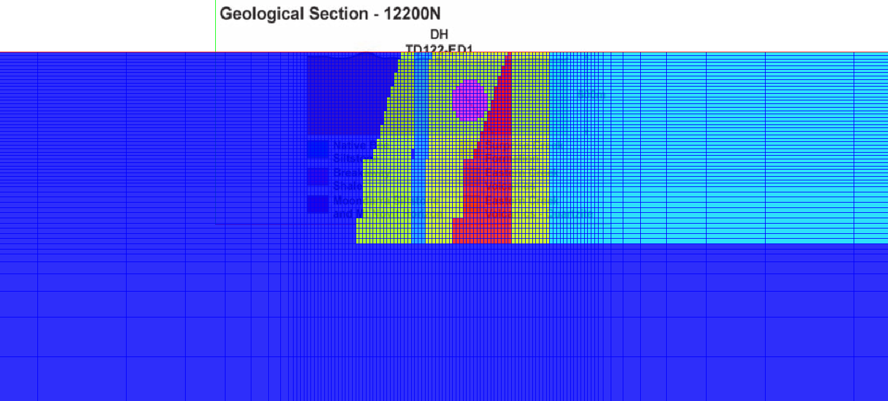
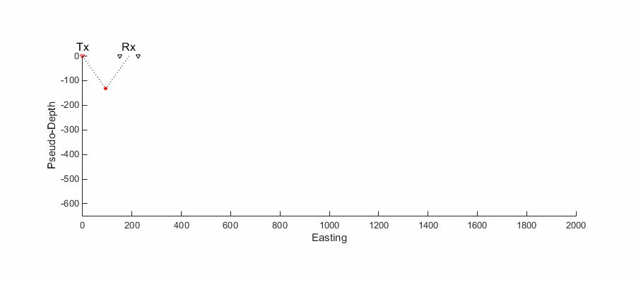
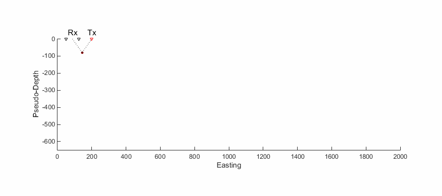

.. _Mt_Isa_case_study:

Mt Isa Case Study
=================

We applied 2D forward modelling to a synthetic model based on a geological
section from the Mt. Isa prospect. A 2D geological section from [insert link
to the paper once we figure out how it's going to be introduced in the
resource] was pasted onto a mesh of rectangular cells as shown in the
following figure.

  
  Geological section pasted onto 2D modelling mesh.

The conductivities of each unit were given in the case study paper. We solved
a 2D version of equation :eq:`DCresDiscrete` using a single pole source to
compute the potential on the nodes of our mesh. To compute synthetic dipole
receiver data we assume that the poles of the receiver lie on surface mesh
nodes and take the difference in computed potential between those nodes. The
data can then be visualized in pseudosection form. Note that pseudosections do
not represent the true geology. This is illustrated in the two pseudosections
below. In the first, data was collected from west to east (left to right on
the page) and in the second data was collected from east to west. We can see
that the data differ significantly depending on the survey direction.

  Data for pole moving east to west.
  

  Data for pole moving west to east.

Using 2D forward modelling, we can also visualize where current flows and
where charge buildup occurs in our single pole source experiment. The
interactive figure below shows how current flows through the earth for a given
source location. Note in particular how current is channelled into the
conductive circular unit and away from the steeply dipping resistive units. We
can also clearly see charge buildup occuring at the interfaces between units.

.. raw:: html
  :file: ./images/Isa_Current.html

Current density (arrows) and charge density (color) for a range of source
locations (Powered by: `SimPEG <http://www.simpeg.xyz/>`_).
