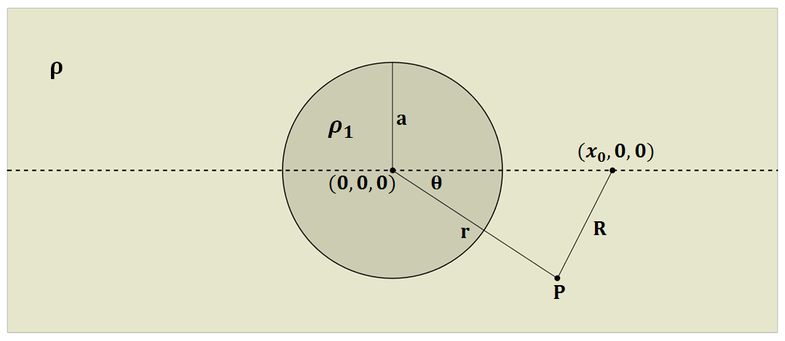
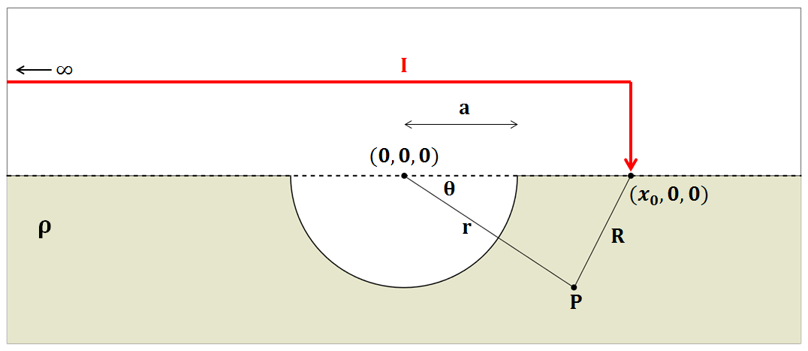
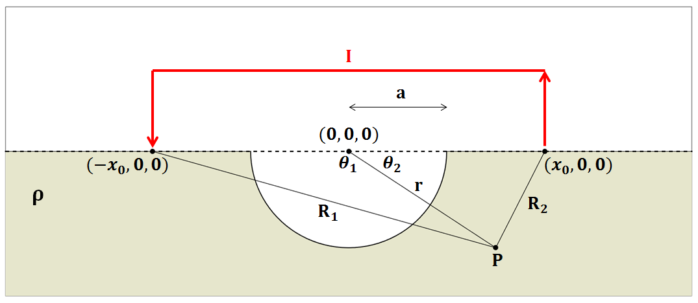

=================================================
Effects of Topography: A Hemispherical Depression
=================================================

Introduction
============

| For this derivation, we will examine the effects of negative
topography by considering a hemispherical depression in the Earth’s
surface. This will be done in 4 steps:
| 1) We will begin by presenting a solution for the electric scalar
potential, within a wholespace defined of resistivity :math:`\rho`, due
to a point current source. This solution will then be re-expressed in
the coordinate system which characterizes our final problem.
| 2) The solution for a conducting sphere within a wholespace is then
presented.
| 3) By exploiting the symmetry of the previous solution, we will obtain
the solution for a hemispherical conductive body within a halfspace. Our
final solution is obtained by setting the resistivity of the
hemispherical depression to infinity.

Electric Potential from a Current Source within a Wholespace
============================================================

Let us consider the case where an electrical current :math:`I` is being
injected into a wholespace with resistivity :math:`\rho`, at location
\\( (x,y,z) = (x_0,0,0) \\). Assuming the medium is lossless,
this results in a current density :math:`J` which flows radially
outwards from the source, with magnitude:

.. math:: J = \frac{I}{4 \pi R^2}

|SphericalDepression_Wholespace|

where :math:`R` is the distance from the source to a point of measure
:math:`P`, and :math:`4 \pi R^2` is the area of a ball centered at the
source. Because our problem is electrostatic,
:math:`\vec E = - \nabla \psi` according to Faraday’s law. The scalar
electric potential :math:`\psi` can be obtained by integrating the
electric field from :math:`R` to :math:`\infty`. By substituting Ohm’s
law (:math:`\vec E = \rho \vec J`) into the path integral:

.. math:: \psi = - \int_R^\infty \vec E \cdot d\vec l = - \int_R^\infty \frac{\rho I}{4 \pi r^2} dr = \frac{\rho I}{4\pi R}

For reasons which will becomes apparent in the next section, we would
like to re-express :math:`\psi` in terms of a radial coordinate system
(:math:`r,\theta,\phi`), centered at (:math:`x,y,z`) = (0,0,0). By using
the cosine law:

.. math:: R = \sqrt{x_0^2 + r^2 - 2rx_0 cos \theta \;}

For solutions where :math:`r<x_0`, :math:`1/R` can be split into a sum
of spherical harmonic modes using the binomial theorem:

.. math::

   \begin{aligned}
   \frac{1}{R} &= \frac{1}{x_0} \Bigg [ 1 + \Bigg ( \frac{r}{x_0} \Bigg )^2 - 2 \frac{r}{x_0} cos \theta \Bigg ]^{-1/2} \\
   &= \frac{1}{x_0} \Bigg [ 1 + \frac{r}{x_0}cos \theta + \Bigg ( \frac{r}{x_0} \Bigg )^2 \Bigg ( \frac{3}{2} cos^2 \theta - \frac{1}{2} \Bigg ) + \; \dotsb \; \Bigg ] \\
   &= \frac{1}{x_0} \sum_{n=0}^\infty \Bigg ( \frac{r}{x_0} \Bigg )^n P_n \big (cos \theta \big )\end{aligned}
   \label{eq:RSol1}

where :math:`P_n \big (cos \theta \big )` is the Legendre polynomial of
order :math:`n`. Because Legendre polynomials have magnitudes less than
unity for :math:`n>0`, and :math:`r<x_0`, the infinite series in Eq.
([eq:RSol1]) is bounded and converges as :math:`n \rightarrow \infty`. A
similar approach for :math:`r < x_0` can be expressed as follows:

.. math::

   \begin{aligned}
   \frac{1}{R} &= \frac{1}{r} \Bigg [ 1 + \Bigg ( \frac{x_0}{r} \Bigg )^2 - 2 \frac{x_0}{r} cos \theta \Bigg ]^{-1/2} \\
   &= \frac{1}{r} \Bigg [ 1 + \frac{x_0}{r}cos \theta + \Bigg ( \frac{x_0}{r} \Bigg )^2 \Bigg ( \frac{3}{2} cos^2 \theta - \frac{1}{2} \Bigg ) + \; \dotsb \; \Bigg ] \\
   &= \frac{1}{r} \sum_{n=0}^\infty \Bigg ( \frac{x_0}{r} \Bigg )^n P_n \big ( cos \theta \big )\end{aligned}
   \label{eq:RSol2}

Similar to Eq. :eq:`eq:RSol1`, since :math:`x_0<r`, the infinite series in
Eq. ([eq:RSol2]) is also boundary and conveges as
:math:`n\rightarrow\infty`. Therefore using Eqs. ([eq:RSol1]) and
([eq:RSol2]), the electric scalar potential :math:`\psi` can be
expressed as an infinite sum of spherical harmonic modes, where:

.. math::

   \psi = \frac{I\rho}{4 \pi} \sum_{n=0}^\infty \frac{r^n \, P_n \big (cos \theta \big )}{x_0^{n+1}} \; \; \; \textrm{for} \; \; \; r<x_0
   \label{eq:PsiWholespace1}

and

.. math::

   \psi = \frac{I\rho}{4 \pi} \sum_{n=0}^\infty \frac{x_0^n \, P_n \big (cos \theta \big )}{r^{n+1}} \; \; \; \textrm{for} \; \; \; x_0<r
   \label{eq:PsiWholespace2}

Unfortunately, this method cannot be used to find a bounded and
convergent series for :math:`r=x_0`.

Electric Potential for a Conducting Sphere in a Wholespace
==========================================================

Let us now consider the electrical scalar potential at :math:`P` in the
presence of a conducting sphere of radius :math:`a` and resistivity
:math:`\rho_1`, centered at the origin. Once again, a current of
:math:`I` is injected at (:math:`r,\theta ,\phi`) = (:math:`x_0,0,0`).
Due to the radial symmetry of the problem,
:math:`\partial /\partial \phi = 0`. Away from the source, the electric
field is divergence free. As a result, :math:`\psi` can be expressed in
terms of the following 2d Poisson’s equation:

.. math::

   \nabla^2 \psi = \frac{1}{r} \frac{\partial }{\partial r} \big ( r^2 \big ) \frac{\partial \psi}{\partial r} + \frac{1}{r^2 sin \theta} \frac{\partial}{\partial \theta}
   \Bigg ( sin \theta \frac{\partial \psi}{\partial \theta} \Bigg ) = 0
   \label{eq:PoissonEq2d}

The boundary conditions for our problem state that :math:`\psi`, and
current flow normal to the sphere’s surface, are continuous at
:math:`r=a`. Therefore:

.. math::

   \psi = \psi_1 \; \; \; \textrm{and} \; \; \; \frac{1}{\rho} \frac{\partial \psi}{\partial r} = \frac{1}{\rho_1} \frac{\partial \psi_1}{\partial r} \; \; \; \textrm{at} \; \; \; r=a
   \label{eq:BoundaryConditions}

For a source which is outside the sphere (:math:`a < x_0`), the desired
solution for the potential is:

.. math::

   \psi = \frac{I \rho}{4\pi R} + \sum_{n=0}^\infty A_n \frac{1}{r^{n+1}} P_n \big ( cos \theta \big ) \; \; \; \textrm{for} \; \; \; r>a
   \label{eq:PsiSolAn}

and

.. math::

   \psi_1 = \sum_{n=0}^\infty B_n r^n P_n \big ( cos \theta \big ) \; \; \; \textrm{for} \; \; \; r<a
   \label{eq:Psi1SolBn}

This makes sense considering :math:`1/r` terms within the sphere would
be infinite as :math:`r \rightarrow 0`, and :math:`r` terms outside the
sphere would be infinite as :math:`r \rightarrow \infty`. Because
Legendre polynomials can be used to form an orthogonal set of basis
functions, coefficients :math:`A_n` and :math:`B_n` may be determined
independently for each :math:`n`. Using locations :math:`r<x_0`, Eq.
([eq:PsiWholespace1]) can be substituted into Eq. ([eq:PsiSolAn]). This
can be use to solve Eq. ([eq:PoissonEq2d]), using boundary conditions
from ([eq:BoundaryConditions]) for each harmonic mode :math:`n`. The
resulting coefficients are given by:

.. math:: A_n = \frac{I \rho}{4\pi} \Bigg ( \frac{a^{2n+1}}{x_0^{n+1}} \Bigg ) \Bigg ( \frac{n \big ( \rho_1 - \rho \big )}{n\rho + \big (n+1 \big )\rho_1} \Bigg )

and

.. math:: B_n = \frac{I\rho}{4\pi} \Bigg ( \frac{1}{x_0^{n+1}} \Bigg ) \Bigg ( \frac{\big ( 2n+1 \big )\rho_1}{n\rho + \big ( n+1 \big )\rho_1} \Bigg )

Therefore, the electric scalar potential observed outside the sphere is
equal to:

.. math:: \psi = \frac{I\rho}{4 \pi} \Bigg [ \frac{1}{R} +  \sum_{n=0}^\infty \frac{a^{2n+1}}{\big (x_0 \, r \big )^{n+1}} \Bigg ( \frac{n \big ( \rho_1 - \rho \big )}{n\rho + \big (n+1 \big )\rho_1} \Bigg ) P_n \big ( cos \theta \big ) \Bigg ]

Eq. [] can be split into two terms: the potential for a wholespace from
Eq. [], and an anomalous potential which results from the exstence of a
conducting sphere.

|SphericalDepression_Sphere|

Electric Potential Across a Hemispherical Depression in a Conducting Half-Space
===============================================================================

Here, we consider the electric scalar potential at :math:`P`, which
results from the injection of current near a hemispherical depression of
radius :math:`a`, centered at (:math:`0,0,0`). According to Telfor, so
long as current is being injected along the axis of symmetry shown in
Fig. [], and :math:`|x_0|>a`, we can obtain our solution from Eq. [] by
replacing :math:`4\pi` with :math:`2\pi`; replacement of the constant is
done because all current flows entirely through the ground. By setting
:math:`\rho_1 = \infty`, the potential created by the injection of
current :math:`I` at (:math:`x_0,0,0`) is:

.. math:: \psi = \frac{I\rho}{2 \pi} \Bigg [ \frac{1}{R} + \sum_{n=0}^\infty \frac{a^{2n+1}}{\big (x_0 \, r \big )^{n+1}} \Bigg ( \frac{n}{n+1} \Bigg ) P_n \big ( cos \theta \big ) \Bigg ]

|SphericalDepression_PoleDipole|

Using Eq. [], we can solve the problem in Fig. [], where a current of
:math:`I` is being injected at :math:`(-x_0,0,0`) and a current of
:math:`-I` is being injected at (:math:`x_0,0,0`).

.. math:: \psi = \psi_{+} + \psi_{\, -} = \frac{\rho I}{2 \pi} \Bigg [ \frac{1}{R_1} - \frac{1}{R_2} + \sum_{n=0}^\infty \frac{a^{2n+1}}{\big (x_0 \, r \big )^{n+1}} \Bigg ( \frac{n}{n+1} \Bigg ) \Big [ P_n \big ( cos \theta_1 \big ) - P_n \big ( cos \theta_2 \big ) \Big ] \Bigg ]

where, by the cosine law:

.. math:: R_1 = \sqrt{x_0^2 + r^2 - 2rx_0 cos \theta_1 \;}

and

.. math:: R_2 = \sqrt{x_0^2 + r^2 - 2rx_0 cos \theta_2 \;}

|SphericalDepression_DipoleDipole|

.. |SphericalDepression_Wholespace| image:: ./figures/SphericalDepression_Wholespace.png

