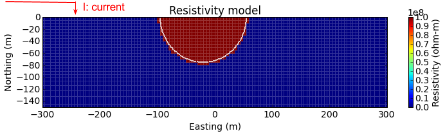
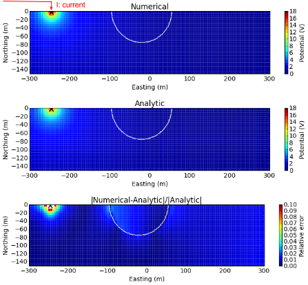
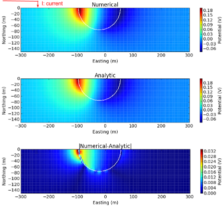
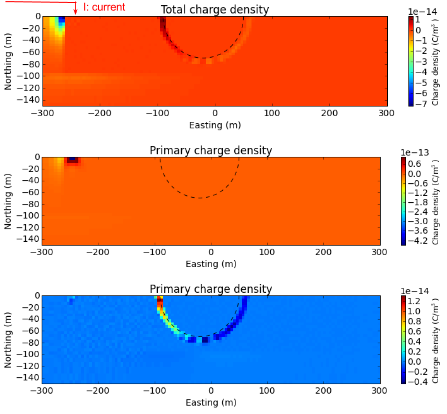
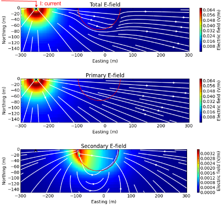

============================================
Effects of topography: Numerical experiments
============================================

Using the depressed hemi-sphere solution for DC problem, we want to identify
effects of topography in terms of two aspects:

- Numerical accuracy of 3D DC forward modelling algorithm (UBC DCIP3D)
- Understanding charge-build up and correspoding electrical fields 

First item is important since we use this forward modelleing algorithm for the
inversion of DC data. If this topographic effect is not accurately computed,
then this will generate artefacts in the recovered resistivity model. In
addition, if numerical and analytic solution show compatible match, this will
provide us cross-checks for both numerical and analytic solutions.

.. note::

   There can be errors on derived analytic solutions!

Without physical understanding of electromagnetic fields in the earth, proper
use of EM geophysics is difficult thus, second item is always crucial. To
investigate effects only due to topography, we subtract primary potential
(:math:`\psi^p = \frac{I\rho}{2\pi R}`) from total potential, :math:`\psi`
which yields secondary potential (:math:`\psi^s`):

.. math::

   \psi^s = \psi - \psi^p

By taking gradient, then electric field :math:`\vec{e}` and total charge
density (:math:`\rho_T`) can be computed using below equations:

.. math::
   \vec{e}=-\nabla \phi    
   :label: elec

.. math::
   \rho_T = \epsilon_0 \nabla \cdot \vec{e}
   :label: charg

Observations of total, primary, and secondary electric field and charge
density will provide us comprehensive understanding of topographic effects in
DC problem.

Numerical validations
=====================

   Section view of 3D resistivity model for depressed hemi-sphere. 

Above resistivity model show depressed hemisphere model. Resistivity of the
depressed hemi-sphere is set to :math:`10^8` ohm-m (close to infinity) to
simulate air, that of half-space is set to and :math:`10^3` ohm-m.  To compute
potential from above depressed hemi-sphere model, we first use numerical
solutions using DCIP3D code (CITE). Then to check the accuracy of our
numerical algorithm we use analytic solution of a sphere problem that we
derived in Section :ref:`effecttopo_theory`. For numerical evaluation of that
analytic solution we use :ref:`effecttopo_code`. To proceed this validation,
we consider a pole transmitter injected to the ground. In above figure
injected current source location is shown.

For numerical comptuation, 3D mesh with 5 m core cell size is used. We compute
potentials in every cells in 3D domain. Top and middle panels of below figure
shows computed numerical and analytici potentials, respectively. White lines
delineate boundary of the depressed hemi-sphere. Bottom panel of below figure
shows relative error, and blank region close to the source has errors greater
than 10 percent. Even at the boundary of hemi-sphere, we have less than 4
percent. This is a reasonable accuracy considering that our noise level is
roughly about 10 percent for DC problem. This shows our numerical solution has
a capability to accurately compute those topographic effects, although our
choice of discretization should be effective.

   Comparisons of numerical and analytic total potentials with topography (depressed hemisphere).

For more careful observation, we provide similar comparison for secondary
potential in 3D space. Top, middle and bottom panels of below figure
correspondingly show numerical, analytic, and absolute errors of secondary
potentials. Maximum error occurs at hemi-sphere boundary close to the current
source, but it is less than 20 percent.

   Comparisons of numerical and analytic secondary potentials with topography (depressed hemisphere).   

Interpretations
===============

Using Eqs. :eq:`elec` and :eq:`charg`, we can compute both electric field and
charge density in 3D. First, we consdier charge density. Below figure shows
total, primary, and secondary charge densities. From total and primary charge
densities (top and second panels), we clearly see positive charge due to input
current, although charge build-up due to topography is difficult to be
recognized. Secondary charge density clearly shows topographic effects.
Positive and negative charges are built up on the left and right sides of the
hemi-sphere, respectively. Since air region will act as an insulator, all
postive charge cannot pass through this hemi-sphere region and accumulated on
the left side closer to the input current. Magnitude of negative charge build-
up on right side is much smaller than postive charge on the other side. These
postive and negative charges will generate electric field based on Coulomb's
law (Link).

   Section views of total (top panel), primary (middle panel), and secondary (bottom panel) charge densities.

A rule of thumb to expect electric field from charges is:

.. note::

   Electric field is coming out from postive charge and coming into negative charge. 

Based on above principle, first imagine how electric fields are going to be
distributed in 3D, then check your conjecture with below figure, which shows
total, primary, and secondary electric fields. From total electric field shown
in the top panel, we reconize dominant electric field due to injected current,
although we can recognize distortion of electric fields due to charge build-up
at hemi-spherical boundry. By subtracting primary from total electric field we
obtain secondary electric field as shown in the bottom panel. At outside of
the hemi-sphere, electric field shows dipolar-shape, while at inside electric
fields straightly flow from positive to negative charges.

   Section views of total (top panel), primary (middle panel), and secondary (bottom panel) electric fields. 

