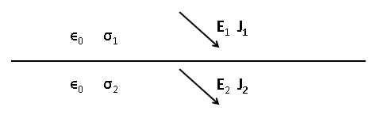
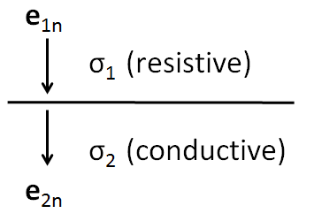
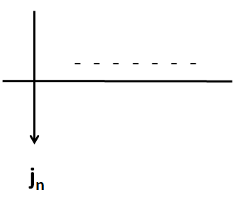
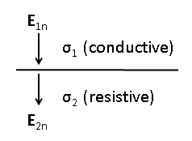

.. _bc_for_dc:

Boundary Conditions for Potentials
----------------------------------

Electric potential (:math:`\psi`) is defined

.. math::
		\mathbf{E} = \boldsymbol{\nabla\cdot}\psi
		:label: potentialDef

We know that electric potential is continuous at a boundary  :math:`\psi_1 = \psi_2` (Daniel:  From where do we know this?? Can you include a reference, please?). To determine the relation for the normal derivative of the potential across a boundary, we start from the continuity of the normal component of the current density (see equation (12))

.. math::
		\mathbf{J}_{2n} = \mathbf{J}_{1n},
		:label: curCont

Applying Ohm's law, (see equation (5)), to the previous expression we obtain

.. math::
		\sigma_2\mathbf{E}_{2n} = \sigma_1\mathbf{E}_{1n}.
		:label: aux1

Now, from the definition of electric potential (see equation (13)) and using this definition in equation (14), gives us the relation of the normal derivative of the potential across a boundary between two regions with different properties.

.. math::
		\sigma_2\frac{\partial \psi_2}{\partial n} &= \sigma_1\frac{\partial \psi_1}{\partial n}.
		:label: potDerivRelation

Charge Buildup at a Boundary
----------------------------

If we have a boundary between two media with different conductivities, as in the figure below  

then from the arguments presented in the previous section, we can determin the buildup of charges on boundaries between regions with differing conductivities. Starting from the continuity of the normal component of the current density (see equation (12))

.. math::
		\mathbf{J}_{2n} &= \mathbf{J}_{1n},\\
		:label: curCont

and using Ohm's law, (see equation (5)) we get

.. math::
		\sigma_2\mathbf{E}_{2n} &= \sigma_1\mathbf{E}_{1n}.
		:label: ohmsLawCurCont

Then, using to boundry conditions for the electric field (see equation (10)) we get

.. math::
		\mathbf{E}_{2n}-\mathbf{E}_{1n}\ &= \frac{\tau_f}{\varepsilon_0}.
		:label: Ebound

Solving the system made by (18) and (19), we get

.. math::
		\mathbf{E}_{2n} &= \frac{\sigma_1}{\sigma_2}\mathbf{E}_{1n}\quad\text{from (18)}\\
		\text{into (19)}\quad \Big(\frac{\sigma_1}{\sigma_2}-1\Big)\mathbf{E}_{1n} &= \frac{\tau_f}{\varepsilon_0}\\
		\frac{\tau_f}{\varepsilon_0} &= \Big(\frac{\sigma_1}{\sigma_2}-1\Big)\mathbf{E}_{1n}.
		:label: chargeBuildup

Which quantifies the charge buildup on a boundary. So in case 1, were the resistive layer is on top i.e. :math:`\sigma_1 < \sigma_2`

.. math:: 
		\sigma_1 < \sigma_2 \implies \tau_f <0

We get a buildup of negative charges on the boundary, and in case 2, were the resistive layer is on top i.e. :math:`\sigma_1 > \sigma_2` 

.. math:: 
		\sigma_1 > \sigma_2 \implies \tau_f >0

.. image:: images/posChargeBuildup.PNG
   :scale: 75 %
   :align: center

We get a buildup of positive charges on the boundary.
