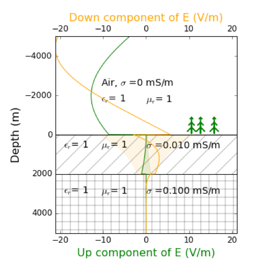

.. _MT_N_layered_Earth:

Response of a layered Earth to a plane wave
===========================================

.. topic:: Purpose

    We present here a 1D modelisation of the MagnetoTelluric waves in a layered Earth and the associated geophysical data. Our goal is to build better representation of the different physical phenomenons and better understanding of the resulting data.

.. raw:: html
    :file: ./images/movieMT_time.html

Introduction
------------

We present here a 1D modelisation of the MagnetoTelluric waves in a layered Earth and the associated geophysical data. Our goal is to build better representation of the different physical phenomenons and better understanding of the resulting data. This work follows the derivation presented in :cite:`ward1988` and is supported by interactive apps developed in a `binder`_.

 .. image:: http://mybinder.org/badge.svg 
    :target: http://mybinder.org/repo/ubcgif/em_examples/notebooks/geophysical_surveys/MT_N_Layered_Earth/MT_n_layered_earth_example.ipynb
    :align: center

.. _binder: http://mybinder.org/repo/ubcgif/em_examples/notebooks/geophysical_surveys/MT_N_Layered_Earth/MT_n_layered_earth_example.ipynb

MagnetoTelluric is a widely used method, especially for imaging geothermy. Its ability to image deep structure, up to several kilometers depth, is unique in EM geophysics. It is a passive method that use waves generated mostly in the Earth's Atmosphere. High frequencies are mainly produced by lightning strikes all around the globe, travelling through the Earth's Ionosphere that acts as a waveguide. Low Frequencies waves are produced through the interaction of the Earth's Ionosphere with solar wind and Earth's magnetic field.

In MagnetoTellurics problems, the key diagnosed physical property is :ref:`electrical conductivity<electrical_conductivity_index>` :math:`\sigma`, as we expect the contrasts of the others physical properties to be negligible. 

Setup
-----

 .. figure:: images/MT_N_layered_Earth-1.hires.png
    :align: center
    :scale: 50% 
    :name: MTlayeredEarth

    1D general Earth Model Configuration

An example of a 1D MagnetoTelluric modelisation, with a 2-layers Earth, is shown in the movie above, where we have:

 - a layered Earth, each layer with its own physical properties :math:`\sigma, \varepsilon, \mu`

 - a plane wave traveling along the axis Z coming from air, composed of an electric field :math:`\mathbf{E_x}` and a magnetic field :math:`\mathbf{H_y}`. These are the fields we will be measuring with our geophysical instruments at the surface to obtain information from the underground

We can see that several phenomenons are occuring. Just to mention few of them:

 - the incoming wave (down component) is reflected at the surface

 - once in the ground we observe a diffusive effect of the Earth on the wave that will regulate the depth of investigation and the resolution of the survey. The decay is more important in the second layer with a higher conductivity

 - :math:`\mathbf{E_x}` and  :math:`\mathbf{H_y}` are continuous and phased compared to each other

Governing Equations
-------------------

The governing equation for MagnetoTellurics problem can be obtained from
:ref:`Maxwell's equations <maxwell1_fundamentals_index>`. We start with :ref:`Faraday's law<faraday>` and :ref:`Ampere's law<ampere_maxwell>`:

.. math::
    \nabla \times \mathbf{E_x} = - i \omega \mu \mathbf{H_y}
    :label: Faraday
    
.. math::
    \nabla \times \mathbf{H_y} = (\sigma + i \omega \varepsilon) \mathbf{E_x}
    :label: Ampere

Knowing that the divergent of **E** and **H** are equal to 0 here (no free charge)
according to :ref:`Gauss's Law for Electric Fields<gauss_electric>` and :ref:`Gauss's Law for Magnetic Fields<gauss_magnetic_frequency>`, we can combine the equations to write the Helmhotz (wave propagation) equation for both **E** and **B** field:

.. math::
    \nabla ^2  \mathbf{E_x} + k^2 \mathbf{E_x} = 0
    :label: E_wave_propagation_equation

.. math::
    \nabla ^2 \mathbf{H_y} + k^2 \mathbf{H_y} = 0
    :label: H_wave_propagation_equation

with k the wavenumber:

.. math::
    k = \sqrt{\omega ^2 \mu \varepsilon - i \omega \mu \sigma }
    :label: kwavenumber

In the ground, we usually assume that the displacement current is negligible, which means :math:`\sigma >> \omega \varepsilon`. In this case 

.. math::
    k_{ground} \simeq (1-i) \sqrt{ \frac{\omega \mu \sigma}{2} }
    :label: kwavenumber_steadystate

In the air, the conductivity is almost 0

.. math::
    k_{air} \simeq \omega \sqrt{ \mu_0 \varepsilon_0}
    :label: kwavenumber_air

Taking the problem from the point of view of the electric field, we know the equation :eq:`E_wave_propagation_equation` has a solution in the form of:

.. math::
    E_x (z) = U e^{i k z} + D e^{-i k z}
    :label: Electric field components
    
.. math::
    H_y (z) = \frac{(\nabla \times \mathbf{E_x})_y}{- i \omega \mu} = \frac{k}{ \omega \mu} (D e^{-i k z} - U e^{i k z}) = \frac{1}{Z} (D e^{-i k z} - U e^{i k z})
    :label: Magnetic field components

with :math:`\mathbf{E_x} = E_x \mathbf{\hat{x}}`  and U and D are the complex amplitudes of the Up and Down components of the field and Z the intrinsic impedance of the space.

Writing the solution in the j-th layer (See :numref:`MTlayeredEarth`), we got:

 .. math::
    E_{x,j} (z) = U_j e^{i k (z-z_{j-1})} + D_j e^{-i k (z-z_{j-1})}
    :label: Electric field components in layers
    
 .. math::
    H_{y,j} (z) = \frac{1}{Z_j} (D_j e^{-i k (z-z_{j-1})} - U_j e^{i k (z-z_{j-1})})
    :label: Magnetic field components in layers

Which can be rewrite as:

 .. math::
    \left(\begin{matrix} E_{x,j} \\ H_{y,j} \end{matrix} \right) = \left(\begin{matrix} 1 & 1 \\ -\frac{1}{Z_j} & \frac{1}{Z_j} \end{matrix} \right) \left(\begin{matrix} U_j \\ D_j \end{matrix} \right) 
    = P_j \left(\begin{matrix} U_j \\ D_j \end{matrix} \right)
    :label: Propagation matrix 

The transition of the Up and Down component inside a layer can then be write as such

 .. figure:: images/InsideLayer.png
    :align: center
    :scale: 100% 
    :name: InsideLayer

    Transition inside a layer, variables definition.

.. math::
    \left(\begin{matrix} U_j' \\ D_j' \end{matrix} \right)  = \left(\begin{matrix} e^{i k h_j} & 0 \\ 0 & e^{-i k h_j} \end{matrix} \right) \left(\begin{matrix} U_j \\ D_j \end{matrix} \right) 
    = T_j \left(\begin{matrix} U_j \\ D_j \end{matrix} \right) 

With the variables U, D, U' and D' define as in (:numref:`InsideLayer`)

Using the continuity of the tangential \\(\\mathbf{E_x}\\) and \\(\\mathbf{H_y}\\) field at the interfaces, we find an iterative relation between the fields in consecutive layers:

.. math::
    \left(\begin{matrix} E_{x,j} \\ H_{y,j} \end{matrix} \right) = P_j T_j P^{-1}_J \left(\begin{matrix} E_{x,j+1} \\ H_{y,j+1} \end{matrix} \right)

We are now only missing a Boundary Condition to be able to compute our MT forward modeling. A reasonable one is to set the Down Amplitude to 1 and the Up Amplitude to 0 in the last layer, as there is no reflection from an other interface below.

.. math::
    \left(\begin{matrix} U_n \\ D_n \end{matrix} \right)  = \left(\begin{matrix} 0 \\ 1 \end{matrix} \right) 

Building Intuition for MT problems
----------------------------------

Skin Depth and Depth of investigation
*************************************

 .. figure:: images/SkinDepth_MT.png
    :align: right
    :scale: 50% 
    :name: SkinDepth_MT

    Depth of investigation in MT

Take the amplitude of the incident component of the electric wave, :math:`E_{x} (z) =  D e^{Im(k) z}`.

The skin depth :math:`\delta` is defined as the depth where the signal has decayed to a factor :math:`\frac{1}{e}(\simeq` 36%).
 
.. math::
    e^{-i Im(k) \delta} = \frac{1}{e}
 
.. math::
    \delta = \sqrt{ \frac{2}{\omega \mu \sigma}} \simeq \frac{500}{\sqrt{\sigma f}}
    :label: Skin Depth

We see the skin depth is highly dependent on both the frequency of our signal and the conductivity of the Earth material. In air , the conductivity is almost 0, so we do not notice important decreased of the electromagnetic wave. In the ground, this is different.
 - the more conductive, the faster the decay is. MT can see very deep in resistive environment.
 - The lower the frequency, the slower the decay is. Lowest frequencies sample the deepest structures while high frequencies bring information on shallower structures.

 In :numref:`SkinDepth_MT` and in the movie, we can see that even at very high frequency (20000 Hz), MT is still a deep exploration method in resistive environment (:math:`10^{-5} S/m`) with a skin depth of about 1125m. Skin Depth is often use as an estimator for the depth of investigation of a survey.

Reflection and Transmission Coefficients
****************************************

 Reflection at 
 interface

.. figure :: images/Reflection_Efield.png 
 :align: right
 :scale: 50% 
 :name: Reflection_Efield

 Notations for 
 reflection

Let define at the j-th interface :math:`(E^i ; H^i)` as the incident waves, :math:`(E^r ; H^r)` as the refleted wave and :math:`(E^t ; H^t)` as the transmitted wave into the ground (:numref:`Reflection_Efield`) 

Using the :ref:`interface conditions<interface_conditions>` for the tangential components of the electric, we can write:

.. math::
    E^i + E^r = E^t
    :label: Continuity of E

And same for the magnetic fields

.. math::
    H^i + H^r = H^t
    :label: Continuity of H

Using :ref:`Faraday's law<faraday>`, assuming variations in :math:`\mu` are negligible, we also obtain from equation :eq:`Continuity of H` :

.. math::
    k_j E^i - k_j E^r = k_{j+1} E^t
    :label: faraday continuity condition

Replacing the differents components of equation :eq:`faraday continuity condition` with equation :eq:`Continuity of E`, we obtain the reflection coefficient R and the transmission coefficient T:

.. math::
    R = \frac{E^r}{E^i} = \frac{k_j - k_{j+1}}{k_j + k_{j+1}}
    :label: Reflection Coefficient

.. math::
    T = \frac{E^t}{E^i} = \frac{2 k_j}{k_j + k_{j+1}}
    :label: Transmission Coefficient

Refraction angle
****************

Field Acquisition
-----------------

In MT, the source is unknown but we are avoiding the problem by measuring the ratio of the fields. usually at the surface. We define an apparent impedance

.. math::
    \hat{Z_{xy}} = \frac{E_x}{H_y}
    :label: Apparent Impedance Definition

Notice this is a complex number, with a norm and an angle.

Impendance tensor
*****************

Data
----

 .. figure:: images/MTdata.PNG
    :align: right
    :scale: 70% 
    :name: MTdata

    MT data for a 2 layers Earth

Apparent Resistivity
********************

The apparent resistivity is obtained through the amplitude of the apparent Impedance :math:`\hat{Z_{xy}}`.

.. math::
    \rho_{app} = \frac{1}{\mu_0 \omega} |\hat{Z_{xy}}|^2
    :label: Apparent Resistivity Definition

For a half-space, :math:`\rho_{app} = \rho_{earth}` :

.. math::
    \hat{Z_{xy}} = \frac{\omega \mu}{k_{earth}} = (1+i) \sqrt{\frac{\omega \mu}{2 \sigma_{earth}}}

.. math::
    \rho_{app} = \frac{1}{\mu_0 \omega} |1+i|^2 \frac{\omega \mu}{2 \sigma_{earth}} = \rho_{earth}

For a unhomogeneous earth, :math:`\rho_{app}` at a particular frequency is an average of the conductivity of the earth on about a sphere with a radius equal to the skin depth.

Phase
*****

The phase is obtained through the angle of the apparent Impedance :math:`\hat{Z_{xy}}`.

.. math::
    \Theta =tan^{-1} \frac{Im(\hat{Z_{xy}})}{Re(\hat{Z_{xy}})}
    :label: Phase Definition

for a half-space,

.. math::
    \Theta = tan^{-1} \frac{Im({Z_{xy}})}{Re({Z_{xy}})} 
    = tan^{-1} 1
    = \frac{\pi}{4}

If :math:`\sigma` **increases** at depth, then :math:`\Theta` **increases** before returning to 45°

If :math:`\sigma` **decreases** at depth, then :math:`\Theta` **decreases** before returning to 45°

Survey Design
-------------

Interpretation
--------------

Pratical Consideration
----------------------

.. [1] Ward, S. H., & Hohmann, W. *Electromagnetic Theory for Geophysical Applications Applications.* In Electromagnetic methods in applied geophysics (1st ed., pp. 130–311). Society of Exploration Geophysicists. 1988.
