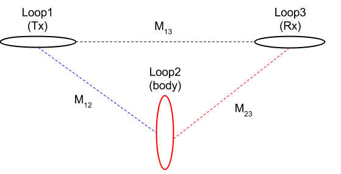

.. _derive_response_function:

Derivation of Response Function
===============================

Consider a simple equivalent circuit as shown in :numref:`Concepts_3loops_only`.

   Conceptual diagram for 3-loops system.

Let us suppose that alternating current, :math:`I_1 e^{\imath \omega t}` is made to flow in the Tx (Loop 1). This current generates an alternating magnetic field in the surrounding environment, which in turn induces an EMF both in the body (Loop 2) and the Rx (Loop 3). These EMFs are governed by Faraday's Law

.. math::
  \mathcal{E}_{j} = - M_{ij} \frac{d I_i}{dt},

where :math:`\mathcal{E}_j` is the EMF induced in one circuit by a current :math:`I_i` flowing in another if :math:`M_{ij}` is their mutual inductance.
The EMF induced in the Rx is therefore

.. math::

  \mathcal{E}^p_3 = -\imath \omega M_{13} I_1 e^{\imath\omega t}

and the EMF induced in the body is

.. math::
  \mathcal{E}_2 = -\imath \omega M_{12}I_1 e^{\imath\omega t}

We must add :math:`\mathcal{E}_2^{\dagger}`, the sum of the voltage drop across the resistance of the circuit and the back EMF generated by the self inductance when a current :math:`I_2 e^{\imath\omega t}`  flows around the body. For this we consider RL circuit as shown in :numref:`RLcircuit`.

.. figure:: ./images/RLcircuit.png
   :align: right
   :scale: 60%
   :name: RLcircuit

   Conceptual diagram of RL circuit.

The electrical impedance of the RL circuit can be written as

.. math::
    Z(\omega) = R + \imath \omega L,

where :math:`R` and :math:`L` indicate resistance and inductance, respecitvely.
Using Ohm's law we obtain

.. math::
    V(\omega) = \mathcal{E}_2 = I_2(\omega) Z(\omega).

To find the current :math:`I_2`, we observe that around any closed circuit the total EMF must vanish i.e.

.. math::
  \mathcal{E}_2 + \mathcal{E}^{\dagger}_2 = 0

and therefore

.. math::
  I_2 e^{\imath \omega t}
  = - \frac{\imath \omega M_{12}}{R + \imath \omega L} I_1 e^{\imath \omega t} \\
  =  - \frac{\imath \omega L/R}{ 1 + \imath \omega L/R} \frac{M_{12}I_1}{L} e^{\imath \omega t} \\

This is the solution for the eddy current induced in the body (Loop 2). However, we are interested only in the secondary magnetic field which this current produces, and particularly in the EMF which the field induces in the Rx (Loop 3).

.. math::
  \mathcal{E}^s_3 = -\imath \omega M_{23} I_2 e^{\imath \omega t}

In most cases the apparatus measures this anomalous voltage by comparing it with the EMF induced by the primary field in the absence of the circuit; that is, it measures :math:`\mathcal{E}_3^s / \mathcal{E}_3^p`. Thus the EM response of the buried loop, is given by

.. math::
  \frac{\mathcal{E}_3^s }{\mathcal{E}_3^p}
  = \frac{-\imath \omega M_{23} I_2 e^{\imath \omega t}}{-\imath \omega M_{13} I_1 e^{\imath\omega t}}
  = - \frac{M_{12}M_{23}}{M_{13}L} \Big[\frac{\imath \omega L/R}{ 1 + \imath \omega L/R} \Big] \\
  = C Q (\alpha)

The EM response is composed of two parts: coupling coefficent, C and reponse function, Q, whcih can be written as

.. math::
  C = - \frac{M_{12}M_{23}}{M_{13}L}

and

.. math::
  Q = \frac{\imath \omega L/R}{ 1 + \imath \omega L/R}

We can redefine this using time constant :math:`\tau = L/R`

.. math::
  Q = \frac{\imath\omega \tau}{1+\imath \omega \tau}

or by using induction number :math:`\alpha = \omega \tau`

.. math::
  Q = \frac{\imath \alpha}{1+\imath\alpha}

Consider complex response function, :math:`Q` as

.. math::
    Q = \frac{\imath \alpha}{1+\imath\alpha}
    = \frac{\imath \alpha(1-\imath\alpha)}{1+\alpha^2}
    = \frac{\alpha^2 + \imath \alpha}{1+\alpha^2}

- for :math:`\alpha \ll 1\rightarrow` :math:`Q\simeq\imath\alpha` so :math:`I(\omega) \approx -\imath \alpha` (in the resitive limit)
- for :math:`\alpha \gg 1\rightarrow` :math:`Q\simeq\imath\alpha` so :math:`I(\omega) \approx -1` (in the inductive limit)

:numref:`CmplxResp` shows real and imaginary component of :math:`Q`.

   Complex response function.

From similar derivation we could obtain

.. math::
  \frac{H_3^s }{H_3^p} =  C Q(\alpha),

where :math:`H` stands for the magnetic field. Therefore, the equality:

.. math::
  \frac{\mathcal{E}_3^s }{\mathcal{E}_3^p} = \frac{H_3^s }{H_3^p}

holds hence fields and voltages can be used interchangeably when measuring with a coil.

.. \alpha: induction number
.. \alpha = \omega \tau
.. \tau: time constant (L/R)
.. Diagram Re/Im;  plus names; quadrature, out-of-phase
.. Diagram (?? Amp-phase)
.. es/ep = Hs/Hp    so fields and voltages can be used interchangeably when measuring with a coil

.. The phase of the current, :math:`\theta_I` can be written as

.. .. math::
..     \theta_I = \theta_V - \theta_Z = -\frac{\pi}{2} - tan^{-1}\Big(\frac{\omega L}{R}\Big),
..     :label: PhaseI

.. where :math:`\theta_z=\Re[z] / \Im[z]` and :math:`\Re[z]` and :math:`\Im[z]` are real and imaginary part of a complex value :math:`z`.

.. Considering Faraday's law: :math:`V = -\imath\omega\Phi^p`, then recoginze factor of :math:`-\imath\omega`, which makes :math:`\frac{\pi}{2}` lag of phase in the induced current. And :math:`tan^{-1}(\frac{\omega L}{R})` lag of phase is induced by the Loop2.

.. So the phase of the current vary with frequency. At low frequencies the information about the conductor is in the quadrature (imaginary part) portion, at high frequencies it is in out-of-phase (real part) portion.
