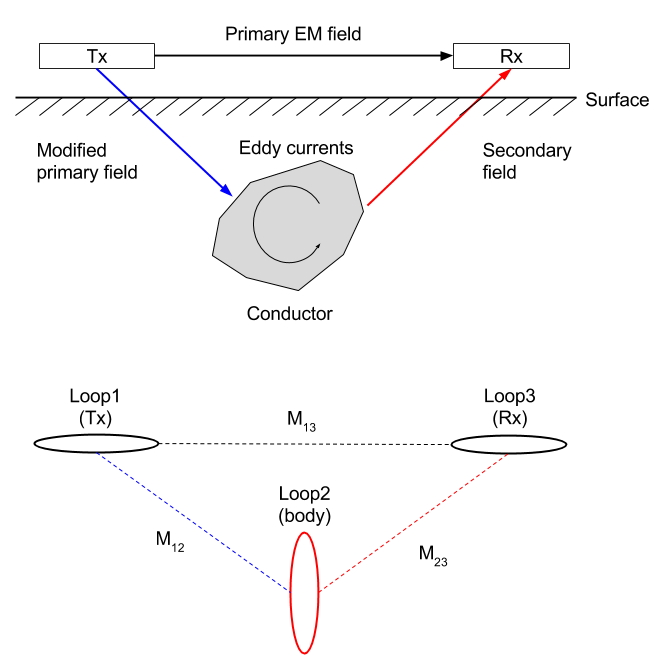
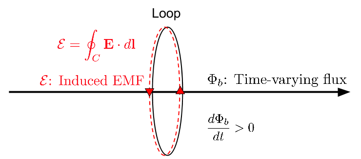

.. _emi_tuotorial_index:

Circuit Model for EM Induction
==============================

.. topic:: Purpose
  The basic principles for EM induction were outlined in CITExxx. Here we use an equivalent electric circuit model consisting of three loops to represent that process. We derive the  inductive response function in terms of circuits, mutual and self-inductance, and coupling. Widgets are developed to help physical understanding. The response functions for many  practical geophysical surveys resemble that from the circuit model and  hence much intuition about EM signals can be obtained using this analysis.

The basic EM  survey is shown in :numref:`Concepts_3loops`. The time varying magnetic field (referred to as the primary field) in the Tx induces currents in the conductor. Those currents produce a secondary field that can be recorded at the receiver.

   Conceptual diagrams for EM inductions. Top panel shows excitation of the conductor using induction, and botton panel shows corresponding 3-loops system.

From :ref:`faraday`, we establish the link between EMF (:math:`\mathcal{E}`, voltage), and time varying flux (:math:`\Phi_b`). Below diagram illustrates how EMF could be generated from time-varying flux (:math:`\mathcal{E}= - \frac{d \Phi_b}{dt}  = \imath \omega \Phi_b`). The EMF (voltage) produces a current in the loop.

The circuit model is now understood as follows:

- Loop 1: is the transmitter (Tx) . It has a time varying current (I1 e^iwt) and hence produces a time varying field everywhere in space.

- Loop 2: represents the conductive body. The time varying flux generates currents in the conductor (:math:`I_2 e^{\imath \omega t}`). These time varying currents produce a time varying field everywhere in space.

- Loop 3: is the receiver (Rx). The measured EMF, :math:`\mathcal{E}^t` is

  .. math::
    \mathcal{E}^t = \mathcal{E}^p +\mathcal{E}^s

  where superscripts refer respectively  to the total, primary, and  secondary fields.

Either numerically, or through instrumentation, it is possible to remove the primary field from the measurements. The important geophysical response is

.. math::
  \frac{\mathcal{E}^s}{\mathcal{E}^p} =  \frac{H^s}{H^p}  =   - \frac{M_{12} M_{23}}{M_{13}L_2} \frac{\alpha^2 + i \alpha}{1 + \alpha^2} \\ = CQ(\alpha),
  :label: l2

where :math:`C` is coupling coefficient.
In Eq. :eq:`l2`, :math:`M_{ij}` is the mutual inductance between loops :math:`i` and :math:`j`, :math:`L` is the self inductance of the target loop, :math:`Q` is the inductive response function. :math:`\alpha = \omega L/R`  is a dimensionless induction number.

The Response Function is a complex quantity and the real and imaginary parts (or in-phase and quadrature phase) look like below figure. The horizontal axis is the induction number.

.. plot::

    from SimPEG.EM.Analytics import Qfun
    import numpy as np
    import matplotlib.pyplot as plt
    L = 1.
    R = 2000.
    alpha = np.logspace(-3, 3, 100)
    alpha, Q = Qfun(R, L, None, alpha=alpha)
    fig = plt.figure(figsize=(5, 3))
    ax1 = plt.subplot(111)
    ax1.semilogx(alpha, Q.real, 'k', lw=3)
    ax1.semilogx(alpha, Q.imag, 'r', lw=3)
    ax1.grid(True)
    ax1.legend(("Real","Imaginary"), loc=2)
    ax1.set_xlabel("Induction number ($\\alpha$)")
    ax1.set_ylabel("Response function (Q)")
    plt.tight_layout()
    plt.show()

Eq. :eq:`l2` has two main components. :math:`C` is determined by geometry. :math:`Q` relates to the target body.

In the following pages we illustrate

.. - Derive the expression for the response function
.. - Explain self and mutual inductance
.. - Illustrate the concept of “coupling”
.. - Provide widgets to explore concepts

.. Either numerically, or through instrumentation, it is possible to remove the primary field from the measurements. The important geophysical response is
.. - Loop1: is the transmitter (Tx). It carries a current that produces an associated magnetic field. This magnetic field is called the primary field. For induction experiments the current in the transmitter varies with time and hence the magnetic field varies with time.

.. - Loop2: represents a conductive body. The  time varying magnetic field generates an  Electromotive Force (EMF) and hence a current in the conductor. These are called secondary currents. The generate secondary magnetic fields.

.. - Loop3: is the receiver (Rx): This measures **total** magnetic field which consists of the sum of the primary and secondary fields.

.. .. note::
.. 	Geophysical goal: remove the primary field from the measurements and interpret the data to find geometric information about the buried conductor.

.. Goals for this tutorial:

.. 	- Show how the above process can be explained in terms of and RL  electric circuits
.. 	- Derive and  understand the  inductive response function
.. 	- Introduce self- and mutual inductances
.. 	- Illustrate the concept of “coupling”
.. 	- Provide the final expression which encapsulated both coupling and induction responses.
.. 	- Provide an interactive widgets in which the above goals can be crystallized.
.. **Contents:**

.. toctree::
    :maxdepth: 1

    derive_response_function
    understanding_EMresponse
    understanding_response_widget
    amplitudeandphase

