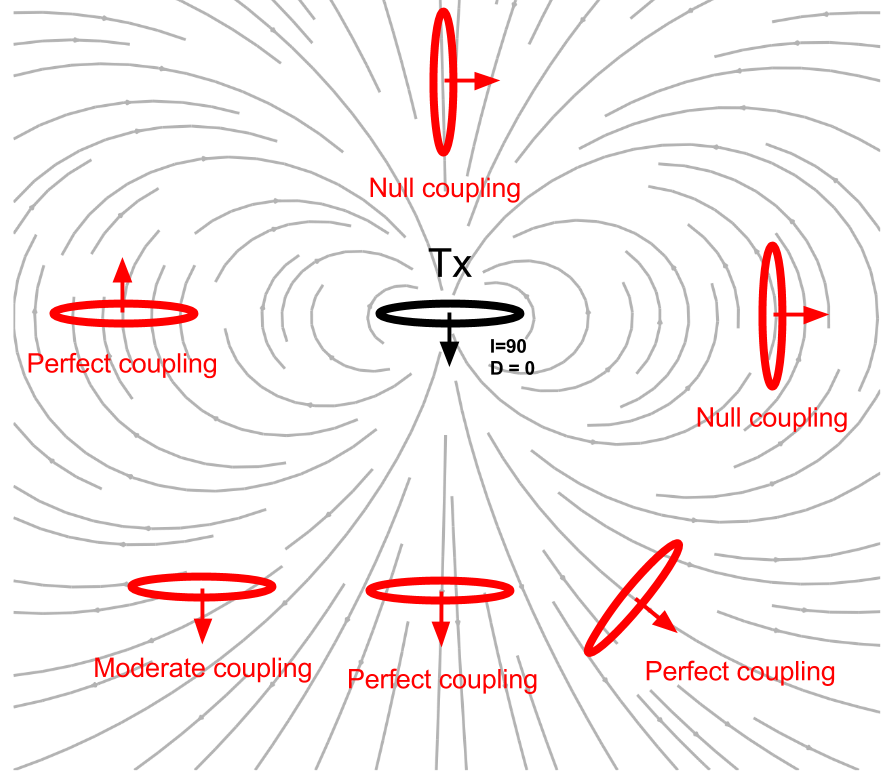
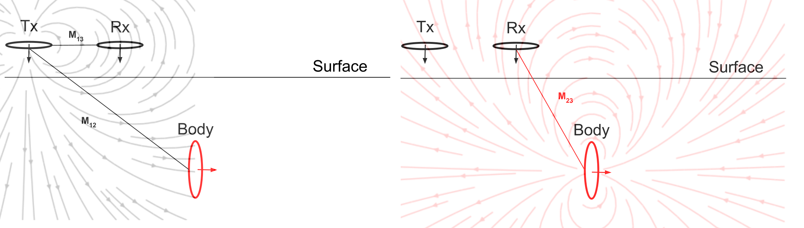
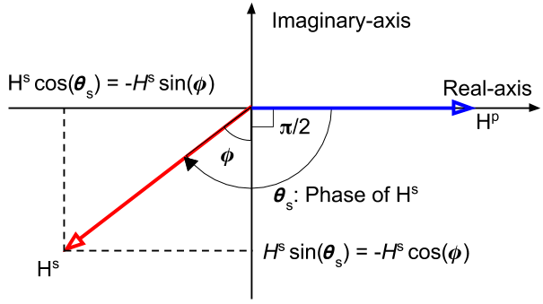

.. _understanding_harmonicEMresponse:

Understanding the Harmonic EM response
======================================

The EM response from a buried loop

.. math::
  \frac{H_3^s }{H_3^p}
  = \frac{\mathcal{E}_3^s }{\mathcal{E}_3^p}
  = - \frac{M_{12}M_{23}}{M_{13}L} \Big[\frac{\alpha^2 + \imath \alpha}{1+\alpha^2}\Big] \\
  = C Q (\alpha)

This expression has two parts. C depends upon geometry (coupling coefficient)
and Q depends only on the EM properties of the body.

	- Coupling coefficient: :math:`C`
	- Response function: :math:`Q`

Coupling coefficient
--------------------

The coupling coefficient can be written as

.. math::
	C = - \frac{M_{12}M_{23}}{M_{13}L},

where :math:`M_{ij}` stands for the mutual inductance between :math:`i` and
:math:`j` loops. Deriving mutual inductance is an essential step to understand
the coupling coefficient. The mutual inductance can be derived from the :ref
:`Biot-Savart law <biot_savart>`, which gives us the magnetic field. Assume we
are looking at two loops and the magnetic field due to the first loop is
:math:`\mathbf{B}_1` . We can calculate the flux :math:`\Phi_2` of this
magnetic field through the second loop as follows:

.. math::
        \Phi_2 = \int \mathbf{B}_1 \cdot da_2 = M_{12} I_1.
        :label: phi2

This flux is then equal the mutual inductance times the current. We can solve
for the mutual induction in a few more steps. Using Stokes' Theorem and the
vector potential of :math:`\mathbf{B}_1`, Equation :eq:`phi2` becomes a line
integral:

.. math::
        \Phi_2 = \int \mathbf{B}_1 \cdot da_2 = \int (\nabla \times \mathbf{A}_1) \cdot da_2 = \oint \mathbf{A}_1 \cdot dl_2,
        :label: phi22

where :math:`\mathbf{A}_1` is derived using the Biot-Savart law:

.. math::
        \mathbf{A}_1 = \frac{\mu_0 I_1}{4\pi} \oint \frac{dl_1}{\lvert \mathbf{r} - \mathbf{r'}\rvert^2}.
        :label: A1

By subbing Equation :eq:`A1` into :eq:`phi22`, we get the following integral
expression for the flux:

.. math::
        \Phi_2 = \frac{\mu_0 I_1}{4\pi} \oint \left ( \oint \frac{dl_1}{\lvert \mathbf{r} - \mathbf{r'}\rvert^2} \right ) \cdot dl_2.
        :label: phi23

We can then write the mutual inductance between two loops as:

.. math::
        M_{12} = \frac{\mu_0}{4\pi} \oint \oint \frac{dl_1 \cdot dl_2}{\lvert \mathbf{r} - \mathbf{r'}\rvert^2}.
        :label: m12

There are a few significant things about Equation :eq:`m12`:

.. note::
    - :math:`M_{12}` depends purely on geometry, such as the size, shape,
      and relative positions of the two loops
    - This expression does not change if we look at the flux in the first
      loop due to the second loop, meaning that :math:`M_{12} = M_{21}`.
      Therefore, following reciprocity staifies

    .. math::
        M_{12} = \frac{\Phi_2}{I_1} = \frac{\Phi_1}{I_2}.

Effects of coupling coefficient
*******************************

    Effects of coupling between loops. The orientation of the loops can be
    changed by adjusting the inclination `I` and the declination `D`.

Effects of the coupling coefficient (:math:`C`) changes mostly due to
orientation of the loops. We define orientation of a loop using inclination
(:math:`I`) and declination (:math:`D`) as shown in :numref:`CouplingEffects`.
For detailed definitions of inclination and declination see XXX. When the
orientation the Body loop is aligned with magnetic field line, better coupling
is created resulting in greater mutual inductance.

We consider a set up with the three loops: Tx, Rx, and body. Left panel of
:numref:`Couping_3loops` shows the primary field lines, and interaction
between Tx and Rx, and Tx and Body. As shown in the right panel of
:numref:`Couping_3loops`, in the body, secondary magnetic field is generated,
and it has the same direction to :math:`H^p_3` at Rx hence the EM response
(:math:`H^s_3 / H^p_3`) has positive sign.

This process can be explained by mutual inductance: :math:`M_{13}` will have
(-) because the primary field lines mostly goes up at Rx. Similarly
:math:`M_{12}` and :math:`M_{23}` have (+) and (-) signs, respectively.
Therefore, the sign of coupling coefficient will be positive. Note that not
only sign but also geometric decay is considered in the mutual inductance so
as in the coupling coefficient. The coupling coefficient among three loops
will change as Tx and Rx loow is moving along the surface.

Computed coupling coefficient along the line is shown below:

.. plot::

    from em_examples.EMcircuit import Mijfun, Cfun, Qfun
    import numpy as np
    import matplotlib.pyplot as plt
    L = 1.
    R = 2000.
    xc = 0.
    yc = 0.
    zc = 2.
    incl = 0.
    decl = 90.
    S = 4.
    ht = 0.
    f = 10000.
    xmin = -10.
    xmax = 10.
    dx = 0.25
    xp = np.linspace(xmin, xmax, 101)
    yp = xp.copy()
    zp = np.r_[-ht]
    xyz_profile = np.c_[xp, np.zeros_like(xp), np.ones_like(xp)*ht]
    c_profile, m12_profile, m23_profile, m13_profile = Cfun(L,R,xc,yc,zc,incl,decl,S,ht,f,xyz_profile)
    fig = plt.figure(figsize=(5,3))
    plt.plot(xp, c_profile, 'k', lw=2)
    plt.plot(xp, np.zeros_like(xp), 'k--', lw=1)
    plt.ticklabel_format(style='sci', axis='y', scilimits=(0,0))
    plt.xlabel("Mid point between Tx and Rx (m)")
    plt.ylabel("Coupling Coefficient")
    plt.grid()
    plt.tight_layout()
    plt.show()

Because the coupling coefficient is generally very small, the EM response, :math:`\frac{H^s_3}{H^{p}_3}` is small, regardless of the value of :math:`\alpha` [0, 1]. Often part per million (ppm) is used for the unit of this ratio.

.. So,  by solving Equation :eq:`m12` for the three mutual inductances for a three-loop system, we can analytically obtain the coupling coefficient allowing us to compute the EM data :math:`H^s / H^p` over different targets, using differing frequencies, loop orientations, and loop separations with the response function.

Response function
-----------------

The response function, :math:`Q` can be written as

.. math::
  Q = \frac{\alpha^2 + \imath \alpha}{1+\alpha^2}

Since :math:`Q` is complex-valued, we can express them as either real and
imaginary or ampliutde and phase.

.. plot::

    from em_examples.EMcircuit  import Qfun
    import numpy as np
    import matplotlib.pyplot as plt
    L = 1.
    R = 2000.
    alpha = np.logspace(-3, 3, 100)
    alpha, Q = Qfun(R, L, None, alpha=alpha)
    fig = plt.figure(figsize=(10, 3))
    ax1 = plt.subplot(121)
    ax2 = plt.subplot(122)
    ax2_1 = ax2.twinx()
    ax1.semilogx(alpha, Q.real, 'k', lw=3)
    ax1.semilogx(alpha, Q.imag, 'r', lw=3)
    ax1.grid(True)
    ax1.legend(("Real","Imaginary"), loc=2)
    ax1.set_xlabel("Induction number ($\\alpha$)")
    ax1.set_ylabel("Response function (Q)")
    ax2.semilogx(alpha, abs(Q), 'k', lw=3)
    ax2_1.semilogx(alpha, np.angle(Q, deg=True), 'r', lw=3)
    ax2.grid(True)
    ax2.set_ylabel("Amplitude |Q|")
    ax2_1.set_ylabel('Pahse (angle)', color='r')
    ax2.set_xlabel("Induction number ($\\alpha$)")
    for tl in ax2_1.get_yticklabels():
        tl.set_color('r')
    plt.tight_layout()
    plt.show()

Asymptotic
**********

We have obtained full expression of the EM response (:math:`H^s_3/H^p_3`),
which can be written as

.. math::

    \frac{H^s_3}{H^p_3} = - \frac{M_{12}M_{23}}{M_{13}L} \Big[\frac{\alpha^2 + \imath \alpha}{1+\alpha^2}\Big]

Obtaining asymptotic values of this EM response at small and large
:math:`\alpha` provides important physical features:

Resistive limit: when :math:`\alpha \ll 1`:
^^^^^^^^^^^^^^^^^^^^^^^^^^^^^^^^^^^^^^^^^^^
.. math::
    \frac{H^s_3}{H^p_3} \approx - \frac{M_{12}M_{23}}{M_{13}L} (\imath \alpha)

The EM response is purely imaginary-valued. The amount of current induced in
the body will also be small, and the secondary magnetic field will be
everywhere much smaller than the primary field. Therefore, each process of
induction(Rx from Tx, body from Tx, Rx from body) can be considered as quite
independently.

.. note::

    Within the resistive limit, it is reasonable to superpose EM response from
    multiple bodies.

Inductive limit: :math:`\alpha \gg 1`:
^^^^^^^^^^^^^^^^^^^^^^^^^^^^^^^^^^^^^^
.. math::
    \frac{H^s_3}{H^p_3} \approx - \frac{M_{12}M_{23}}{M_{13}L}

The EM response is purely real-valued, and only dependent of the coupling
coefficient. As :math:`\alpha` becomes larger, the secondary magnetic field
induced an EMF in the body which begins to become appreciable in relation to
that induced by the primary field. The phase angle of the current in the body,
and therefore the phase angle of the secondary magnetic field, must shift in
order that the net induced EMF and the resistive loss should exactly balance.
At the inductive limit, this balance virtually becomes equality between the
EMFs induced by the primary and by the secondary magnetic field in the body.
The induced current and the secondary magnetic field must therefore be in-
phase with, but in opposition to the primary field.

Phase
*****

The phase of :math:`\frac{H^s_3}{H^p_3}`, :math:`\theta_s` will be same as
that of :math:`Q(\omega)`, hence

.. math::
    \theta_s = - \frac{\pi}{2} - \phi,
    :label: phaseHs

where

.. math::
    \phi=tan^{-1}(\frac{\omega L}{R})=tan^{-1}(\alpha).
    :label: phaseHs_phi

   Phase diagram of secondary magnetic field (:math:`H^s`).

From above diagram and Eq. :eq:`phaseHs_phi`, it can be seen that:

.. note::

    - For a very good conductor: :math:`\alpha = \frac{\omega L}{R}
      \rightarrow \infty` and :math:`\phi \rightarrow \frac{\pi}{2}`. In this
      case, phase of the secondary field is 180 :math:`^\circ` (:math:`\pi`)
      behind the primary field

    - For a very poor conductor: :math:`\alpha = \frac{\omega L}{R}
      \rightarrow 0` and :math:`\phi \rightarrow 0`.  In this case, phase of
      the secondary field is 90 :math:`^\circ` (:math:`\frac{\pi}{2}`) behind
      the primary field

Assuming the phase of the primary magnetic field, :math:`\theta_p=0`, its
phase lag, :math:`\psi`, can be written as

.. math::
    \psi = \theta_p - \theta_s =\frac{\pi}{2} + \phi,
    :label: phaseHs_lag

The lag in the phase of :math:`\frac{\pi}{2}` is due to the inductive coupling
between Loop1 and Loop2, whereas the additional phase lag :math:`\phi` is
determined by the properties of the conductor as an electrical circuit. That
is,

.. math::
    H^s_3 = |H^s_3| cos (\omega t - (\frac{\pi}{2}+\phi))
        = |H^s_3| sin (\omega t - \phi)

        = |H^s_3| \Big( cos (\omega t-\frac{\pi}{2}) cos (\phi) + cos (\omega t-\pi) sin (\phi) \Big)

The component of :math:`H^s_3` 180 :math:`^\circ` out of phase with
:math:`H^p` is :math:`H^s_3 sin(\phi)`, whereas the component 90
:math:`^\circ` out-ouf-phase is :math:`H^s_3 cos(\phi)`.

In frequency domain EM survey:

- the 180 :math:`^\circ` out-of-phase fraction of :math:`H^s_3` is called the
  **Real** or **In-phase** component.

- the 90 :math:`^\circ` out-of-phase fraction of :math:`H^s_3` is called the
  **Imaginary**, **Out-of-phase**, or **Quadrature** component.

