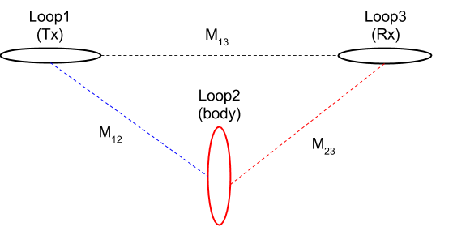
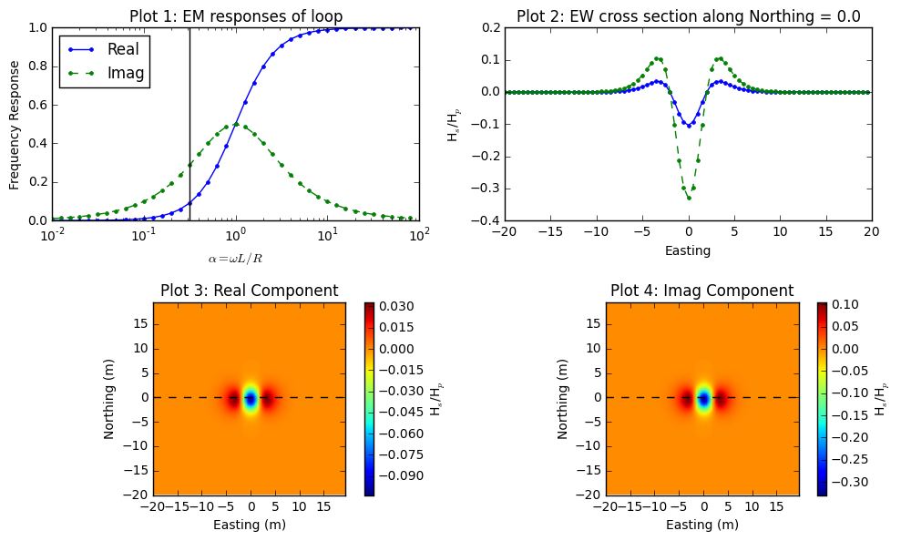
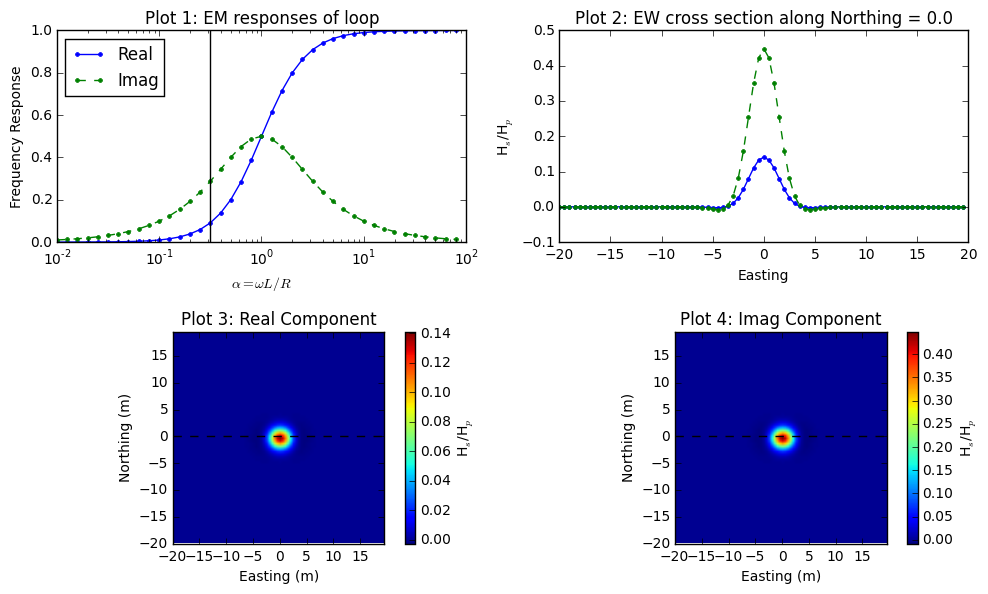
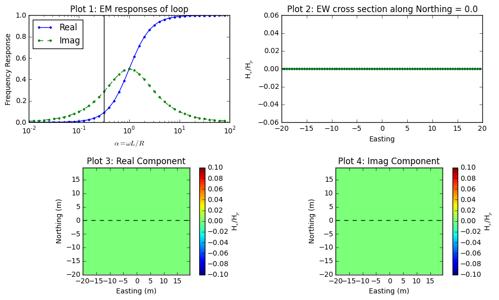

.. _understanding_response_widget:

Understanding the response using a widget
=========================================

   The EM circuit model with three loops.

The EM response from the above circuit model can be written as

.. math::

    \frac{H^s_3}{H^p_3} = - \frac{M_{12}M_{23}}{M_{13}L} \Big[\frac{\alpha^2 + \imath \alpha}{1+\alpha^2}\Big]

Let I=0 :math:`^\circ` and D=90 :math:`^\circ` of the Loop2 shown in
:numref:`Concepts_3loops_M`. For this case, we consider a loop-loop EM survey
with the geometry of EM-31 (3.66m Tx-Rx offset), and the body (Loop2) is
embedded 3 m below the surface. :numref:`EMdataI0D90` shows complex response
function (**Plot1**), easting line at 0 m-northing (**Plot2**), plan maps of
real and imaginary part of the EM data with the loop-loop EM survey when
:math:`\alpha` =0.31. **Plot2** clearly shows how coupling is changing
depending on relative location and orientation of three loop system. **Plot3**
and **Plot4** illustrate plan map of EM data we could possibly obtain by
acquring multiplie lines. Following considers different orientation of the
body (Loop2), which will generate different coupling effects on the measured
EM data.

    Frequency domain EM response from loop-loop EM survey when I=0
    :math:`^\circ` and D=90 :math:`^\circ`.

:numref:`EMdataI_90D0` shows same figures, but with different I and
D of body (Loop2): I=-90 :math:`^\circ` and D=0 :math:`^\circ`. Shape
anomalous response is significantly different due to the different coupling
among three loop system. Especially, the peak anomaly at the center has
positive sign. :numref:`EMdataI0D0` shows the case when I=0 :math:`^\circ` and
D=0 :math:`^\circ`. This is null-coupled case where there is no primary flux
passing the area of Loop2, hence measured reponse is zero everywhere.

    Frequency domain EM response from loop-loop EM survey when I=-90
    :math:`^\circ` and D=0 :math:`^\circ`.

    Frequency domain EM response from loop-loop EM survey when I=0
    :math:`^\circ` and D=0 :math:`^\circ`.

If you want to play with loop-loop EM survey click below:

.. todo::
    - Link to Python app for three-loop system
    - Use plot function in sphinx to plot above figures (?)

