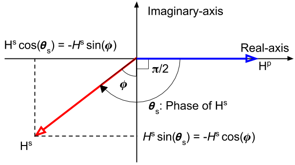

.. _amplitudeandphase:

Amplitude and phase
-------------------

.. figure:: ./images/Concepts_3loops_only_K.png
   :align: center
   :scale: 60%
   :name: Concepts_3loops_only_K

   Conceptual diagram for 3-loops system.

Based upon the induced current in the body (Loop2), in CITE, here we consider amplitude and phase of the secondary magnetic field (:math:`H^s`) normalized by primary magnetic field (:math:`H^p`), :math:`\frac{H^s}{H^p}`, measured at Rx (Loop3). For this, we first consider the primary magnetic field at body (Loop2), :math:`H^p_2`, resulting from a current, :math:`i^p`, flowing in the Loop1, which can be expressed as

.. math::
	H^p_2(t) = K_{12} i^p(t),

where :math:`i^p = I^p cos(\omega t)` and :math:`K_{12}` is coefficint depending on the geomtry of the system, the area, and number of turns of the primary coil, and attenuation of the wave between Loop1 and Loop2.

Effectively, through Faraday's law, :math:`\mathcal{E} = -\imath \omega \Phi^p`, volatage will be generated, which generates induced currents (this has been done in CITE):

.. math::
    I(\omega) = \frac{-\imath \alpha}{1+\imath\alpha}\frac{\Phi^p}{L},

where :math:`\alpha=\frac{\omega L}{R}`. EMF induced here can be written as

.. math::
	\mathcal{E} = -M\frac{d i^p}{dt} = -M \imath \omega I^p = -M \imath \omega \frac{H^p_2}{K_{12}},
	:label: EMF

where :math:`M` is mutual inductance, and this property illustrates how much voltage induced in Loop2 due to time varying current in Loop1. This yields :math:`\Phi^p = \frac{\mathcal{E}}{-\imath \omega} = M\frac{H^p_2}{K_{12}}`. The secondary magnetic field, :math:`H_s` at the Rx (Loop3) due to this current will be

.. math::
	H^s =K_{23} I(\omega)
	= -K_{23}\frac{\imath \alpha}{1+\imath\alpha}\frac{\Phi^p}{L}
	= -\frac{K_{23}M H^p_2}{K_{12}L}\frac{\imath \alpha}{1+\imath\alpha},
	:label: secondaryHs

where :math:`K_{23}` is similar coefficient with :math:`K`, but between body (Loop2) and Rx (Loop3).

Eq. :eq:`secondaryHs` provides us an explicit form of secondary magnetic field measured at Loop3, but we are interested in the ration between :math:`H^s` and :math:`H^p`:

.. math::
	\frac{H^s}{H^{p}} = \frac{K_{23}}{K_{13}} \frac{I(\omega)}{I^p}
	= -\frac{K_{23}M}{K_{13}L} \frac{\imath \alpha}{1+\imath\alpha}
	= -\frac{K_{23}M}{K_{13}L} \frac{\alpha^2+\imath \alpha}{1+\alpha^2}
	:label: HsHpratio

Because the primary field at the Loop3 is

.. math::
	H^p = K_{13}I^p = K_{13}\frac{H^p_2}{K_{12}},

where :math:`K_{13}` is similar coefficient with :math:`K`, but between body (Loop1) and Rx (Loop3). Eq. :eq:`HsHpratio` can be simplified as

.. math::
	\frac{H^s}{H^{p}} = -A Q(\alpha),

where :math:`A = \frac{K_{23}M}{K_{13}L}` and response function, :math:`Q = \frac{\alpha^2+\imath \alpha}{1+\alpha^2}`. The amplitude can be written as

.. math::
	\Big| \frac{H^s}{H^p} \Big|
	= \frac{K_{23}M}{K_{13}L} \frac{\alpha}{\sqrt{\alpha^2+1}} .

.. note::

	Because the ratio :math:`\frac{K_{23}M}{K_{13}L}` is generally very small, the ratio :math:`\frac{H^s}{H^{p}_3}` is small, regardless of the value of :math:`\alpha`. Often part per million (ppm) is used for the unit of this ratio.

Phase of :math:`\frac{H^s}{H^p}`, :math:`\theta_s` will be same as that of :math:`I(\omega)`, hence

.. math::
	\theta_s = - \frac{\pi}{2} - \phi,
	:label: phaseHs

where

.. math::
	\phi=tan^{-1}(\frac{\omega L}{R})=tan^{-1}(\alpha).
	:label: phaseHs_phi

   Phase diagram of secondary magnetic field (:math:`H^s`).

From above diagram and Eq. :eq:`phaseHs_phi`, it can be seen that:

.. note::
	- For a very good conductor: :math:`\alpha = \frac{\omega L}{R} \rightarrow \infty` and :math:`\phi \rightarrow \frac{\pi}{2}`. In this case, phase of the secondary field is 180 degree (:math:`\pi`) behind the primary field

	- For a very poor conductor: :math:`\alpha = \frac{\omega L}{R} \rightarrow 0` and :math:`\phi \rightarrow 0`.  In this case, phase of the secondary field is 90 degree (:math:`\frac{\pi}{2}`) behind the primary field

Assuming the phase of the primary magnetic field, :math:`\theta_p=0`, its phase lag, :math:`\psi`, can be written as

.. math::
	\psi = \theta_p - \theta_s =\frac{\pi}{2} + \phi,
	:label: phaseHs_lag

The lag in the phase of :math:`\frac{\pi}{2}` is due to the inductive coupling between Loop1 and Loop2, whereas the additional phase lag :math:`\phi` is determined by the properties of the conductor as an electrical circuit. That is,

.. math::
	H^s = K_{23}|I(\omega)| cos (\omega t - (\frac{\pi}{2}+\phi))
	    = K_{23}|I(\omega)| sin (\omega t - \phi)

	    = K_{23}|I(\omega)| [cos (\omega t-\frac{\pi}{2}) cos (\phi) + cos (\omega t-\pi) sin (\phi)]

The component of :math:`H^s` 180 degree out of phase with :math:`H^p` is :math:`H^s sin(\phi)`, whereas the component 90 degree out-ouf-phase is :math:`H^s cos(\phi)`.

In loop-loop frequency domain EM survey,

.. note::

	- the 180 degree out-of-phase fraction of :math:`H^s` is called the real or in-phase component.

	- the 90 degree out-of-phase fraction of :math:`H^s` is called the imaginary, out-of-phase, or quadrature component.

