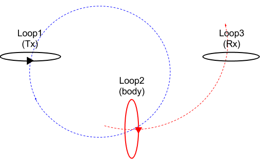

.. _induced_currents_body:

Induced currents in the body
============================

Consider a simple equivalent circuit as shown in :numref:`Concepts_3loops_only`.

   Conceptual diagram for 3-loops system.

Through the Tx (Loop1) we flow time-varying currents, then it generates time varying magnetic flux, which will exite the body (Loop2). Let :math:`\Phi^{p}` be the primary magnetic flux from the Tx. The body treats like and R-L circuilt.

.. figure:: ./images/RLcircuit.png
   :align: right
   :scale: 60%
   :name: RLcircuit

   Conceptual diagram of RL circuit.

Electrical impedance of the RL circuit can be written as

.. math::
    Z(\omega) = R + \imath \omega L,

where R and L indicate resistance and inductance, respecitvely.
Using Ohm's law we obtain

.. math::
    V(\omega) = I(\omega) Z(\omega).

Voltage, can be expressed using :math:`\Phi^{p}` as

.. math::
    V = \mathcal{E} = -\frac{\partial \Phi^p}{\partial t} = -\imath \omega \Phi^p

So,

.. math::
    I(\omega) = \frac{V(\omega)}{Z(\omega)} = \frac{-\imath\omega \Phi^p}{R+\imath \omega L}

We can redefine this using time constant, :math:`\tau = \frac{L}{R}`:

.. math::
    I(\omega) = \frac{-\imath\omega \Phi^p}{R+\imath \omega L}

or effectively,

.. math::
    I(\omega) = \frac{-\imath\omega \tau}{1+\imath \omega \tau} \frac{\Phi^p}{L},

The quantity of :math:`\alpha = \omega \tau` is dimensionless, and

.. math::
    I(\omega) = \frac{-\imath \alpha}{1+\imath\alpha}\frac{\Phi^p}{L}.

For small :math:`\alpha`, :math:`I(\omega) \simeq -\imath \alpha = -\imath \omega \tau`, so the current (and magnetic field) increases with frequency.

Consider complex response function, :math:`Q` as

.. math::
    Q = \frac{\imath \alpha}{1+\imath\alpha}
    = \frac{\imath \alpha(1-\imath\alpha)}{1+\alpha^2}
    = \frac{\imath \alpha +\alpha^2}{1+\alpha^2}

- for :math:`\alpha \ll 1\rightarrow` :math:`Q\simeq\imath\alpha` so :math:`I(\omega) \approx -\imath \alpha` (in the resitive limit)
- for :math:`\alpha \gg 1\rightarrow` :math:`Q\simeq\imath\alpha` so :math:`I(\omega) \approx -1` (in the inductive limit)

:numref:`CmplxResp` shows real and imaginary component of :math:`Q`.

.. figure:: ./images/CmplxResp.png
   :align: center
   :scale: 80%
   :name: CmplxResp

   Complex response function.

.. note::
    For low frequencies the response is in the imaginary part, for high frequencies it will be in the real part.

Phase of the current, :math:`\theta_I` can be written as

.. math::
    \theta_I = \theta_V - \theta_Z = -\frac{\pi}{2} - tan^{-1}\Big(\frac{\omega L}{R}\Big),
    :label: PhaseI

where :math:`\theta_z=\Re[z] / \Im[z]` and :math:`\Re[z]` and :math:`\Im[z]` are real and imaginary part of a complex value :math:`z`.

Considering Faraday's law: :math:`V = -\imath\omega\Phi^p`, then recoginze factor of :math:`-\imath\omega`, which makes :math:`\frac{\pi}{2}` lag of phase in the induced current. And :math:`tan^{-1}(\frac{\omega L}{R})` lag of phase is induced by the Loop2.

So the phase of the current vary with frequency. At low frequencies the information about the conductor is in the quadarature (imaginary part) portion, at high freuquencies it is in out-of-phase (real part) portion.
