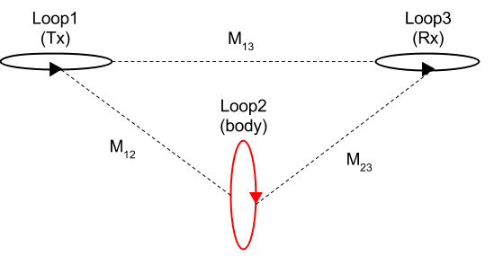

.. _mutualinductance:

Mutual inductance
-----------------

When an EMF (:math:`\mathcal{E}`) is produced in a loop because of the change in current in a coupled loop, the effect is called mutual inductance.

   Conceptual diagram for 3-loops system.

A sinusoidal current in the Loop1 (Tx) generates a primary magnetic field. This induces a EMF in the Loop2 (body), which can be written as

.. math::
    \mathcal{E}_2 = -M_{12} \imath \omega I_1,

where :math:`M_{12}` is the mutual inductance between Loop1 and Loop2 (previously we used :math:`M` for this term). Using :ref:`Lenz's law <lenz>` :math:`\mathcal{E}_2 = -\imath \omega \Phi_2`, :math:`M_{12}` can be expressed as

.. math::
    M_{12} = \frac{\Phi_2}{I_1},

where :math:`\Phi_2` is the magnetic flux at Loop2. This voltage generates current at Loop2, which in turn generates a secondary magnetic field in opposing direction.

.. figure:: ./images/LoopOrientations.png
    :name: looporient
    :figwidth: 30%
    :align: right

    The orientation of the loops can be changed by adjusting the inclination `I` and the declination `D`.

The primary and secondary magnetic field are measured at the Loop3 (Rx). If the primary and secondary field are in opposing directions at the receiver, we consider this to be a negative datum. If they are in the same direction, the datum is positive. This geometric coupling can be explained with the mutual inductance between each Loop.

For this, we first write :math:`\frac{H^s}{H^p}` at Loop3 as

.. math::
    \frac{H^s}{H^p} = -\frac{M_{12}K_{23}}{K_{13}L_2} \frac{\alpha^2+\imath \alpha}{1+\alpha^2}
    :label: l1

Considering arbitrary coupling coeffients, :math:`K_{12}= \frac{H_2}{I_1}`, which satisfies :math:`M_{12} = K_{12} \sqrt{L_1 L_2}`. Similarly, we obtain :math:`M_{23} = K_{23} \sqrt{L_2 L_3}` and  :math:`M_{13} = K_{13} \sqrt{L_1 L_3}`. Then Eq. :eq:`l1` can be rewritten as

.. math::
    \frac{H^s}{H^p}  = - \frac{M_{12} M_{23}}{M_{13}L_2} \frac{\alpha^2 + i \alpha}{1 + \alpha^2},
    :label: l2

Equation :eq:`l2` depends on the mutual inductance between the loops.
The mutual inductance can be derived from the :ref:`Biot-Savart law <biot_savart>`, which gives us the magnetic field. Assume we are looking at two loops and the magnetic field due to the first loop is :math:`\mathbf{B}_1` . We can calculate the flux :math:`\Phi_2` of this magnetic field through the second loop as follows:

.. math::
        \Phi_2 = \int \mathbf{B}_1 \cdot da_2 = M_{12} I_1.
        :label: phi2

This flux is then equal the mutual inductance times the current. We can solve for the mutual induction in a few more steps. Using Stokes' Theorem and the vector potential of :math:`\mathbf{B}_1`, Equation :eq:`phi2` becomes a line integral:

.. math::
        \Phi_2 = \int \mathbf{B}_1 \cdot da_2 = \int (\nabla \times \mathbf{A}_1) \cdot da_2 = \oint \mathbf{A}_1 \cdot dl_2,
        :label: phi22

where :math:`\mathbf{A}_1` is derived using the Biot-Savart law:

.. math::
        \mathbf{A}_1 = \frac{\mu_0 I_1}{4\pi} \oint \frac{dl_1}{\lvert \mathbf{r} - \mathbf{r'}\rvert^2}.
        :label: A1

By subbing Equation :eq:`A1` into :eq:`phi22`, we get the following integral expression for the flux:

.. math::
        \Phi_2 = \frac{\mu_0 I_1}{4\pi} \oint \left ( \oint \frac{dl_1}{\lvert \mathbf{r} - \mathbf{r'}\rvert^2} \right ) \cdot dl_2.
        :label: phi23

We can then write the mutual inductance between two loops as:

.. math::
        M_{12} = \frac{\mu_0}{4\pi} \oint \oint \frac{dl_1 \cdot dl_2}{\lvert \mathbf{r} - \mathbf{r'}\rvert^2}.
        :label: m12

There are a few significant things about Equation :eq:`m12`:

- :math:`M_{12}` depends purely on geometry, such as the size, shape, and relative positions of the two loops
- This expression doesn't change if we look at the flux in the first loop due to the second loop, meaning that :math:`M_{12} = M_{21}` .

So,  by solving Equation :eq:`m12` for the three mutual inductances for a three-loop system, we can analytically solve Equation :eq:`l2` and determine the data :math:`H^s / H^p` over different targets, using differing frequencies, loop orientations, and loop separations. This can provide meaningful understanding about three-loop systems (such as the EM-31 and Resolve systems) and their data.

.. todo::
    Link to Python app for three-loop system
