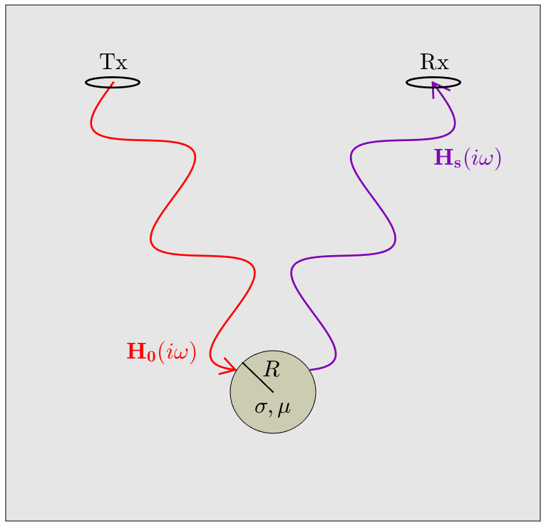

.. _SphereFEM_AnalyticExpressions:

Analytic Expressions
--------------------

**Purpose**: Here, we present final analytic expressions derived by Wait (1951).
These expression can be used to predict the harmonic dipole response from a conductive and magnetically permeable sphere in free-space.

        Harmonic response from a conductive and magnetically permeable sphere in free-space.

**Problem Geometry**: Consider the illustration in Figure :numref:`FreeSpaceSphereGeometry`.
Here, a sphere of radius :math:`R`, conductivity :math:`\sigma` and magnetic permeability :math:`\mu` is located in the vicinity of an inductive source transmitter (Tx).
The transmitter generates a harmonic primary field :math:`{\bf H_0} (i\omega)` which induces an excitation within the sphere.
The excitation induced within the sphere produces a secondary field :math:`{\bf H_s} (i\omega)` which is then measured by a receiver coil (Rx).
Note that because we are in free-space, :math:`{\bf H_0} (i\omega)` may be calculated using the :ref:`Biot-Savart law <biot_savart>`.

.. figure:: ./images/figDipoleField.png
        :align: right
        :figwidth: 35%
        :name: DipoleField
        
        Dipolar response :math:`{\bf H} (i\omega)` (purple) from a conductive and magnetically permeable sphere, under the influence of a spatially uniform harmonic field :math:`{\bf H_0} (i\omega)` (red). The induced dipole moment (blue) is represented by :math:`{\bf m} (i\omega)`.

**Dipole Response**: To approximate the sphere's response, Wait (1951) considered the dipole response from a conductive and magnetically permeable sphere under the influence of a spatially uniform harmonic field (:numref:`DipoleField`).
The geometry of this problem is illustrated in Figure :numref:`DipoleField`.
For an inductive source, the inducing field may be considered spatially uniform about the sphere if 1) the radius of the sphere is much smaller than the wavelength of the inducing field, and 2) the distance between the transmitter and the sphere is sufficiently larger than the sphere's radius (typically :math:`> 10R`).
According to Wait (1951), the sphere's free-space dipole response :math:`{\bf H} (i\omega)` can be expressed in terms of a harmonic dipole moment :math:`{\bf m} (i\omega)` such that:

.. math::
	{\bf H} (i \omega) =\frac{1}{4\pi} \Bigg [ \frac{3 {\bf r} \; \big [ {\bf m}(i \omega) \cdot {\bf r} \; \big ]}{r^5} - \frac{{\bf m} (i \omega) }{r^3} \Bigg ]
	:label: eqDipoleVacuum

where :math:`{\bf r}` is the vector distance between :math:`P` and :math:`Q`.
The induced magnetic dipole moment characterizing the sphere's excitation is given by:

.. math::
	{\bf m} (i \omega) = \frac{4\pi}{3}R^3 \chi (i \omega) \, {\bf H_0} (i \omega)
	:label: eqDipoleMoment

where :math:`\chi (i\omega)` is defined as the sphere's excitation factor.
The dipole moment is therefore a product of the sphere's volume, its excitation factor, and the inducing field.
We use the excitation factor to characterize the nature of the sphere's frequency-domain response.
An explicit expression for the excitation factor is given by (Wait, 1951):

.. math::
	\chi (i \omega) = \frac{3}{2} \Bigg [ \! \frac{2\mu \big [ tanh(\alpha) - \alpha  \big ] + \mu_0 \big [\alpha^2 \, tanh(\alpha) - \alpha + tanh(\alpha) \big ] }{\mu  \big [ tanh(\alpha) - \alpha \big ] - \mu_0 [ \alpha^2 \, tanh(\alpha) - \alpha + tanh(\alpha) \big ] } \! \Bigg ]
	:label: eqExcitationFactor
	
where

.. figure:: ./images/figChiOmega.png
        :align: right
        :figwidth: 40%
        :name: ExcitationEx
        
        Excitation factor for a sphere with physical properties :math:`R=25` m, :math:`\sigma = 10` S/m and :math:`\mu = 1.1 \mu_0`.

.. math::
	\alpha = \Big [ i \omega \mu \sigma \Big ]^{1/2} R

and :math:`\mu_0 = 4\pi \times 10^{-7}` H/m is the permeability of free-space.
An example for the excitation factor as a function of frequency is shown in :numref:`ExcitationEx`.

Therefore, we can use Eqs. :eq:`eqDipoleVacuum`, :eq:`eqDipoleMoment` and :eq:`eqExcitationFactor` to approximate the free-space harmonic response from a conductive and magnetically permeable sphere.
The nature of the sphere's harmonic response is characterized by an excitation excitation factor :math:`\chi (i\omega)`.
We discuss the excitation factor for several special cases in the :ref:`following section<SphereFEM_ExcitationFactor>`.

**References**: Wait, J. R., 1951, "A conductive sphere in a time varying magnetic field," Geophysics, vol. 16, pp. 666-672.

