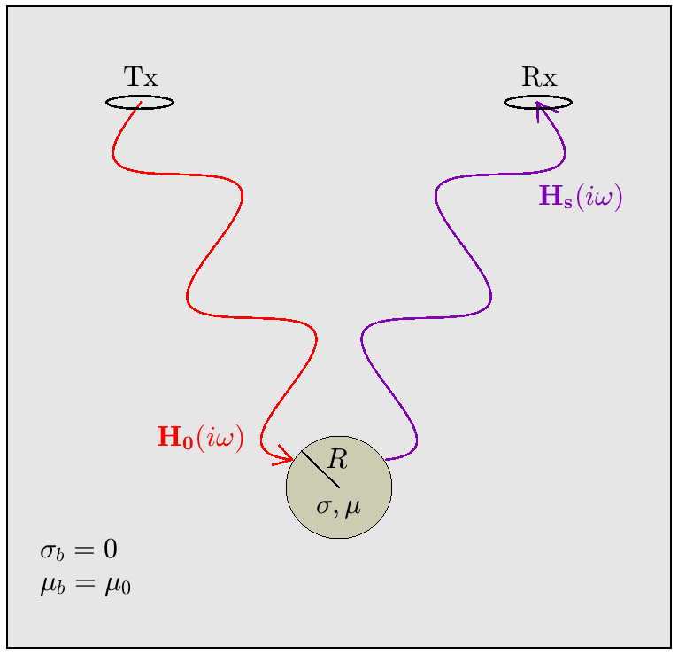

.. _sphereFEM_freespace_index:

Sphere
------

**Purpose**: Here, we examine the frequency-domain response from a conductive and magnetically permeable sphere in free-space.
Expressions provided in this section can be used to characterize the frequency-domain responses from compact ore bodies and unexploded ordnance items.

Our analysis is performed using expressions derived by Wait (1951); who considered the dipole response from a sphere under the influence of a spatially uniform harmonic field.
The problem geometry is illustrated in Figure :numref:`FreeSpaceGeometry`, where  :math:`H_0 (i\omega)` represents the inducing field from a transmitter :math:`Tx` and :math:`H_s (i\omega)` represents the sphere's dipole response at some receiver location :math:`Rx`.

        Response :math:`H_s (i \omega)` from a sphere in free-space under the influence of a harmonic field :math:`H_0 (i\omega)`.

**Structure**: Our analysis of the sphere's frequency-domain response is presented in three parts:

1. :ref:`Analytic Expressions<SphereFEM_AnalyticExpressions>`: Here, we present final analytic expressions derived by Wait (1951).
These expressions characterize the sphere's dipole response under the influence of a spatially homogeneous harmonic field.

2. :ref:`Excitation Factor<SphereFEM_ExcitationFactor>`: The sphere's dipole response is characterized by the induced dipole moment.
Here, the induced dipole is expressed in terms of an excitation factor; which depends on the physical properties of the sphere as well as the frequency of the inducing field.
Here, we examine the excitation factor for several important cases.

3. :ref:`Analytic Derivation<SphereFEM_AnalyticDerivation>`: Here, a derivation is provided for the final expressions found in Wait (1951).
This derivation begins with Maxwell's equations in the frequency-domain and makes use of the Schelkunoff potentials.

**Contents (Quick Links)**:

.. toctree::
    :maxdepth: 3

    SphereFEM_AnalyticExpressions
    SphereFEM_ExcitationFactor
    SphereFEM_AnalyticDerivation

**References**: Wait, J. R., 1951, "A conductive sphere in a time varying magnetic field," Geophysics, vol. 16, pp. 666-672.

