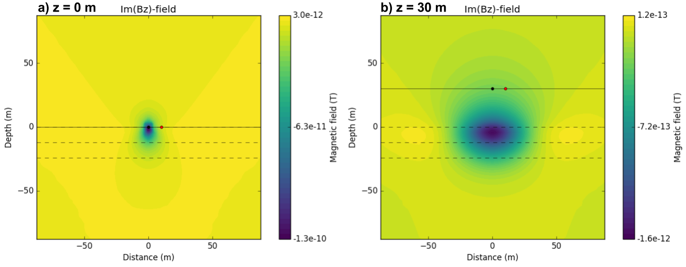
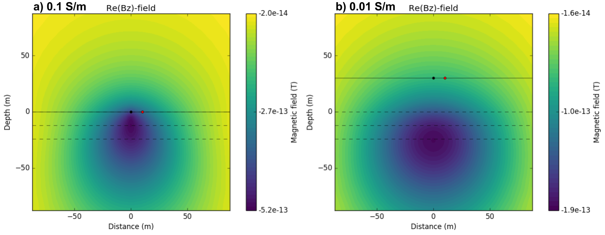
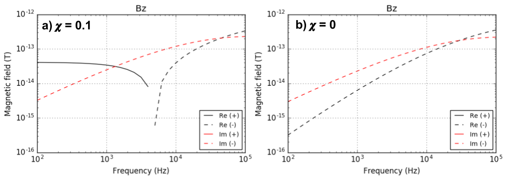

.. _fdem_fields_from_inductive_sources_halfspace:

Half-space
==========

.. purpose::

    With a simple half-space model we explore electric field, magnetic flux, and conduction currents in the domain due to the vertical magnetic dipole (VMD) source. By analyzing those fields with variable transmitting frequency, Tx height, conductivity, and susceptibility values, we understand how the inductive source exicte the earth. In addition, we discuss how the measured magnetic flux data behave as a function of frequency.

Oscillating magnetic flux is generated by injected sinusoidal current in the loop, and will generate induced electric field everywhere due to Faraday's law:

.. math::
    \nabla \times \mathbf{E} = -\imath \omega \mathbf{B}
    :label: faraday

Because conductivity of the air is zero (:math:`\sigma_{air} \approx 0`), conduction currents in the earth is zero (:math:`\mathbf{J}_f=\sigma \mathbf{E}`). From Ampere's law:

.. math::
    \nabla \times \mathbf{B}  = \mu_0\mathbf{J} = \mu_0(\mathbf{J}_e + \mathbf{J}_f + \mathbf{J}_m)
    :label: ampere

where :math:`\mathbf{J}_m=\nabla \times \mathbf{M}` is magnetic current density. Biot-Savart Law shown in :ref:`biot_savart` allows us to compute magnetic flux density from current density. For the free-space case, conduction and magnetic currents are both zero hence only the current source term :math:`\mathbf{J}_e` will be taken account hence by applying Biot-Savart law to this we can obtain primary magnetic flux :math:`\mathbf{B}^{p}`. Similarly, by only taking into account conduction current, :math:`\mathbf{J}_f`, secondary magnetic flux :math:`\mathbf{B}^{s}` can be evaluated. So if we define Biot-Savart operator :math:`G_{BS}[\cdot]` which takes currents, then primary, secondary, and total magnetic fields can be defined as

.. math::
    \mathbf{B}^{p} = G_{BS}[\mathbf{J}_e]
    :label: Bprim

.. math::
    \mathbf{B}^{s} = G_{BS}[\mathbf{J}_f + \mathbf{J}_m]
    :label: Bsec

.. math::
    \mathbf{B} =\mathbf{B}^{p}+\mathbf{B}^{s}
                   =G_{BS}[\mathbf{J}_e+\mathbf{J}_f+\mathbf{J}_m]
    :label: Btotal

Separating total magentic fields as primary and secondary will be useful for our following analyses to see impact of the eddy currents induced in the earth.

.. figure:: images/Halfspace.png
   :align: center
   :scale: 100%
   :name: Halfspace

   A loop source in a half-space earth. :math:`\sigma_{air}` and :math:`\sigma_{earth}` conductivity of the air and earth, respectively. :math:`\mu_{0}` and :math:`\mu_{earth}` susceptibility of the air and earth, respectively. :math:`z` and offset correspondingly indicate Tx height (m) and Tx-Rx offset (m).

Using the setup shown in :numref:`Halfspace`, we perform a simulation, compute electric, magnetic flux, and current density. Here :math:`z` = 30 m, :math:`\sigma_{earth}=0.01` S/m, :math:`\mu_{earth}=\mu_0`, and :math:`f=10^3` Hz. :numref:`Half_EJ` shows imaginary part of electric fielc and current density in :math:`y`-direction.

Rotating electric field induced by oscillating magnetic field exist everywhere and show great amplitude at the near surface. Current density at an air region is zero, and this will make impact to the magnetic flux density. :numref:`Half_B_imag` shows imaginary part of :math:`\mathbf{B}`. Imaginary part of magnetic flux is localized at the near surface, and mostly propagating downward.

.. note::

  Imaginary part of :math:`\mathbf{B}` only includes secondary field i.e. it is soely from the earth. This will be directly related to real part of :math:`\mathbf{E}` from Eq. :eq:`faraday`.

.. figure:: images/Half_EJ.png
   :align: center
   :scale: 100%
   :name: Half_EJ

   Real part of  :math:`E_y` a) and  :math:`J_y` b)  in :math:`x\text{-}z` plane. Postive and negative values indicate vector directing into the page and out of the page.

.. figure:: images/Half_B_imag.png
   :align: center
   :scale: 50%
   :name: Half_B_imag

   Imaginary part of :math:`\mathbf{B}` in :math:`x\text{-}z` plane

Different from the imaginary part of :math:`\mathbf{B}`, real part includes both primary and secondary magnetic flux.
:numref:`Half_BpBs` a and b show the real part of total and secondary magnetic flux density as a vector. Primary flux is dominant in :math:`\mathbf{B}` hence signficantly localized close to Tx location, while secondary flux induced in the conductive earth are much more spreaded. Direction of the total (upward) and secondary flux (downward) is opposite in general. In practice, we cannot measure magnetic fields everywhere, but

.. figure:: images/Half_BpBs.png
   :align: center
   :scale: 100%
   :name: Half_BpBs

   Real part of total a) and secondary magnetic flux density b).

.. question::

    Compare imaginary and real part of :math:`\mathbf{B}_s` :numref:`Half_B_imag` and :numref:`Half_BpBs` b. What is the main difference? Which component is more sensitive to the near surface?

Considering airborne EM survey or small-loop EM survey often

.. figure:: images/Half_B_data.png
   :align: center
   :scale: 50%
   :name: Half_B_data

   Meausured real component of :math:`B_z` data as a function of frequency at Rx when Tx-Rx offset is 10 m. Total a) and secondary b) :math:`B_z`.

You can use below link to play with the app that we used to run a given simulation.

.. image:: http://mybinder.org/badge.svg
   :target: http://mybinder.org/repo/ubcgif/em_examples/notebooks/notebooks/maxwell3_fdem/HarmonicVMDLayerWidget.ipynb
   :align: center

|

Using the app introduced, now we are going to run suite of simulations to see impact of four main factors to EM fields due to inductive source excitation:

- Frequency
- Tx height
- Conductivity
- Susceptibility

Frequency
---------

With the same setup, now we vary frequency from 10 :sup:`6` to 10 :sup:`3`. We may expect that the lower the frequency the deeper information. :numref:`Half_E_freq` shows current density in :math:`y`-direction at four different frequencies: 10 :sup:`5`, 10 :sup:`4`, 10 :sup:`3`, and 10 :sup:`2`. As the frequency decreases, distribution of currents are more spreaded indicating the lower frequency has deeper depth information. Amplitude of the current increases as frequency increases.

.. figure:: images/Half_E_freq.png
   :align: center
   :scale: 100%
   :name: Half_E_freq

   Real part of :math:`E_y`  in :math:`x\text{-}z` plane at 10 :sup:`5` Hz a), 10 :sup:`4` Hz a), 10 :sup:`3` Hz a), and 10 :sup:`2` Hz d).

Tx height
---------

Previously Tx height (:math:`z`) was 30 m similar to airborne EM survey. Then what happens if we lower the :math:`z` to 0 m? This can be considered as a small-loop EM survey such as EM-31 on the ground. Here, we use different :math:`\sigma` = 0.1 S/m to emphasize difference in the results of two simulations, and fix frequency as 10 KHz. :numref:`Half_Bs_height` a and b respecively show the the imaginary part of :math:`B_z` at :math:`z` = 0 and :math:`z` = 30 m. When the source is located right at the surface, magnetic flux is much more localized close to the near surface. However, when Tx height is increased to 30 m, magnetic flux has much distributed to both deeper depth and greater horizontal extent. This will indicate different resolution power in a) small-loop and b) airborne EM systems. First a small-loop EM survey will have much higher resolution to small near surface structures such as re-bar and UXO compared to an airborne EM survey. In contrast, an airborne EM survey will cover much greater volume of earth both in horizontal and vertical directions (i.e. greater depth of investigation). Similar difference can be recognized in the observed data. :numref:`Half_Bs_height_data` shows corresponding :math:`B_z` data at a receiver location marked as red in :numref:`Half_Bs_height`. Here the offset between Tx and Rx is 10 m. Changes in measured response are much more significant when :math:`z` = 0 m compared to :math:`z` = 30 m. Especially, when :math:`z` = 0 m imaginary part of :math:`B_z` shows sign reversal near 40 KHz , whereas when :math:`z` = 30 m no sign reversal are occurred.

   Imaginary part of :math:`B_z` in :math:`x \text{-} z` plane. At a) z = 0 m and b) z = 30 m.

.. figure:: images/Half_Bs_height_data.png
   :align: center
   :scale: 50%
   :name: Half_Bs_height_data

   Meausured imaginary component of :math:`B_z` data as a function of frequency at Rx when Tx-Rx offset is 10 m.

Conductivity
------------

Often a main goal of inductive source EM survey is imaging conductivity structure of the earth and for this, understanding how EM fields changes due to conductivity will be crucial. Here we assumed half-space model, hence we consider changes in a half-space conductivity value. :numref:`Half_Bs_cond` a and b show real part of :math:`B_z` component when :math:`\sigma_{earth}` is 0.1 S/m and 0.01 S/m, respectively. When :math:`\sigma_{earth}` is more conductive, EM fields decays faster, and hence :numref:`Half_Bs_cond` a shows much localized distribution compared to :numref:`Half_Bs_cond` b. This also indicates, conductive ground has much limited depth of investigation compared to resistive ground. :numref:`Half_Bs_cond_data` show shows corresponding :math:`B_z` data for both conductivity values.

   Real part of :math:`B_z`-direction in :math:`x\text{-}z` plane. :math:`\sigma_{earth}` = 0.1 S/m a) and 0.01 S/m b).

.. figure:: images/Half_Bs_cond_data.png
   :align: center
   :scale: 50%
   :name: Half_Bs_cond_data

   Meausured real component of :math:`B_z` data as a function of frequency at Rx when Tx-Rx offset is 10 m. :math:`\sigma_{earth}` = 0.1 S/m a) and 0.01 S/m b).

Susceptibility
--------------

We consider effect of magnetic currents shown in Eq. :eq:`Btotal`. Upon the definition of primary magnetic flux :math:`\mathbf{B}^p`, effects of susceptibility is not contained in :math:`\mathbf{B}^p`, but included in secondary flux :math:`\mathbf{B}^s`. Similar to the physics of magnetic survey, even static magnetic flux (zero frequency) will excite susceptible medium in the direction of primary magnetic flux indicating this secondary magnetic flux will be in the same direction of primary magnetic flux.
:numref:`Half_Bs_sus` a and b show real part of magnetic flux when :math:`\chi`=0.1 and :math:`\chi`=0, respectively. Difference between these two cases are drastic especially at near surface. And at location where Rx is located direction of the magnetic flux is opposite. :numref:`Half_Bs_sus_data` shows measured :math:`B_z` component for those two cases. When frequency is low, real part of :math:`B_z` when :math:`\chi` = 0.1 has positive sign, whereas the sign changes to negative when frequency gets higher. Imaginary part of :math:`B_z` for two cases do not show significant difference indicating effects of susceptibility is minor in this component.

.. question::
    Why susceptibility effects is significant at low frequency, real part of :math:`B_z` data?

.. figure:: images/Half_Bs_sus.png
   :align: center
   :scale: 100%
   :name: Half_Bs_sus

   Real part of :math:`B_z`-direction in :math:`x\text{-}z` plane. :math:`\chi_{earth}` = 0.1 a) and 0 b). Frequency is 1000 Hz, and :math:`\sigma_{earth}` is fixed to 0.01 S/m.

   Meausured real component of :math:`B_z` data as a function of frequency at Rx when Tx-Rx offset is 10 m. :math:`\chi_{earth}` = 0.1 a) and 0 b). :math:`\sigma{earth}` is fixed to 0.01 S/m.

