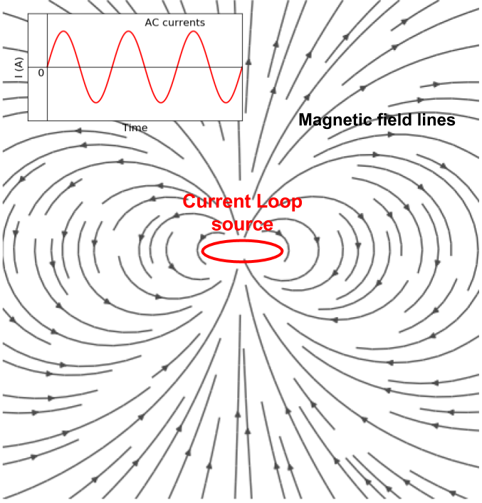

.. _fdem_fields_from_inductive_sources_index:

Fields from inductive sources
=============================

.. .. raw:: html
..     :file: ../../../underconstruction.html

.. purpose::

    Using a loop source with the injection of sinusoidal current, we can excite the earth with EM induction. By exploring various types of EM fields in simple earth structure (e.g. half-space and layered earth), we understand principal physics of inductive excitation.

   A current loop source and magnetic field lines.

Mathematical definition of the inductive source can be

.. math::
    \nabla \cdot \mathbf{J}_e = 0

where :math:`\mathbf{J}_e` is a current source term in Ampere-Maxwell equation:

.. math::
    \nabla \times \mathbf{B}  = \mathbf{J}_e + \mathbf{J}_f + i \omega \mathbf{D} + \nabla \times \mathbf{M}
    :label: ampere_maxwell

where :math:`\mathbf{J}_f = \sigma \mathbf{E}` is conduction currents, :math:`\mathbf{D}=\epsilon \mathbf{E}` displacement currents, and :math:`\mathbf{M}=\chi\mu_0\mathbf{H}` is mangnetization. Here :math:`\chi` stands for magnetic susceptibility, and using this magnetic permeability can be defined as :math:`\mu = \mu_0 (1+\chi)`. Using quasi-static approximation we ignore displacement currents hence :eq:`ampere_maxwell` can be re-written as

.. math::
    \nabla \times \mathbf{B}  = \mathbf{J}_f + \mathbf{J}_c + \nabla \times \mathbf{M}
    :label: ampere_maxwell_quasistatic

Both conduction currents, and magnetic currents (:math:`\nabla \times \mathbf{M}`), will distorts EM fields, hence we investigate both conductivity and susceptibility effects.

An inductive source is divergence free, indicating the current wire loop is closed. Recalling DC resistivity, a current source, :math:`q` are expressed as

.. math::
    -\nabla \cdot \sigma \nabla \phi = \nabla \cdot \mathbf{J}_e = -q = \delta(\mathbf{r}-\mathbf{r}_s)I

From this, we can infer inductive source will not have any steady-state electric field, because right hand side is zero for any inductive source. However, there will be steady-state magnetic field everywhere due to the currents flowing  in the loop as shown in :numref:`InductiveSource`. And this current is oscillating so, upon :ref:`faraday` eddy current will be generated in conductive earth medium. To understand fundamentals of EM induction in the earth medium, we focus on a vertical magnetic dipole (VMD) case in simple earth structures such as half-space and layered earth. Note that we have shown if radius of the current loop source is small enough then considering the current loop as magnetic dipole is reasonable assumption LinkXXX.

.. note::
  EM fields are complex-valued, hence they have both real (in-phase) and imaginary (out-of-phase or quadrature) component.

.. toctree::
    :maxdepth: 2

    halfspace
    layered_earth
    sphere/index
    plate
