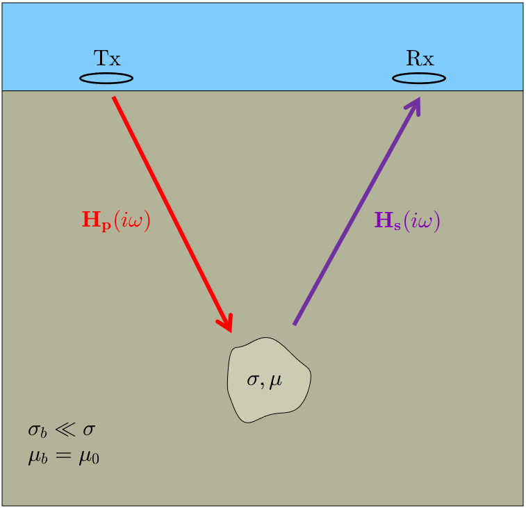
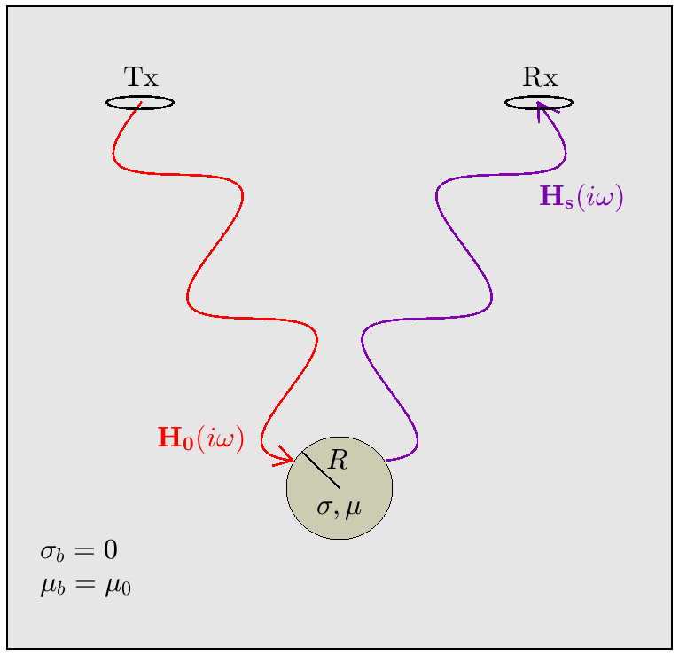

.. _sphereFEM_freespace_index:

Response from a Conductive and Magnetically Permeable Sphere
============================================================

.. Purpose::

    Here, we explore the nature of frequency-domain responses generated by compact ore-bodies and unexploded ordnance items. If contained within a resistive media, this may be accomplished by considering the dipole response from a conductive and magnetically permeable sphere in free-space. The associated analytic expressions are provided by Wait (:cite:`Wait1951`).

Introduction
------------

        Problem geometry for a compact target located within a resistive medium.

For a compact target within a resistive medium, the frequency-domain response can be understood by considering the problem geometry illustrated in :numref:`ProblemGeometry`; where the target has conductivity :math:`\sigma` and magnetic permeability :math:`\mu`, and the host medium has conductivity :math:`\sigma_b \ll \sigma` and magnetic permeability :math:`\mu_b=\mu_0`.
In this case, the transmitter generates a harmonic primary field :math:`{\bf H_p} (i\omega)`, which induces an excitation within the target.
The excitation induced within the target produces a secondary field :math:`{\bf H_s} (i\omega)`, which is then measured by a receiver coil (Rx).

        :align: right
        :figwidth: 40%
        :name: FreeSpaceGeometry

        Problem geometry for a conductive and magnetically permeable sphere in free-space.

On a fundamental level, the geophysical problem illustrated in :numref:`ProblemGeometry` may be understood by considering a conductive and magnetically permeable sphere in free-space (:numref:`FreeSpaceGeometry`).
This is accomplished by assuming the frequency-dependent attenuation (link) of EM signals, and inductive responses from the host media, are negligible.
For the free-space problem, background physical properties are now given by :math:`\sigma_b=0` and :math:`\mu_b=\mu_0`, and the primary field :math:`{\bf H_0} (i\omega)` may be calculated using the :ref:`Biot-Savart law <biot_savart>`.
The free-space problem will act as the basis for our analysis of frequency-domain responses.

Outline
-------

The analysis presented in this section follows expressions derived by Wait (1951).
Wait considered the free-space dipole response from a conductive and magnetically permeable sphere, under the influence of a spatially uniform, harmonic field.
Analytic expression, and the conditions in which they are valid, are presented :ref:`here<sphereFEM_dipole_response>`.
The characteristic response of a conductive and magnetically permeable sphere may be defined in terms of an excitation factor.
The excitation factors for several special cases are presented :ref:`here<sphereFEM_excitation_factor>` .
These cases include: a conductive and magnetically permeable sphere, a purely conductive sphere, and the zero-frequency excitation of a highly permeable sphere.
A supporting derivation for the excitation factor can be found :ref:`here<sphereFEM_schelkunoff>`.

.. toctree::
    :maxdepth: 1

    sphereFEM_dipole_response
    sphereFEM_excitation_factor
    sphereFEM_schelkunoff

References: Wait, J. R., 1951, "A conductive sphere in a time varying magnetic field," Geophysics, vol. 16, pp. 666-672.

