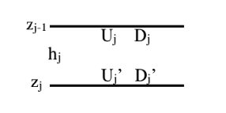
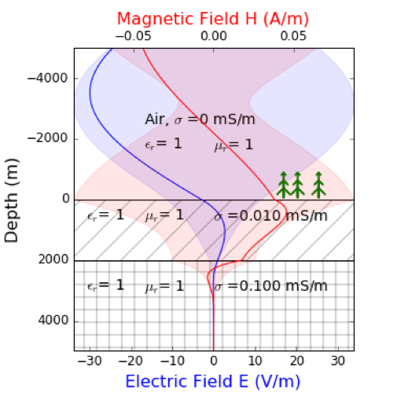

.. _MT_N_layered_Earth:

Response of a layered Earth to a plane wave
===========================================

.. purpose::

    Plane wave propagation through the earth is at the core of the
    Magnetotelluric problem. Here, we investigate the physics of plane wave
    propagation through a 1D layered earth and discuss the connection between
    the physical responses and what we observe in MT data

.. raw:: html
    :file: images/movieMT_time.html

Introduction
------------

We present here a 1D modelisation of the Magnetotelluric waves in a layered
Earth and the associated geophysical data. Our goal is to build better
representation of the different physical phenomenons and better understanding
of the resulting data. This work follows the derivation presented in
:cite:`ward1988` and is supported by interactive apps developed in a
`binder`_.

 .. image:: http://mybinder.org/badge.svg
    :target: https://mybinder.org/v2/gh/geoscixyz/em_apps/master?filepath=notebooks%2FMT_LayeredEarth.ipynb
    :align: center

.. _binder: https://mybinder.org/v2/gh/geoscixyz/em_apps/master?filepath=notebooks%2FMT_LayeredEarth.ipynb

The magnetotelluric (MT) method is a widely used geophysical technique, in
particular for imaging geothermal systems, that is sensitive to Earth
structures as shallow as tens of meters to depths of hundreds of kilometers.
It is a passive method that use plane waves generated mostly in the Earth's
Atmosphere. High frequency waves are mainly produced by lightning strikes all
around the globe, traveling through the Earth's Ionosphere that acts as a
waveguide. Low frequency waves are produced through the interaction of the
Earth's Ionosphere with solar wind and Earth's magnetic field.

In Magnetotelluric problems, the key diagnostic physical property is
:ref:`electrical conductivity<electrical_conductivity_index>` :math:`\sigma`.
In most cases we expect the contrasts of the others physical properties
(magnetic permeability, dielectric permittivity) to be negligible compared to
the electrical conductivity contrasts. As a result, at sufficiently low
frequencies ( :math:`\prec 10^5 Hz` ), the impact of the other physical
properties  contrasts on the EM response is expected to be negligible.

Setup
-----

.. figure:: images/MT_N_layered_Earth-1.hires.png
   :align: center
   :scale: 50%
   :name: MTlayeredEarth

   1D layered Earth Model

In the movie above, we show an example of plane wave electromagnetic fields
propagating in a 2-layered earth with:

- a layered Earth, each layer with its own physical properties
  :math:`\sigma_j, \varepsilon_j, \mu_j`

- a plane wave traveling along the axis :math:`\mathbf{\hat{z}}` coming from
  air, composed of an electric field :math:`\mathbf{E_x}` and a orthogonal
  magnetic field :math:`\mathbf{H_y}`. These are the fields we will be
  measuring with our geophysical instruments at the surface to obtain
  information from the underground

We can see that several phenomenons are occuring. Just to mention few of them:

- the incoming wave (down component) is reflected at the surface

- once in the ground we observe a diffusive effect of the Earth on the wave

- the depth of investigation is regulate by the damping effect on the
  amplitudes, which is characterized by the skin depth. We notice the decay is
  more important in the second layer with a higher conductivity

- :math:`\mathbf{E_x}` and  :math:`\mathbf{H_y}` are continuous. There is a
  phase shift between the two.

Governing Equations
-------------------

The governing equation for Magnetotelluric problem can be obtained from
:ref:`Maxwell's equations <maxwell1_fundamentals_index>`. We start with
:ref:`Faraday's law<faraday>` and :ref:`Ampere's law<ampere_maxwell>`:

.. math::
    \nabla \times \mathbf{E_x} = - i \omega \mu \mathbf{H_y}
    :label: Faraday

.. math::
    \nabla \times \mathbf{H_y} = (\sigma + i \omega \varepsilon) \mathbf{E_x}
    :label: Ampere

Knowing that that :math:`\mathbf{E}` and :math:`\mathbf{H}` are divergence
free, according to :ref:`Gauss's Law for Electric Fields<gauss_electric>` and
:ref:`Gauss's Law for Magnetic Fields<gauss_magnetic_frequency>`, we can
combine the equations to write the Helmhotz (wave propagation) equation for
both :math:`\mathbf{E}` and :math:`\mathbf{H}` fields:

.. math::
    \nabla ^2  \mathbf{E_x} + k^2 \mathbf{E_x} = 0
    :label: E_wave_propagation_equation

.. math::
    \nabla ^2 \mathbf{H_y} + k^2 \mathbf{H_y} = 0
    :label: H_wave_propagation_equation

with k the wavenumber:

.. math::
    k = \sqrt{\omega ^2 \mu \varepsilon - i \omega \mu \sigma }
    :label: kwavenumber

In the ground, we can generally assume that the displacement current is
negligible, which means :math:`\sigma \gg \omega \varepsilon`. In this case

.. math::
    k_{ground} \simeq (1-i) \sqrt{ \frac{\omega \mu \sigma}{2} }
    :label: kwavenumber_steadystate

In the air, the conductivity is almost 0

.. math::
    k_{air} \simeq \omega \sqrt{ \mu_0 \varepsilon_0}
    :label: kwavenumber_air

Taking the problem from the point of view of the electric field, we know the
equation :eq:`E_wave_propagation_equation` has a solution in the form of:

.. math::
    E_x (z) = U e^{i k z} + D e^{-i k z}
    :label: Electric field components

.. math::
    H_y (z) = \frac{1}{- i \omega \mu} (\nabla \times \mathbf{E_x})_y = \frac{k}{ \omega \mu} (D e^{-i k z} - U e^{i k z}) = \frac{1}{Z} (D e^{-i k z} - U e^{i k z})
    :label: Magnetic field components

with :math:`\mathbf{E_x} = E_x \mathbf{\hat{x}}`  and U and D are the complex
amplitudes of the Up and Down components of the field and :math:`Z = \frac{
\omega \mu}{k}` the intrinsic impedance of the space.

Writing the solution for the j-th layer (See :numref:`MTlayeredEarth`), we obtain:

.. math::
    E_{x,j} (z) = U_j e^{i k (z-z_{j-1})} + D_j e^{-i k (z-z_{j-1})}
    :label: Electric field components in layers

.. math::
    H_{y,j} (z) = \frac{1}{Z_j} (D_j e^{-i k (z-z_{j-1})} - U_j e^{i k (z-z_{j-1})})
    :label: Magnetic field components in layers

which can be re-written in matrix form as:

.. math::
    \left(\begin{matrix} E_{x,j} \\ H_{y,j} \end{matrix} \right) = \left(\begin{matrix} 1 & 1 \\ -\frac{1}{Z_j} & \frac{1}{Z_j} \end{matrix} \right) \left(\begin{matrix} U_j \\ D_j \end{matrix} \right)
    = P_j \left(\begin{matrix} U_j \\ D_j \end{matrix} \right)
    :label: Propagation matrix

The transfert of the Up and Down components inside a layer can then be write as such

   Transfert of Up and Down components inside a layer, variables definition.

.. math::
    \left(\begin{matrix} U_j' \\ D_j' \end{matrix} \right)  = \left(\begin{matrix} e^{i k h_j} & 0 \\ 0 & e^{-i k h_j} \end{matrix} \right) \left(\begin{matrix} U_j \\ D_j \end{matrix} \right)
    = T_j \left(\begin{matrix} U_j \\ D_j \end{matrix} \right)

With the variables U, D, U' and D' defined as in (:numref:`InsideLayer`)

Using the continuity of the tangential :math:`\mathbf{E_x}` and
:math:`\mathbf{H_y}` field at the interfaces, we find an iterative relation
between the fields in consecutive layers:

.. math::
    \left(\begin{matrix} E_{x,j} \\ H_{y,j} \end{matrix} \right) = P_j T_j P^{-1}_J \left(\begin{matrix} E_{x,j+1} \\ H_{y,j+1} \end{matrix} \right)

We are now only missing a Boundary Condition to be able to compute our MT
forward modeling. A reasonable one is to set the Down Amplitude to 1 and the
Up Amplitude to 0 in the last layer, as there is no reflection from an other
interface below.

.. math::
    \left(\begin{matrix} U_n \\ D_n \end{matrix} \right)  = \left(\begin{matrix} 0 \\ 1 \end{matrix} \right)

We assume with this boundary condition that the last layer is a half-space.
Knowing all the model parameters, the forward can now be solved by first use
the matrix :math:`P_{n}` to calculate the fields :math:`\mathbf{E_{x,n}}` and
:math:`\mathbf{H_{y,n}}` and then propagate the field iteratively up to the
top layer using the matrix :math:`P_j T_j P^{-1}_J`.

Building Intuition for MT problems
----------------------------------

.. _MT_skindepthdoi:

Skin Depth and Depth of investigation
*************************************

   Depth of investigation in MT

Take the amplitude of the incident component of the electric wave,
:math:`E_{x} (z) =  D e^{Im(k) z}`.

The skin depth :math:`\delta` is defined as the depth where the signal has
decayed to a factor :math:`\frac{1}{e}(\simeq` 36%).

.. math::
    e^{-Im(k) \delta} = \frac{1}{e}

Assuming the Earth is non-magnetic (:math:`\mu \sim \mu_0 = 4\pi \times 10^{-7}` H/m):

.. math::
    \delta = \sqrt{ \frac{2}{\omega \mu \sigma}} \simeq \frac{500}{\sqrt{\sigma f}}
    :label: Skin Depth

We see the skin depth is highly dependent on both the frequency of our signal and the conductivity of the Earth material. In air , the conductivity is almost 0, so we do not notice important decreased of the electromagnetic wave. In the ground, this is different.

    - the more conductive, the faster the decay is. MT can see very deep in
      resistive environment.

    - The lower the frequency, the slower the decay is. Lowest frequencies
      sample the deepest structures while high frequencies bring information
      on shallower structures.

In :numref:`SkinDepth_MT` and in the movie, we can see that even at very high
frequency (20000 Hz), MT is still a deep exploration method in resistive
environment (:math:`10^{-5} S/m`) with a skin depth of about 1125m. Skin Depth
is often used as an estimator for the depth of investigation of a survey.

.. _MT_refl_transcoeff:

Reflection and Transmission Coefficients
****************************************

.. figure:: images/Reflection_MT_annotated.png
   :align: right
   :scale: 40%
   :name: Reflection_MT

   Reflection at
   interface

.. figure :: images/Reflection_Efield.png
   :align: right
   :scale: 50%
   :name: Reflection_Efield

   Notations for
   reflection

Let define at the j-th interface :math:`(E^i ; H^i)` as the incident waves,
:math:`(E^r ; H^r)` as the refleted wave and :math:`(E^t ; H^t)` as the
transmitted wave into the ground (:numref:`Reflection_Efield`)

Using the :ref:`interface conditions<maxwell1_fundamentals_interface_conditions_index>` for the tangential
components of the electric, we can write:

.. math::
    E^i + E^r = E^t
    :label: Continuity of E

And same for the magnetic fields

.. math::
    H^i + H^r = H^t
    :label: Continuity of H

Using :ref:`Faraday's law<faraday>`, assuming variations in :math:`\mu` are
negligible, we also obtain from equation :eq:`Continuity of H` :

.. math::
    k_j E^i - k_j E^r = k_{j+1} E^t
    :label: faraday continuity condition

Replacing the different  components of equation :eq:`faraday continuity condition` with equation :eq:`Continuity of E`, we obtain the reflection coefficient R and the transmission coefficient T:

.. math::
    R = \frac{E^r}{E^i} = \frac{k_j - k_{j+1}}{k_j + k_{j+1}}
    :label: Reflection Coefficient

.. math::
    T = \frac{E^t}{E^i} = \frac{2 k_j}{k_j + k_{j+1}}
    :label: Transmission Coefficient

These coefficients tell us how much energy of the incoming has been reflected
or transmitted.

Refraction angle
****************

   Refraction and Reflection angles

In reality, the incident wave is coming from all the possible directions in
the air. So how valid is our assumption of an incident vertical wave?

What is important is the refraction angle at the Air-Earth interface, the
angle of the transmitted wave in the ground.

As any wave, electromagnetic waves follow `Snell's law`_, that we can derive
from the :ref:`Frequency Domain Maxwell's equation<frequency_domain_equations>`.

.. _Snell's law: https://en.wikipedia.org/wiki/Snell%27s_law

Starting from an non orthogonal incident wave, modifyig the solution for
:eq:`E_wave_propagation_equation` , we now get:

.. math::
    E^i(x,z) =||E^i|| e^{-i k_{iz} z} e^{-i k_{ix} x}

.. math::
    E^r(x,z) = ||E^r|| e^{i k_{rz} z} e^{-i k_{rx} x}

.. math::
    E^t(x,z) = ||E^t|| e^{-i k_{tz} z} e^{-i k_{tx} x}

The equation :eq:`Continuity of E` is still valid, for all x. This is possible
if and only if :math:`||k_{ix}||=||k_{rx}||=||k_{tx}||`

For the reflected wave

.. math::
   ||k_{ix}||=||k_{rx}||

.. math::
    ||k_{air}|| *sin (\theta_i) = ||k_{air}||*sin (\theta_r)

.. math::
    \theta_i = \theta_r

We find the intuitive result that the wave is reflected at the same angle than
the incident wave

For the transmitted wave

.. math::
    ||k_{ix}||=||k_{tx}||

.. math::
    ||k_{air}|| *sin \theta_i = ||k_{earth}||*sin \theta_t

.. math::
    \theta_t = sin^{-1} (\frac{||k_{air}||}{||k_{earth}||} *sin (\theta_i))  \simeq 0

As :math:`\frac{||k_{air}||}{||k_{earth}||}` is a really small number as the
conductivity of the earth is usually several order of magnitude higher than
the one of the air, :math:`\theta_t \simeq 0`. Any wave that hits the Earth
gets refracted vertically because of the extreme contrast in conductivity,
regardless of the angle of incidence.

Field Acquisition
-----------------

In MT, the source is unknown but we are avoiding the problem by measuring the
ratio of the fields, which cancels the amplitude of the source. The data are
acquired usually at the surface. We define an apparent impedance:

.. math::
    \hat{Z}_{xy} = \frac{E_x}{H_y}
    :label: Apparent Impedance Definition

Notice this is a complex number, with a norm and an argument (angle).

Impedance matrix
*****************

We saw that in 1D, the horizontal orthogonal components of the electric and
magnetic fields :math:`\mathbf{E_x}` and  :math:`\mathbf{H_y}` are linked
through the :ref:`Faraday's law<faraday>` and :ref:`Ampere's
law<ampere_maxwell>`. We can then write the same types of relationship for
:math:`\mathbf{E_y}` and  :math:`\mathbf{H_x}` and write the system in a
matrix form:

.. math::
    \left(\begin{matrix} E_{x} \\ E_{y} \end{matrix} \right) =  \left(\begin{matrix} 0 & \hat{Z}_{xy} \\ -\hat{Z}_{xy} & 0 \end{matrix} \right) \left(\begin{matrix} H_x \\ H_y \end{matrix} \right)

which can be generalised:

.. math::
    \left(\begin{matrix} E_{x} \\ E_{y} \end{matrix} \right) = \left(\begin{matrix} \hat{Z}_{xx} & \hat{Z}_{xy} \\ \hat{Z}_{yx} & \hat{Z}_{yy} \end{matrix} \right) \left(\begin{matrix} H_x \\ H_y \end{matrix} \right)

The matrix linking the component of  :math:`\mathbf{E}` and
:math:`\mathbf{H}`  is called the impedance matrix.

On field, we do not know a priori the orientation of the source wave. This
orientation can also changes over times if the source wave is polarised. We
usually record both horizontals components of each field. If the Earth is
purely 1D, a simple rotation of the matrix would allow to find the
antisymetric matrix and thus obtain the apparent impedance
:math:`\hat{Z}_{xy}`.

Note: for a pure 2D Earth, the impedance matrix is also purely off-diagonal
(with the right rotation if needed) but is not anymore antisymetric. In 3D the
impedance matrix is a full matrix.

Data
----
.. figure:: images/MTdata.png
    :align: right
    :scale: 70%
    :name: MTdata

    MT data for a 2 layers Earth

Apparent Resistivity
********************

The apparent resistivity is obtained through the amplitude of the apparent
Impedance :math:`\hat{Z_{xy}}`.

.. math::
    \rho_{app} = \frac{1}{\mu_0 \omega} |\hat{Z_{xy}}|^2
    :label: Apparent Resistivity Definition

For a half-space, :math:`\rho_{app} = \rho_{earth}` :

.. math::
    \hat{Z}_{xy} = \frac{\omega \mu}{k_{earth}} = (1+i) \sqrt{\frac{\omega \mu}{2 \sigma_{earth}}}

.. math::
    \rho_{app} = \frac{1}{\mu_0 \omega} |1+i|^2 \frac{\omega \mu}{2 \sigma_{earth}} = \rho_{earth}

For a nonhomogeneous earth, :math:`\rho_{app}` at a particular frequency is an
average of the conductivity of the earth on about a sphere with a radius equal
to the skin depth.

Phase
*****

The phase is obtained through the angle of the apparent Impedance :math:`\hat{Z}_{xy}`.

.. math::
    \Theta =tan^{-1} \frac{Im(\hat{Z}_{xy})}{Re(\hat{Z}_{xy})}
    :label: Phase Definition

for a half-space,

.. math::
    \Theta = tan^{-1} \frac{Im({Z_{xy}})}{Re({Z_{xy}})}
    = tan^{-1} 1
    = \frac{\pi}{4}

If :math:`\sigma` **increases** at depth, then :math:`\Theta` **increases**
before returning to 45°

If :math:`\sigma` **decreases** at depth, then :math:`\Theta` **decreases**
before returning to 45°

Survey Design
-------------

Interpretation
--------------

Pratical Consideration
----------------------

