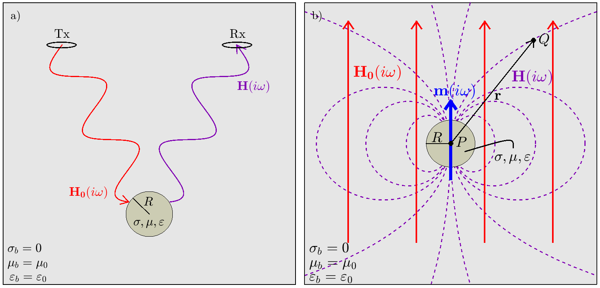

.. _dipole_response

Dipole Response in Free-Space
-----------------------------

Consider the problem geometry illustrated in Figure (??); wherein a homogeneous sphere with physical properties :math:`\mu , \; \sigma` and :math:`\varepsilon`
A transmitter loop (Tx) generate

.. math::
	{\bf H} (i \omega) =\frac{\mu_0}{4\pi} \Bigg [ \frac{3 {\bf r} \; \big [ {\bf m}(i \omega) \cdot {\bf r} \; \big ]}{r^5} - \frac{{\bf m} (i \omega) }{r^3} \Bigg ] 

So long as observations are sufficiently far from the sphere (:math:`\sim 5 \times` the diameter), the response is approximately equal to the dipole field:

.. math::
	{\bf m} (i \omega) = \frac{4\pi}{3}R^3 \chi (i \omega) \, {\bf H_0} (i \omega)

.. math::
	\chi (i \omega) = \frac{3}{2} \Bigg [ \! \frac{2\mu \big [ tanh(\alpha) - \alpha  \big ] + \mu_0 \big [\alpha^2 \, tanh(\alpha) - \alpha + tanh(\alpha) \big ] }{\mu  \big [ tanh(\alpha) - \alpha \big ] - \mu_0 [ \alpha^2 \, tanh(\alpha) - \alpha + tanh(\alpha) \big ] } \! \Bigg ]

where

.. math::
	\alpha = \Big [ i \omega \mu \sigma \Big ]^{1/2} R

        :math:`(a)` Problem geometry for a homogeneous sphere in free-space. :math:`(b)` Dipole field from a conductive and magnetically permeable sphere, under the influence of a uniform inducing field.

