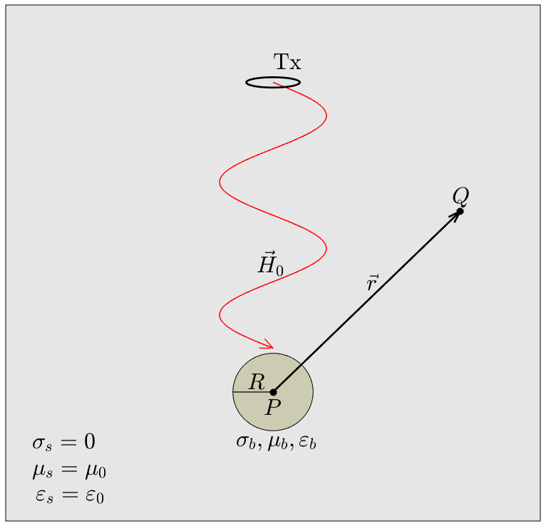

.. _dipole_response

Dipole Response from a Compact Body
-----------------------------------

Dipole Response in Free-Space
=============================

Linear Operator for the Free-Space Dipole Response
==================================================

Here, we present a model for predicting the anomalous frequency-domain response in free-space, from a conductive and permeable sphere, due to an inductive loop source.
This scenario represents a low-order approximation for a conductive and magnetically permeable object within a resistive medium.
The geometry of this problem is shown in Figure ??.

In the previous section, analytic expressions were derived by considering a uniform inducing field about the sphere.
However, if the radius of the sphere is sufficiently smaller than its distance from an inductive source, this condition will hold approximately for small enough frequencies.
According to Ward and Hohmann (1988?), a distance larger than 5 times the average dimension of the object is required for a dipole source.
If the frequency-dependent dipole moment of a conductive and permeable sphere is known, the resulting free-space dipole field may be calculated using Eq. :eq:`DipoleField`, where :math:`\vec m (\omega)` is given by Eq. :eq:`DipoleMoment`.
By decomposing the problem into separable cartesian components, Eq. :eq:`DipoleField` can be re-expressed as:

.. math::
	{\bf B}(\omega) = \frac{\mu_0}{4 \pi r^3} \Big [ 3 {\bf \hat r \otimes \hat r - I} \Big ] \cdot {\bf m} (\omega) = {\bf G} \, {\bf m} (\omega)
	:label: DipoleVacuumLin
	
where

.. math::
	{\bf B} (\omega) = \begin{bmatrix} B_x (\omega) \\ B_y(\omega) \\ B_z(\omega) \end{bmatrix}, \; \;
	{\bf m}(\omega) = \begin{bmatrix} m_x (\omega) \\ m_y(\omega) \\ m_z(\omega) \end{bmatrix} \; \; \textrm{and} \; \;
	{\bf I} = \begin{bmatrix} 1&0&0\\0&1&0\\0&0&1 \end{bmatrix}
	:label: DipoleOperator

The vector from :math:`P` to :math:`Q` is denoted by :math:`\vec r`, and has unit-direction :math:`{\bf \hat r}`.
For our formulation, we use :math:`{\bf \hat r \otimes \hat r}` to represent an outer-product.
We can see from Eq. :eq:`DipoleVacuumLin` that :math:`{\bf G}` is a :math:`3\times 3` linear operator, which depends solely on the geometry of the problem.
Because the magnetization factor for our sphere is a scalar quantity, it may be used to obtain each cartesian component of the induced dipole moment separately.
As a result, we may express :math:`{\bf m} (\omega)` as follows:

.. math::
	{\bf m} (\omega) = {\bf M \, H_0}
	:label: mDecomposition
	
where

.. math::
	{\bf M} = \Bigg ( \frac{4}{3} \pi R^3 \chi (\omega ) \Bigg ) {\bf I} \; \; \textrm{and} \; \;
	{\bf H_0} = \begin{bmatrix} H_x(\omega) \\ H_y (\omega) \\ H_z (\omega) \end{bmatrix}
	:label: Magnetization
	
By substituting Eq. :eq:`mDecomposition` into Eq. :eq:`DipoleVacuumLin`, the free-space dipole response can be expressed as:

.. math::
	{\bf B}(\omega) = {\bf G \, M \, H_0}
	:label: DipoleVacuumLinSys

