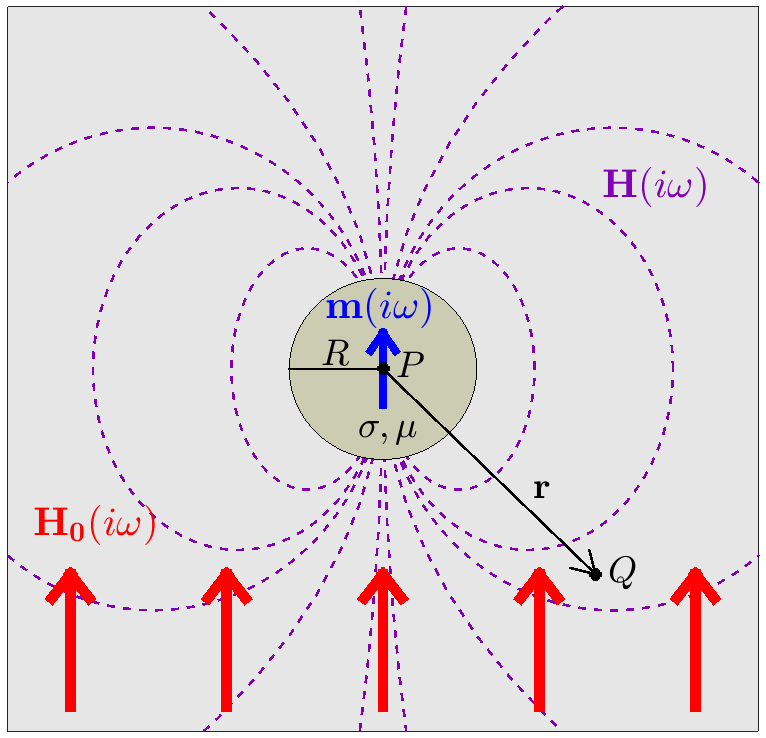

.. _dipole_response

The Sphere's Dipolar Response
-----------------------------

**Purpose**: Here, expressions from Wait (1951) are presented for predicting the dipole response from a conductive and magnetically permeable sphere in free-space.
We show how the characteristic response of the sphere is dependent on its excitation factor; where the excitation factor is used to define the induced dipole moment of the sphere.

.. figure:: ./images/figFreeSpaceSphere.png
        :align: right
        :figwidth: 40%
        :name: FreeSpaceSphere

        Problem geometry for a conductive and magnetically permeable sphere in free-space.

Consider the problem geometry illustrated in :numref:`FreeSpaceSphere`, wherein a sphere of radius :math:`R`, conductivity :math:`\sigma` and magnetic permeability :math:`\mu` is located in the vicinity of an inductive source transmitter (Tx).
The transmitter generates a harmonic primary field :math:`{\bf H_0} (i\omega)` which induces an excitation within the sphere.
Because we are in free-space, :math:`{\bf H_0} (i\omega)` may be calculated using the Biot-Savart law (link).
The excitation induced within the sphere produces a secondary field :math:`{\bf H_s} (i\omega)` which is then measured by a receiver coil (Rx).

        
        Dipolar response :math:`{\bf H} (i\omega)` (purple) from a conductive and magnetically permeable sphere, under the influence of a spatially uniform, harmonic inducing field :math:`{\bf H_0} (i\omega)` (red). The induced dipole moment (blue) is represented by :math:`{\bf m} (i\omega)`.

To approximate the sphere's response, Wait (1951) considered the dipole response from a conductive and magnetically permeable sphere under the influence of a spatially uniform, harmonic field (:numref:`DipoleField`).
For inductive sources, the inducing field may be considered spatially uniform about the sphere if 1) the radius of the sphere is much smaller than the wavelength of the inducing field , and 2) the distance between the transmitter and the sphere is sufficiently larger than the sphere's radius (typically :math:`> 10R` ).
For a magnetic dipole moment :math:`{\bf m} (i\omega)`, the dipole field :math:`{\bf H} (i\omega)` is given by:

.. math::
	{\bf H} (i \omega) =\frac{1}{4\pi} \Bigg [ \frac{3 {\bf r} \; \big [ {\bf m}(i \omega) \cdot {\bf r} \; \big ]}{r^5} - \frac{{\bf m} (i \omega) }{r^3} \Bigg ]
	:label: eqDipoleVacuum

where :math:`{\bf r}` is the vector distance between :math:`P` and :math:`Q`.
The magnetic dipole moment which characterizes the sphere's excitation is given by:

.. math::
	{\bf m} (i \omega) = \frac{4\pi}{3}R^3 \chi (i \omega) \, {\bf H_0} (i \omega)
	:label: eqDipoleMoment

where :math:`\chi (i\omega)` is defined as the sphere's excitation factor.
The dipole moment is therefore a product of the sphere's volume, its excitation factor, and the inducing field.
The excitation factor is used to characterize the nature of the sphere's frequency-domain response.
An explicit expression for the excitation factor is given by (Wait, 1951):

.. math::
	\chi (i \omega) = \frac{3}{2} \Bigg [ \! \frac{2\mu \big [ tanh(\alpha) - \alpha  \big ] + \mu_0 \big [\alpha^2 \, tanh(\alpha) - \alpha + tanh(\alpha) \big ] }{\mu  \big [ tanh(\alpha) - \alpha \big ] - \mu_0 [ \alpha^2 \, tanh(\alpha) - \alpha + tanh(\alpha) \big ] } \! \Bigg ]
	:label: eqExcitationFactor
	
where

.. figure:: ./images/figChiOmega.png
        :align: right
        :figwidth: 45%
        :name: ExcitationEx
        
        Excitation factor for a sphere with physical properties :math:`R=25` m, :math:`\sigma = 10` S/m and :math:`\mu = 1.1 \mu_0`.

.. math::
	\alpha = \Big [ i \omega \mu \sigma \Big ]^{1/2} R

and :math:`\mu_0 = 4\pi \times 10^{-7}` H/m is the permeability of free-space.
An example for the excitation factor as a function of frequency is shown in :numref:`ExcitationEx`.

To summarize, Eqs. :eq:`eqDipoleVacuum`, :eq:`eqDipoleMoment` and :eq:`eqExcitationFactor` can be used to approximate the dipole response from a conductive and magnetically permeable sphere.
The nature of the sphere's response is characterized by the sphere's excitation factor.
The excitation factors for several cases are discussed in the following section (link).

References: Wait, J. R., 1951, "A conductive sphere in a time varying magnetic field," Geophysics, vol. 16, pp. 666-672.

