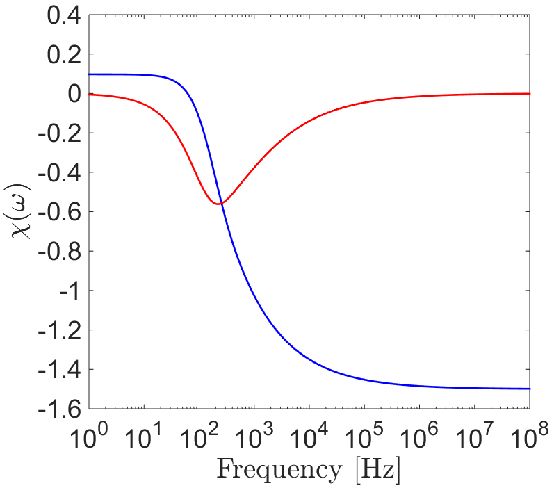
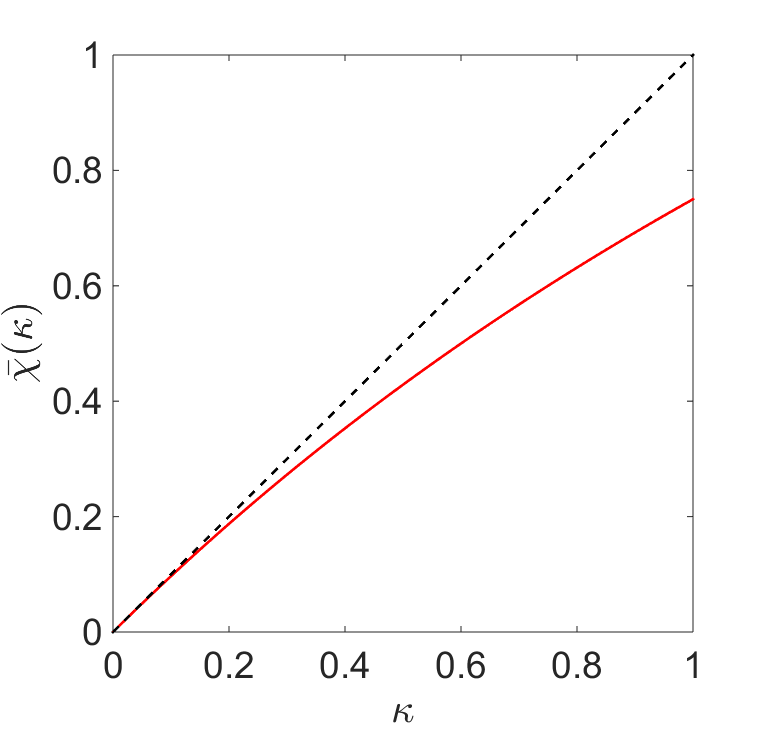

.. _excitation_factor

Excitation Factor for a Conductive and Permeable Sphere
-------------------------------------------------------

.. math::
	\vec m (\omega) = 4 \pi a_0 \vec H_0 (i \omega) = \frac{4\pi}{3}R^3 \chi (\omega) \vec H_0 (i \omega)
	:label: DipoleMoment

where

.. math::
	\chi (\omega) \! =\! \frac{3}{2 e^{-\alpha_b}} \!\Bigg [ \! \frac{2\mu_s \big [ tanh(\alpha_s) - \alpha_s  \big ] + \mu_b \big [\alpha_s^2 \, tanh(\alpha_s) - \alpha_s + tanh(\alpha_s) \big ] }{\mu_s \big ( \alpha_b^2 +\alpha_b + 1 \big ) \big [ tanh(\alpha_s) - \alpha_s \big ] - \mu_b \big ( \alpha_b + 1 \big ) \big [ \alpha_s^2 \, tanh(\alpha_s) - \alpha_s + tanh(\alpha_s) \big ] } \! \Bigg ]
	:label: ChiFull

Conductive and Magnetically Permeable Sphere
============================================

.. math::
	\chi (\omega) = \frac{3}{2} \Bigg [ \! \frac{2\mu_s \big [ tanh(\alpha_s) - \alpha_s  \big ] + \mu_0 \big [\alpha_s^2 \, tanh(\alpha_s) - \alpha_s + tanh(\alpha_s) \big ] }{\mu_s  \big [ tanh(\alpha_s) - \alpha_s \big ] - \mu_0 [ \alpha_s^2 \, tanh(\alpha_s) - \alpha_s + tanh(\alpha_s) \big ] } \! \Bigg ]
	:label: ChiApprox

	Magnetization factor for a sphere in free-space with :math:`\sigma_s` = 10 S/m, :math:`\mu_s` = 1.1 :math:`\mu_0` , :math:`\varepsilon_s` = :math:`\varepsilon_0`, and :math:`R` = 25 m.
	
The magnetization factor for a sphere in free space, with :math:`\sigma_s` = 10 S/m, :math:`\mu_s` = 1.1 :math:`\mu_0` , :math:`\varepsilon_s` = :math:`\varepsilon_0` and :math:`R` = 25 m, can be seen in Figure (reference).
Near the resistive limit, :math:`\chi (\omega)` is positive, implying that excitation of the sphere is parallel to the inducing field.
Because the EM induction is negligible at sufficiently low frequencies, this case represents a purely magnetic response by the sphere.
Near the inductive limit, :math:`\chi(\omega)` is negative.
Therefore, inductive excitation of the sphere will oppose the inducing field.

Purely Conductive Sphere
========================

For a purely conductive object (i.e. :math:`\mu_s = \mu_0`), Eq. :eq:`ChiApprox` can be further simplified.
By neglecting electric displacement (i.e. :math:`\omega \varepsilon_s \ll \sigma_s`):

.. math::
	\chi (\omega) = - \; \frac{3}{2} \Bigg [ 1 + \frac{3}{\alpha^2} - \frac{3 \, \textrm{coth}(\alpha)}{\alpha} \Bigg ]
	:label: ChiConductive 

where

.. math::
	\alpha = \Big [ i \omega \mu_0 \sigma_s \Big ]^{1/2} R
	:label: alpha_c
	
Eq. :eq:`ChiConductive` is commonly used to understand the excitation of a compact conductive object in a resistive medium.

Low-Frequency Limit for Highly Permeable Spheres
================================================

For a conductive and permeable sphere in free-space, Eq. :eq:`ChiApprox` can be used to show that:

.. math::
	\chi (\omega) = \begin{cases}
	\dfrac{3 \big ( \mu_s - \mu_0 \big )}{ \big ( \mu_s + 2 \mu_0 \big ) } = \dfrac{3 \kappa }{3 + \kappa} & \textrm{ as } \omega \rightarrow 0 \\
	\\
	\dfrac{3}{2}  & \textrm{ as } \omega \rightarrow \infty
	\end{cases}
	:label: ChiLimits
	

	
	Magnetization facter at :math:`\omega` = 0 for increasing magnetic susceptibilities (red), compared to a linear trend with respect to :math:`\kappa` (black).

where :math:`\kappa` is the magnetic susceptibility of the sphere, and :math:`\mu_s =\mu_0 \big [ 1 + \kappa \big ]`.
According to Eq. :eq:`ChiLimits`, the inductive limit of :math:`\chi (\omega)` is constant.
As a result, the dipole moment which characterizes the sphere in this case is proportional only to :math:`R^3`, and the strength of the inducing field.
For purely magnetic responses however, the magnetization factor ultimately depends on the magnetic susceptibility of the sphere.
For small magnetic susceptibilities (:math:`\kappa < 0.1`), the relationship between :math:`\kappa` and the resulting dipole moment is approximately linear.
For large values however, the effects of self-demagnetization within the sphere will result in a weaker magnetic dipole moment for the sphere.
As :math:`\kappa \rightarrow \infty`, Eq. :eq:`ChiLimits` can be used to show that :math:`\chi \rightarrow 3`.
The magnetization factor for :math:`\omega = 0`, denoted here as :math:`\chi (\kappa)`, is plotted in Figure (reference). 

