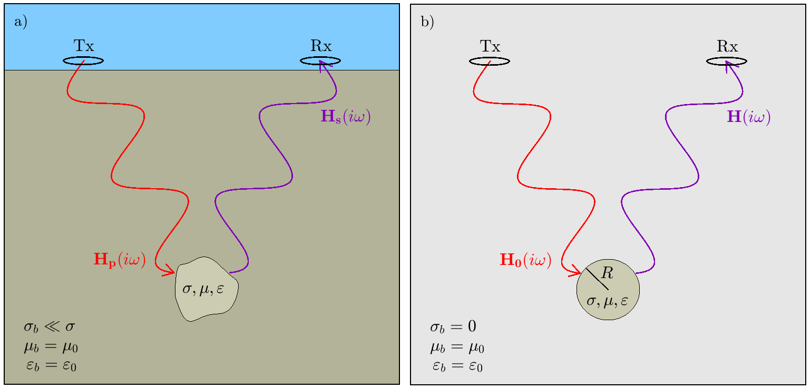

.. _schelkunoff

Derivation of the Excitation Factor
-----------------------------------

In this section, equations derived by Wait (1951) are used to describe the induced magnetic dipole moment of a conductive and permeable sphere, resulting from excitation by a uniform magnetic field (Figure ??).
According to Ward and Hohmann (1989), the frequency-domain wave equation within a homogeneous media can be expressed in terms of the magnetic Schelkunoff potential :math:`\vec F`:

.. math::
	\nabla^2 \vec F - \gamma^2 \vec F = 0
	:label: Schelkunoff_Wave

For a propagation media with conductivity :math:`\sigma`, magnetic permeability :math:`\mu` and electric permittivity :math:`\varepsilon`, the wavenumber :math:`\gamma` can be expressed as follows:

.. math::
	\gamma = \Big [ i \omega \mu \sigma - \omega^2 \mu \varepsilon \Big ]^{1/2}
	:label: Wave_Number

By definition of the Schelkunoff potential, the electric field :math:`\vec E` may be obtained by substituting :math:`\vec F` into the following expression:

.. math::
	\vec E = - \nabla \times \vec F
	:label: EcurlF

And for the magnetic field :math:`\vec H`:

.. math::
	\vec H = - \big (\sigma + i \omega \varepsilon \big ) \vec F + \frac{1}{i \omega \mu} \nabla \big ( \nabla  \cdot \vec F \big )
	:label: SchelkunoffH

For his derivation, Wait (1951) began by considering the induced magnetic dipole moment resulting from an incident plane wave.
If the wavelength of the incident wave is sufficiently larger than the radius of the sphere (i.e. :math:`|\gamma_b |/2\pi \ll R`), then we may assume the magnetic field which induces the dipole moment is approximately uniform about the sphere.
For an inducing field of the form :math:`\vec H_0 (i\omega) = H_0 e^{i\omega t} \hat z`, symmetry of the problem implies that :math:`\vec E` only has components in :math:`\hat \phi`.
Therefore by Eq. :eq:`EcurlF`, it follows that our Schelkunoff potential will only have components in :math:`\hat z`.
The Schulkunoff potential may be obtained by considering seperate solutions inside and outside of the sphere:

.. math::
	\vec F (\omega) = \begin{cases}
	F_b e^{i \omega t} \hat z \; \; \textrm{  at  } \; \; r>R \\
	\\
	F_s e^{i \omega t} \hat z \; \; \textrm{  at  } \; \; r<R 
	\end{cases}
	:label: SolnsInsideOutside

For our problem, boundary conditions on the sphere require that tanjential components of the magnetic field and normal components of the flux density must be continuous.
According to Wait (1951), these conditions are satisfied by the following:

.. math::
	\textrm{At }r=R: \; \begin{cases}
	\dfrac{1}{r} \dfrac{\partial F_b}{\partial r} - \gamma_b^2 F_b = \dfrac{1}{r} \dfrac{\partial F_s}{\partial r} - \gamma_s^2 F_s \\
	  \\
	\mu_b \Bigg ( \dfrac{\partial^2 F_b}{\partial r^2} - \gamma_b^2 F_b \Bigg ) = \mu_s \Bigg ( \dfrac{\partial^2 F_s}{\partial r^2} - \gamma_s^2 F_s \Bigg )
	\end{cases}
	:label: BoundaryConditions

To solve the boundary value problem, Wait (1951) expressed the Schelkunoff potentials, both inside and outside of the sphere, as a sum of spherical harmonic modes with coefficients :math:`a_n` and :math:`b_n`, respectively.
For the boundary conditions to be satisfied however, he found that coefficients :math:`a_n=b_n=0 \; \forall \; n>0`.
As a result, the solution to the Schelkunoff potentials inside and outside the sphere are defined by:

.. math::
	F_b = - \frac{H_0 }{\sigma_b + i \omega \varepsilon_b} + i \omega \mu_b  \frac{e^{-\gamma_b r}}{r}a_0 H_0
	:label: Foutside

and

.. math::
	F_s = i \omega \mu_s \frac{sinh \big ( \gamma_s r \big )}{r} b_0 H_0
	:label: Finside

To determine the solution outside of the sphere, Eqs. :eq:`Foutside` and :eq:`Finside` may be substituted into Eq. :eq:`BoundaryConditions`.
Through meticulous algebra, coefficient :math:`a_0` can be expressed as:

.. math::
	a_0 \! =\! \frac{R^3}{2 e^{-\alpha_b}} \!\Bigg [ \! \frac{2\mu_s \big [ tanh(\alpha_s) - \alpha_s  \big ] + \mu_b \big [\alpha_s^2 \, tanh(\alpha_s) - \alpha_s + tanh(\alpha_s) \big ] }{\mu_s \big ( \alpha_b^2 +\alpha_b + 1 \big ) \big [ tanh(\alpha_s) - \alpha_s \big ] - \mu_b \big ( \alpha_b + 1 \big ) \big [ \alpha_s^2 \, tanh(\alpha_s) - \alpha_s + tanh(\alpha_s) \big ] } \! \Bigg ]
	:label: a0
	
where

.. math::
	\alpha_b = \gamma_b R = \Big [ i \omega \mu_b \sigma_b - \omega^2 \mu_b \varepsilon_b \Big ]^{1/2} R
	:label: alpha_b
	
and

.. math::
	\alpha_s = \gamma_s R = \Big [ i \omega \mu_s \sigma_s - \omega^2 \mu_s \varepsilon_s \Big ]^{1/2} R
	:label: alpha_s

The total magnetic field outside the sphere, in response to an inducing field of the form :math:`\vec H_0 e^{i\omega t}`, may be obtained by substituting Eqs. :eq:`Foutside` and :eq:`a0` into Eq. :eq:`SchelkunoffH`.
Note that our derivation of :math:`a_0` did not require us to include the frequency-dependent term :math:`e^{i\omega t}` of the primary field.
Therefore, we may generalize our solution for any inducing field of the form :math:`\vec H_0 (i\omega )`.
For practical purposes, it is common to examine the dipole response of the sphere.
In this case, the dipole response :math:`\vec B (\omega)` at location :math:`Q` is:

.. math::
	\vec B (\omega) =\frac{\mu_0}{4\pi} \Bigg [ \frac{3\vec r \; \big [ \vec m(\omega) \cdot \vec r \; \big ]}{r^5} - \frac{\vec m (\omega) }{r^3} \Bigg ] 
	:label: DipoleField

where :math:`\mu_0` is the permeability of free-space, :math:`\vec r` defines the spatial vector from :math:`P` to :math:`Q`, and :math:`\vec m (\omega)` is the frequency-dependent dipole moment induced by the primary field.
The dipole moment can be expressed as the product of the sphere's volume, the inducing field, and a magnetization factor :math:`\chi (\omega)`:

.. math::
	\vec m (\omega) = 4 \pi a_0 \vec H_0 (i \omega) = \frac{4\pi}{3}R^3 \chi (\omega) \vec H_0 (i \omega)
	:label: DipoleMoment

where

.. math::
	\chi (\omega) \! =\! \frac{3}{2 e^{-\alpha_b}} \!\Bigg [ \! \frac{2\mu_s \big [ tanh(\alpha_s) - \alpha_s  \big ] + \mu_b \big [\alpha_s^2 \, tanh(\alpha_s) - \alpha_s + tanh(\alpha_s) \big ] }{\mu_s \big ( \alpha_b^2 +\alpha_b + 1 \big ) \big [ tanh(\alpha_s) - \alpha_s \big ] - \mu_b \big ( \alpha_b + 1 \big ) \big [ \alpha_s^2 \, tanh(\alpha_s) - \alpha_s + tanh(\alpha_s) \big ] } \! \Bigg ]
	:label: ChiFull

If the sphere is located within a resistive medium, then :math:`\alpha_b \ll \alpha_s`, :math:`\mu_b = \mu_0`, and Eq. :eq:`ChiFull` will reduce to:

.. math::
	\chi (\omega) = \frac{3}{2} \Bigg [ \! \frac{2\mu_s \big [ tanh(\alpha_s) - \alpha_s  \big ] + \mu_0 \big [\alpha_s^2 \, tanh(\alpha_s) - \alpha_s + tanh(\alpha_s) \big ] }{\mu_s  \big [ tanh(\alpha_s) - \alpha_s \big ] - \mu_0 [ \alpha_s^2 \, tanh(\alpha_s) - \alpha_s + tanh(\alpha_s) \big ] } \! \Bigg ]
	:label: ChiApprox

