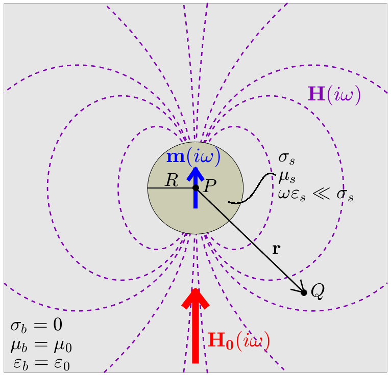

.. _schelkunoff

Derivation of the Excitation Factor
-----------------------------------

In this section, the excitation factor for a conductive and magnetically permeable sphere in free-space is derived according to Wait (1951).
The excitation factor characterizes the magnetic dipole moment, induced by a uniform, harmonic magnetic field.

The geometry of our problem is illustrated in :numref:`SchelkunoffGeometry`, where :math:`{\bf H_0}(i\omega)` represents the inducing field, :math:`{\bf m}(i\omega)` is the induced magnetic dipole moment of the sphere, and :math:`{\bf H}(i\omega)` is the resulting dipole response.
:math:`\sigma_s`, :math:`\mu_s` and :math:`\varepsilon_s` represent the conductivity, magnetic permeability and electric permittivity of the sphere, respectively.
:math:`\sigma_b`, :math:`\mu_b` and :math:`\varepsilon_b` represent the conductivity, magnetic permeability and electric permittivity of the background media.

        Geometry for the free-space dipole response from a conductive and magnetically permeable sphere.

Let us begin the derivation by considering Maxwell's equations in the frequency domain:

.. math::
	\begin{align}
	\nabla \times {\bf E} &= - i \omega \mu {\bf H}\\
	\nabla \times {\bf H} &= \big ( \sigma + i \omega \varepsilon \big ) {\bf E}
	\end{align}
	:label: Maxwell_Schelk
	
where :math:`\omega` is the angular frequency, :math:`\sigma` is the conductivity, :math:`\mu` is the magnetic permeability, and :math:`\varepsilon` is the electric permittivity.
According to Ward and Hohmann (1988), the electric field :math:`{\bf E}` and magnetic field intensity :math:`{\bf H}` may be written in terms of the following Schelkunoff potential :math:`{\bf F}`, where:

.. math::
	{\bf E} = - \nabla \times {\bf F}
	:label: SchelkunoffE
	
and

.. math::
	{\bf H} = - \big (\sigma + i \omega \varepsilon \big ) {\bf F} + \frac{1}{i \omega \mu} \nabla \big ( \nabla  \cdot {\bf F} \big )
	:label: SchelkunoffH
	
By subsituting Eqs. :eq:`SchelkunoffE` and :eq:`SchelkunoffH` into Maxwell's equations, we can obtain a wave equation in terms of the :math:`{\bf F}` potential:

.. math::
	\nabla^2 {\bf F} - \gamma^2 {\bf F} = 0
	:label: Schelkunoff_Wave

The wavenumber :math:`\gamma` depends on the physical properties of the media, and is given by:

.. math::
	\gamma = \Big [ i \omega \mu \sigma - \omega^2 \mu \varepsilon \Big ]^{1/2}
	:label: Wave_Number

For his derivation, Wait (1951) considered the induced magnetic dipole moment resulting from an incident plane wave.
If the wavelength of the incident wave is sufficiently larger than the radius of the sphere (i.e. :math:`|\gamma_b |/2\pi \ll R`), then we may assume the magnetic field which excites the sphere is approximately uniform about the sphere.
For an inducing field of the form :math:`{\bf H_0} (i\omega) = H_0 e^{i\omega t} {\bf \hat z}`, symmetry of the problem implies that :math:`{\bf E}` only has components in :math:`\boldsymbol{\hat \phi}`.
Therefore by Eq. :eq:`SchelkunoffE`, it follows that our Schelkunoff potential will only have components in :math:`{\bf \hat z}` as well.

The Schulkunoff potential may be obtained by considering seperate solutions inside and outside of the sphere:

.. math::
	{\bf F} (\omega) = \begin{cases}
	F_b e^{i \omega t} {\bf \hat z} \; \; \textrm{  at  } \; \; r>R \\
	\\
	F_s e^{i \omega t} {\bf \hat z} \; \; \textrm{  at  } \; \; r<R 
	\end{cases}
	:label: SolnsInsideOutside

For our problem, boundary conditions on the sphere require that tanjential components of the magnetic field and normal components of the flux density must be continuous.
According to Wait (1951), these conditions are satisfied by the following expressions:

.. math::
	\textrm{At }r=R: \; \begin{cases}
	\dfrac{1}{r} \dfrac{\partial F_b}{\partial r} - \gamma_b^2 F_b = \dfrac{1}{r} \dfrac{\partial F_s}{\partial r} - \gamma_s^2 F_s \\
	  \\
	\mu_b \Bigg ( \dfrac{\partial^2 F_b}{\partial r^2} - \gamma_b^2 F_b \Bigg ) = \mu_s \Bigg ( \dfrac{\partial^2 F_s}{\partial r^2} - \gamma_s^2 F_s \Bigg )
	\end{cases}
	:label: BoundaryConditions

To solve the boundary value problem, Wait (1951) expressed the solutions, both inside and outside of the sphere, as a sum of spherical harmonic modes with coefficients :math:`a_n` and :math:`b_n`, respectively.
For the boundary conditions to be satisfied however, he found that coefficients :math:`a_n=b_n=0 \; \forall \; n>0`.
As a result, the solution to the Schelkunoff potentials inside and outside the sphere are defined by:

.. math::
	F_b = - \frac{H_0 }{\sigma_b + i \omega \varepsilon_b} + i \omega \mu_b  \frac{e^{-\gamma_b r}}{r}a_0 H_0
	:label: Foutside

and

.. math::
	F_s = i \omega \mu_s \frac{sinh \big ( \gamma_s r \big )}{r} b_0 H_0
	:label: Finside

To determine the solution outside of the sphere, Eqs. :eq:`Foutside` and :eq:`Finside` may be substituted into Eq. :eq:`BoundaryConditions`.
Through meticulous algebra, coefficient :math:`a_0` can be expressed as:

.. math::
	a_0 \! =\! \frac{R^3}{2 e^{-\alpha_b}} \!\Bigg [ \! \frac{2\mu_s \big [ tanh(\alpha_s) - \alpha_s  \big ] + \mu_b \big [\alpha_s^2 \, tanh(\alpha_s) - \alpha_s + tanh(\alpha_s) \big ] }{\mu_s \big ( \alpha_b^2 +\alpha_b + 1 \big ) \big [ tanh(\alpha_s) - \alpha_s \big ] - \mu_b \big ( \alpha_b + 1 \big ) \big [ \alpha_s^2 \, tanh(\alpha_s) - \alpha_s + tanh(\alpha_s) \big ] } \! \Bigg ]
	:label: a0
	
where

.. math::
	\alpha_b = \gamma_b R = \Big [ i \omega \mu_b \sigma_b - \omega^2 \mu_b \varepsilon_b \Big ]^{1/2} R
	:label: alpha_b
	
and

.. math::
	\alpha_s = \gamma_s R = \Big [ i \omega \mu_s \sigma_s - \omega^2 \mu_s \varepsilon_s \Big ]^{1/2} R
	:label: alpha_s

The total magnetic field outside the sphere, in response to an inducing field of the form :math:`{\bf H_0} e^{i\omega t}`, may be obtained by substituting Eqs. :eq:`Foutside` and :eq:`a0` into Eq. :eq:`SchelkunoffH`.
Note that our derivation of :math:`a_0` did not require us to include the frequency-dependent term :math:`e^{i\omega t}` of the primary field.
Therefore, we may generalize our solution for any harmonic inducing field of the form :math:`{\bf H_0} (i\omega )`.

If the sphere lies within a resistive background (:math:`\sigma_b \ll \sigma_s`, :math:`\mu_b = \mu_0`, and :math:`\varepsilon_b = \varepsilon_0`), and if electric displacement within the sphere is neglected (:math:`\omega \varepsilon_s \ll \sigma_s`), then Eq. :eq:`a0` reduces to:

.. math::
	a_0 \! =\! \frac{R^3}{2} \!\Bigg [ \! \frac{2\mu_s \big [ tanh(\alpha) - \alpha  \big ] + \mu_0 \big [\alpha^2 \, tanh(\alpha) - \alpha + tanh(\alpha) \big ] }{\mu_s \big [ tanh(\alpha) - \alpha \big ] - \mu_0 \big [ \alpha^2 \, tanh(\alpha) - \alpha + tanh(\alpha) \big ] } \! \Bigg ]
	:label: a0reduced
	
where

.. math::
	\alpha = \Big [ i\omega \mu_s \sigma_s \Big ]^{1/2}R
	:label: alpha

Wait (1951) simplified the solution outside the sphere by considering the dipole field within a vacuum.
For a dipole moment :math:`{\bf m} (i\omega)`, the dipole field :math:`{\bf H} (i\omega)` is given by (Griffiths, 1999):

.. math::
	{\bf H} (i \omega) =\frac{1}{4\pi} \Bigg [ \frac{3 {\bf r} \; \big [ {\bf m} (i\omega) \cdot {\bf r} \; \big ]}{r^5} - \frac{{\bf m} (i\omega) }{r^3} \Bigg ] 
	:label: DipoleField

where :math:`{\bf r}` defines the spatial vector from :math:`P` to :math:`Q`.
The dipole field was derived by performing a multipole expansion on Eq. :eq:`Foutside`, and neglecting higher order terms.
This lead to an explicit expression for the magnetic dipole moment in terms of coefficient :math:`a_0`, where:

.. math::
	{\bf m} (i \omega) = 4 \pi a_0 {\bf H_0} (i \omega) = \frac{4\pi}{3}R^3 \chi (i \omega) {\bf H_0} (i \omega)
	:label: DipoleMoment

According the Eq. :eq:`DipoleMoment`, :math:`{\bf m} (i\omega)` may also be expressed as the product of the inducing field, the sphere's volume, and an excitation factor :math:`\chi (i\omega)`, where:

.. math::
	\chi (i \omega) = \frac{3}{2} \Bigg [ \! \frac{2\mu_s \big [ tanh(\alpha) - \alpha  \big ] + \mu_0 \big [\alpha^2 \, tanh(\alpha) - \alpha + tanh(\alpha) \big ] }{\mu_s  \big [ tanh(\alpha) - \alpha \big ] - \mu_0 [ \alpha^2 \, tanh(\alpha) - \alpha + tanh(\alpha) \big ] } \! \Bigg ]
	:label: ChiApprox

