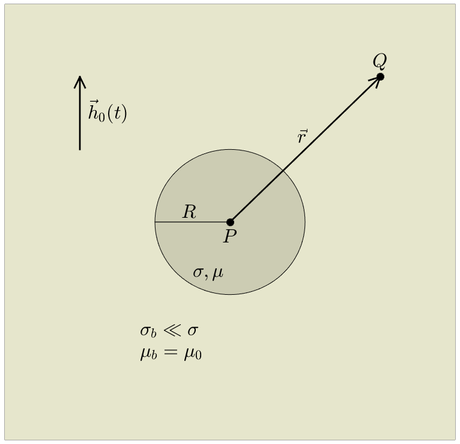
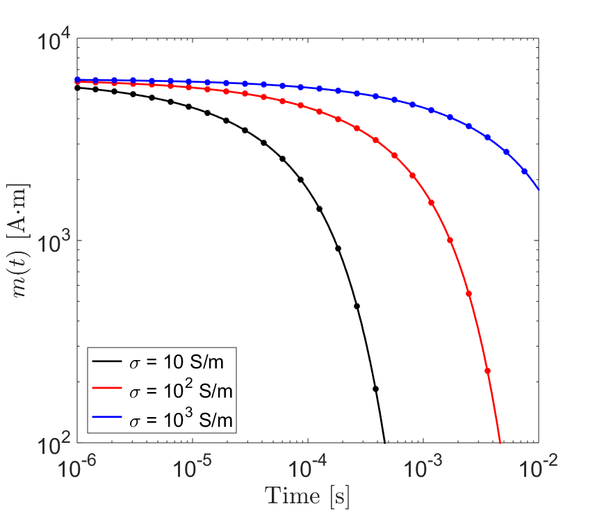
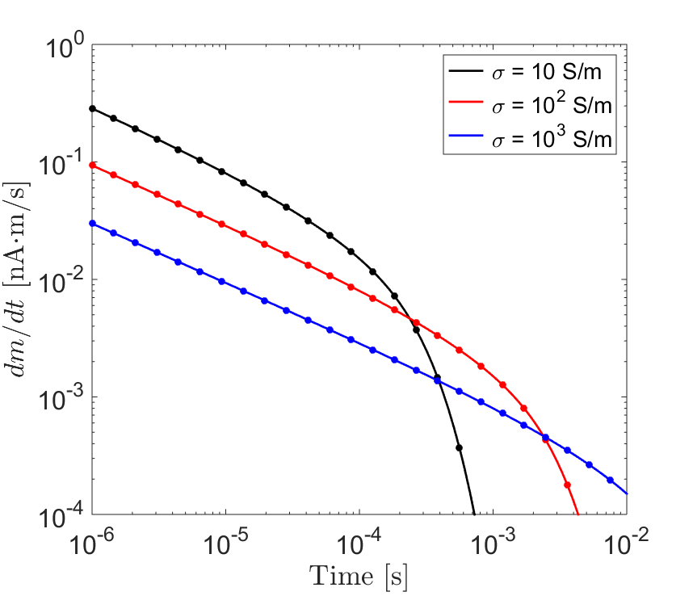
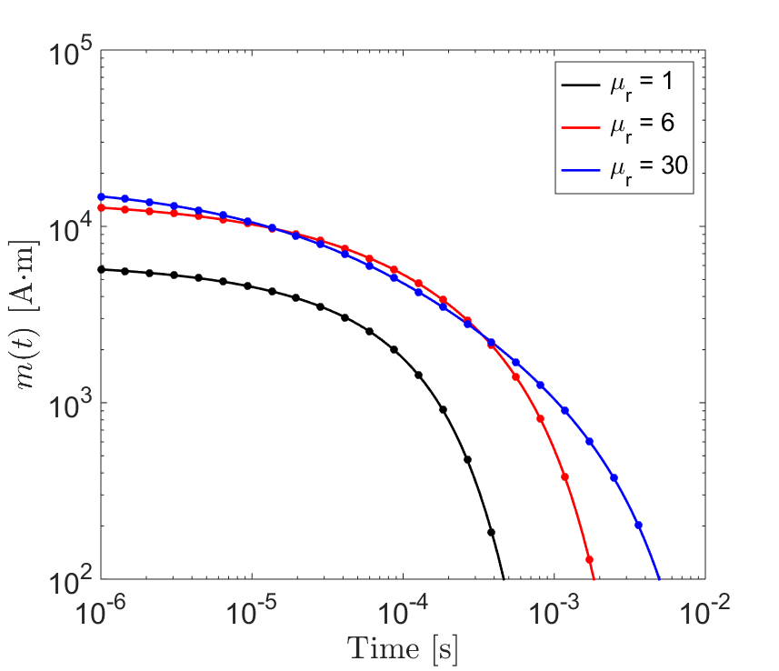
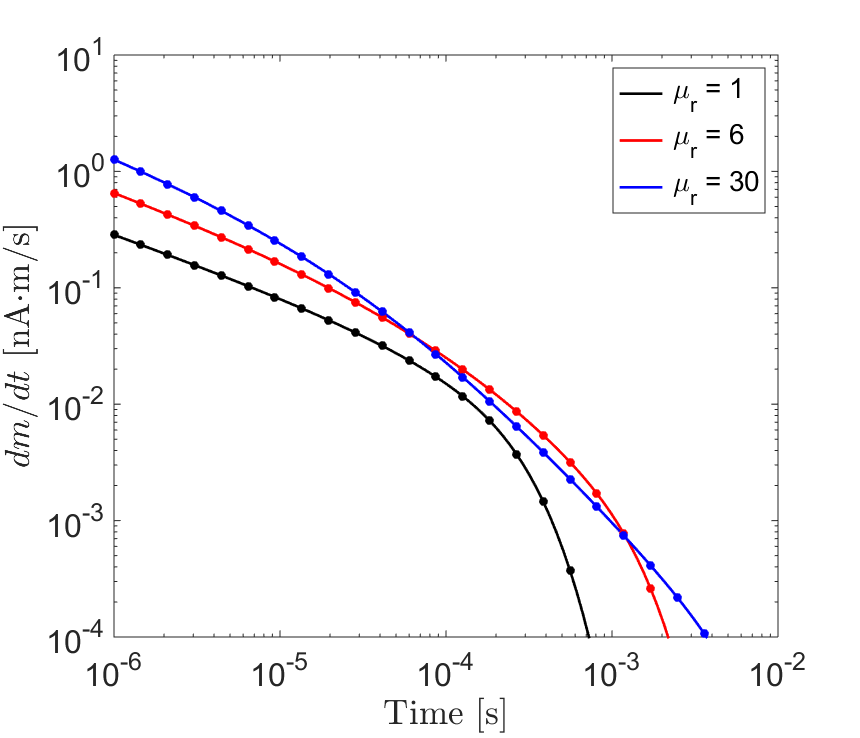
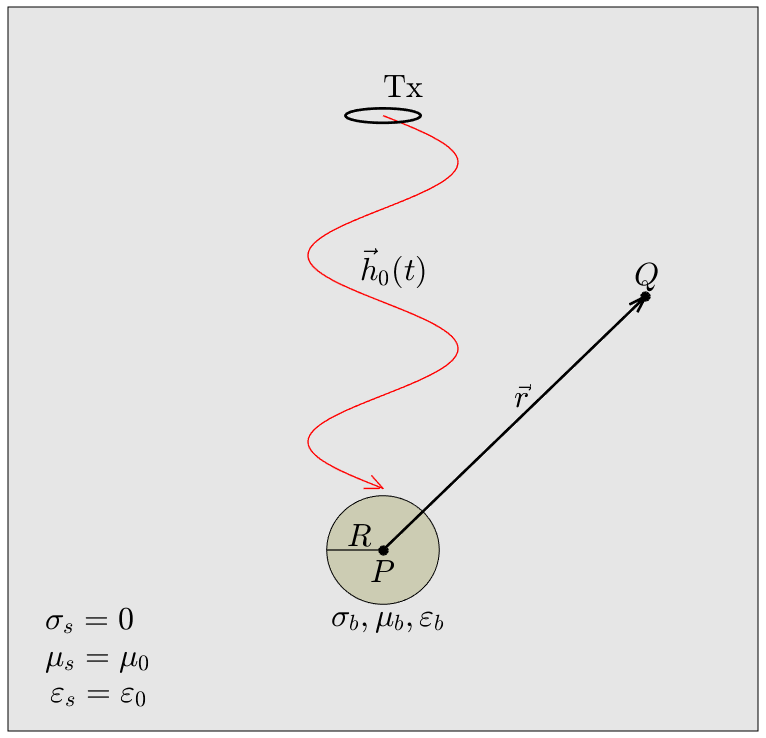

.. _SphereTEM_index:

Response from a Conducting and Permeable Sphere in Free-Space
-------------------------------------------------------------

Introduction
============

Time-domain responses from ore bodies and unexploded ordnance items are of great practical importance to geophysicists.
On a fundamental level, these responses can be understood by considering the excitation of a conductive and magnetically permeable sphere.
Wait (1951) was able to characterize a sphere's frequency-domain excitation in terms of an induced dipole moment.
Here, expressions derived by Wait (1951) are transformed to the time-domain according to Wait and Spies (1969).
These expressions are used to provide explicit solutions for the step and impulse responses which characterize conductive and magnetically permeable spheres.
A simple model for predicing the sphere's dipole response in free-space is then presented.
For a sufficiently compact target, and at sufficiently late times, the free-space response represents a good approximation to the response of a conductive and permeable object within a resistive medium.

Obtaining the Time-Domain Response of a Conducting and Permeable Sphere
=======================================================================

Consider a conductive and permeable sphere in a resistive media (Figure reference).
Under the influence of an applied magnetic field, the sphere will exhibit an electromagnetic response.
This response may be represented by an induced magnetic dipole moment.
In the frequency domain, the magnetic dipole moment :math:`\vec m(i \omega)` induced by the primary field is given by:

.. math::
	\vec m (i \omega) = \frac{4\pi}{3}R^3 \chi (i \omega) \vec H_0 (i \omega) 
	:label: DipoleMoment

where :math:`R` is the radius of the sphere, :math:`\chi (i \omega)` is an excitation factor, and :math:`H_0 (i \omega)` is a harmonic inducing field.
It should be noted that because of our problem geometry, all excitation is parallel to the inducing field.

To obtain the time-dependent magnetic dipole moment of the sphere, defined by :math:`m(t)`, we can apply an inverse Fourier transform to Eq. :eq:`DipoleMoment`:

.. math::
	m(t) = \frac{1}{2\pi} \int_{-\infty}^\infty m(i \omega) e^{i\omega t} \, d\omega = \frac{4 \pi}{3} R^3 \Bigg [ \frac{1}{2\pi} \int_{-\infty}^\infty \chi(i \omega) H_0 (i\omega) e^{i\omega t} \, d\omega \Bigg ]
	:label: mIFT

By letting :math:`s = i\omega`, :math:`m(t)` can also be obtained via the following inverse Laplace transform (Wait, 1951; Wait and Spies, 1969):

.. math::
	m(t) = \frac{1}{2\pi i} \int_{c-i\infty}^{c+i\infty} m(s) e^{s t} \, ds = \frac{4 \pi}{3} R^3 \Bigg [ \frac{1}{2\pi i} \int_{c-i\infty}^{c+i\infty} \chi(s) H_0 (s) e^{s t} \, ds \Bigg ] = \mathcal{L}^{-1} \big [m(s) \big ]
	:label: mILT

where :math:`c` is some positive constant.
The inverse Fourier transform of the product of two frequency-dependent functions can be expressed as a convolution, thus:

.. math::
	m(t) = \frac{4\pi}{3} R^3 \big [ \chi_\delta (t) \otimes h_0(t) \big ] 
	:label: mConvolutionDef
	
where :math:`\chi_\delta (t)` is defined as the excitation's impulse response, and :math:`h_0 (t)` is the time-dependent inducing field.
The excitation's impulse response is the inverse Fourier transform of :math:`\chi (i\omega)`, or inverse Laplace transform, of :math:`\chi (s)`:

.. math::
	\chi_\delta (t) = \frac{1}{2\pi} \int_{-\infty}^\infty \chi (i \omega) e^{i\omega t} \, d\omega = \frac{1}{2\pi i} \int_{c-i\infty}^{c+i\infty} \chi (s) e^{s t} ds
	:label: ImpulseIFT

The convolution :math:`\chi_\delta (t) \otimes h_0 (t)` is defined as:

.. math::
	\chi_\delta (t) \otimes h_0 (t) = \int_{-\infty}^\infty \chi_\delta (\tau) h_0 (t -\tau) d\tau = \int_{-\infty}^\infty \chi_\delta (t - \tau) h_0 (\tau) d\tau 
	:label: ConvolutionDef

Therefore, we can obtain the sphere's time-domain excitation two different ways: 1) obtain the sphere's frequency-domain magnetization and take the inverse Fourier/Laplace transform, or 2) use the inverse Fourier/Laplace transform to obtain the sphere's impulse response and convolve it with a time-dependent inducing field waveform.

The time-domain response of the sphere is causal, implying :math:`\chi_\delta (t<0)=0`.
As a result, the convolution is frequently expressed as an integral from 0 to :math:`\infty`.
For many geophysical applications, we are interested in the response to step-off excitation.
In this case, the sphere is excited by an inducing field of the form:

.. math::
	h_0 (t) = h_0 \big [ 1 - u(t) \big ]
	:label: StepOff

where :math:`h_0` is the amplitude of the field before it is removed, and :math:`u(t)` is the unit step function.
According to Newmann (et al., 1996), the time-dependent magnetization at :math:`t>0` can be expressed using inverse sine and cosine transforms:

.. math::
	\begin{split}
	m(t) &= - \frac{4\pi}{3}R^3 \Bigg [ \frac{2}{\pi} \int_0^\infty \frac{\mathrm{Im} [\chi(i\omega)]}{\omega} \; \mathrm{cos}(\omega t) \;d \omega \Bigg ] h_0 \\
	     &= m(0) - \frac{4\pi}{3}R^3 \Bigg [ \frac{2}{\pi} \int_0^\infty \frac{\mathrm{Re} [\chi(i\omega)]}{\omega} \; \mathrm{sin}(\omega t) \; d \omega \Bigg ] h_0
	\end{split}
	:label: mSineCosine

where :math:`m(0)` represents some initial dipole moment at :math:`t=0`. For the rate of decay:

.. math::
	\begin{split}
	\frac{d \, m(t)}{d t} &= \frac{4\pi}{3}R^3 \Bigg [ \frac{2}{\pi} \int_0^\infty \mathrm{Im} [\chi (i\omega)] \; \mathrm{sin}(\omega t) \;d \omega \Bigg ] h_0\\
					    &= - \frac{4\pi}{3}R^3 \Bigg [ \frac{2}{\pi} \int_0^\infty \mathrm{Re} [\chi(i\omega)]\; \mathrm{cos}(\omega t) \; d \omega \Bigg ] h_0 
	\end{split}
	:label: dmdtSineCosine

Eqs :eq:`mSineCosine` and :eq:`dmdtSineCosine` have been used extensively in geophysical applications to examine transient responses using expressions derived in the frequency-domain.

Response from a Conducting Sphere in a Resistive Medium
=======================================================

Here we consider the time-dependent magnetization of a purely conductive sphere (:math:`\mu = \mu_0`) within a resistive medium (:math:`\sigma_b \ll \sigma`).
In this case, the frequency-dependent excitation of the sphere is defined by:

.. math::
	\chi (i\omega) = - \; \frac{3}{2} \Bigg [ 1 + \frac{3}{\alpha^2} - \frac{3 \, \textrm{coth} (\alpha)}{\alpha} \Bigg ]
	:label: ChiConductive

where, if electric displacement is neglected (i.e. :math:`\omega \varepsilon \ll \sigma`):

.. math::
	\alpha = \Big [ i \omega \mu_0 \sigma \Big ]^{1/2} R
	:label: alpha

From Eq. :eq:`alpha`, we can see that the sphere's excitation factor is dependent on the product of :math:`\sqrt{\sigma}R`.

Impulse Response
++++++++++++++++

To obtain the excitation factor's impulse response, Wait and Spies (1969) employed a change of variables on Eq. :eq:`ChiConductive` by replacing :math:`s=i\omega` and :math:`\beta=(\mu_0 \sigma)^{1/2} R`.
The hyperbolic cotanjent term was then re-expressed as an infinit series, thus:

.. math::
	\begin{align}
	\chi (s)&= - \; \frac{3}{2} \Bigg [ 1 + \frac{3}{\beta^2 s} - \frac{3 \, \textrm{coth} (\beta s^{1/2} )}{\beta s^{1/2}} \Bigg ] \\
		&= - \; \frac{3}{2} \Bigg [ 1 + \frac{3}{\beta^2 s} + \frac{3}{\beta s^{1/2}} \Bigg ( \frac{1 + e^{-2 \beta s^{1/2} } }{1 -  e^{-2 \beta s^{1/2}}} \Bigg ) \Bigg ] \\
		&= - \; \frac{3}{2} \Bigg [ 1 + \frac{3}{\beta^2 s} - \frac{3}{\beta s^{1/2}} - \frac{6}{\beta} \sum_{n = 1}^\infty \frac{e^{-2n \beta s^{1/2}}}{s^{1/2}} \Bigg ]
	\end{align}
	:label: ChiChangeVar

This allowed them to obtain the excitation's impulse response using the inverse Laplace transform:

.. math::
	\chi_\delta (t) = \frac{1}{2 \pi i} \int_{c - i\infty}^{c + i\infty} \chi (s) e^{st} ds = \mathcal{L}^{-1} \big [ \chi (s) \big ]
	:label: LaplaceIFT

where :math:`c` is a small positive constant, chosen so that the contour path of integration lies within the convergence region of :math:`\chi (s)`.
By substituting Eq. :eq:`ChiChangeVar` into Eq. :eq:`LaplaceIFT`, a conductive sphere's impulse response can be expressed as:

.. math::
	\chi_\delta (t) = - \; \frac{3}{2} \delta (t) - \frac{9}{2} \Bigg [ \frac{1}{\beta^2} - \frac{1}{\beta \sqrt{\pi t}} \Bigg ( 1 + 2 \sum_{n = 1}^\infty e^{-(n\beta)^2/t} \Bigg ) \Bigg ] u(t)
	:label: ImpulseConductive

where :math:`\delta(t)` is the Dirac delta function.
We can see that Eq. :eq:`ImpulseConductive` is zero for :math:`t<0`, implying it is causal.
It should be noted that our expression for :math:`\chi_\delta (t)` differs from the one in Wait and Spies (1969) by a factor of :math:`-3/2`.
This is because of how we chose to define :math:`\chi (i\omega)`.
Although the impulse response is written as an infinite series, exponential terms become negligible when the product of :math:`(n\beta)^2t` is sufficiently large.
As a result, only a finite portion of the sum is required to approximate the response to a reasonable degree of accuracy, with more terms being required at early times.

Step Response
++++++++++++++++

Consider the sphere's response to step-excitation.
At time :math:`t=0`, an inducing field of amplitude :math:`h_0` excites the sphere.
The inducing field can be expressed as:

.. math::
	h_0 (t) = h_0 u(t)
	:label: StepOn

Using Eqs. :eq:`ConvolutionDef`, :eq:`ImpulseConductive` and :eq:`StepOn` to solve Eq. :eq:`mConvolutionDef`:

.. math::
	m(t) = \frac{4\pi}{3}R^3 \Bigg [ \int_{-\infty}^{\infty} \chi_\delta (\tau) h_0 u(t-\tau) d\tau \Bigg ] = \frac{4\pi}{3}R^3 \Bigg [ \int_0^t \chi_\delta (\tau) d\tau \Bigg ] h_0
	:label: ConvolutionStep

The convolution in Eq. :eq:`ConvolutionStep` only requires integration of the impulse response from 0 to :math:`t`.
By substituting Eq. :eq:`ChiConductive` into Eq :eq:`ConvolutionStep`, we can obtain the final expression presented in Wait and Spies (1969):

.. math::
	\int_0^t \chi_\delta (t) d\tau = - \; \frac{9}{2} \Bigg [ \frac{1}{3} + \frac{t}{\beta^2} - \frac{2}{\beta} \sqrt{\dfrac{t}{\pi}} \Bigg ( 1 + 2 \sum_{n=1}^\infty e^{-(n\beta)^2/t} \Bigg ) + 4 \sum_{n=1}^\infty n \; \textrm{erfc}\Bigg ( \frac{n\beta}{\sqrt{t}} \Bigg ) \Bigg ] u(t)
	:label: IntImpulse0t

where :math:`\textrm{erfc}(z)` is the complimentary error function given by:

.. math::
	\textrm{erfc}(z) = \frac{2}{\sqrt{\pi}} \int_z^\infty e^{-t^2} dt
	:label: erfc
	
Although a rigorous proof will not be provided here, Eq. :eq:`IntImpulse0t` goes to 0 as :math:`t` goes to infinity.
Thus:

.. math::
	\lim_{t\rightarrow\infty} \; \int_0^t \chi_\delta (\tau) d\tau = 0
	:label: IntImpulseLimit
	
This is expected given that inductive responses decay to zero after sufficient time.
The response to step-off excitation may be obtained by replacing the waveform in Eq. :eq:`ConvolutionStep` with Eq. :eq:`StepOff`.
This results in the following expression:

.. math::
	m(t) = \frac{4\pi}{3}R^3 \Bigg [ \int_{-\infty}^{\infty} \chi_\delta (\tau) h_0 \big [ 1 - u(t-\tau) \big ] d\tau \Bigg ] = - \; \frac{4\pi}{3}R^3 \Bigg [ \int_0^t \chi_\delta (\tau) d\tau \Bigg ] h_0
	:label: ConvolutionStepOff
	
Comparing Eqs. :eq:`ConvolutionStep` and :eq:`ConvolutionStepOff`, the response to step-on and step-off excitation behave identically and have opposing sign.
The rate of decay for the step-off response is obtained by taking the derivative of Eq. :eq:`ConvolutionStepOff` with respect to :math:`t`:

.. math::
	\begin{align}
	\frac{d \, m(t)}{dt} &= \frac{4\pi}{3}R^3 \Bigg [ \int_{-\infty}^{\infty} \chi_\delta (\tau) \frac{d \, h_0 (t-\tau)}{dt} d\tau \Bigg ] \\
			     &= \frac{4\pi}{3}R^3 \Bigg [ - \; \int_{-\infty}^{\infty} \chi_\delta (\tau) \, h_0 \, \delta (t-\tau) d\tau \Bigg ] \\
			     &= - \; \frac{4\pi}{3}R^3 \, \chi_\delta (t) \, h_0
	\end{align}
	:label: dmdtStepOff

Therefore, the rate of decay may be obtained directly if the excitation's impulse response is known.
The unit step-off response for a sphere of radius :math:`R` = 10 m, for several conductivities, is shown in Figure ??.
Solid lines are responses predicted using Eqs. :eq:`mSineCosine` and :eq:`dmdtSineCosine`.
Circular dots are responses predicted using analytic expressions derived in this section.

Response from a Conductive and Magnetically Permeable Sphere in a Resistive Medium
==================================================================================

Here we consider the time-dependent magnetization of a conductive and magnetically permeable sphere within a resistive medium (:math:`\sigma_b \ll \sigma`).
Expressions for the step-on response, step-off response, rate of decay, and impulse response are presented.
In this case, the frequency-dependent excitation of the sphere is defined by:

.. math::
	\chi (i\omega) = \frac{3}{2} \Bigg [ \frac{2\mu (\mathrm{tanh} \, \alpha - \alpha) + \mu_0 (\alpha^2 \, \mathrm{tanh} \, \alpha - \alpha + \mathrm{tanh} \, \alpha)}{\mu (\mathrm{tanh} \, \alpha - \alpha) - \mu_0 (\alpha^2 \, \mathrm{tanh} \, \alpha - \alpha + \mathrm{tanh} \, \alpha)} \Bigg ]
	:label: ChiPermeable

where, if electric displacement is neglected (i.e. :math:`\omega \varepsilon \ll \sigma`):

.. math::
	\alpha = \Big [ i \omega \mu \sigma \Big ]^{1/2} R
	:label: alphaPermeable

Once again, step and impulse responses for the conductive and magnetically permeable sphere can be derived using the inverse Laplace transform (Wait and Spies, 1969).
The inverse Laplace transforms can be solved using the pole-residue theorem.
As this derivation is somewhat more technical, only the final results from Wait and Spies are provided here.

Step Response
+++++++++++++

For a conductive and magnetically permeable sphere, it is easier to begin by presented expressions for the step response.
According to Eqs. :eq:`DipoleMoment` and :eq:`mILT`, the time-dependent excitation of the sphere can be expressed as:

.. math::
	m(t) = \frac{4\pi}{3}R^3 \mathcal{L}^{-1} \big [ \chi(s) H_0 (s) \big ]
	:label: mStepILTpermeable
	
where :math:`H_0 (s)` is the Laplace transform of :math:`h_0 (t)`.
For a step-on excitation:

.. math::
	\mathcal{L}^{-1} \big [ \chi(s) H_0 (s) \big ] = \frac{h_0}{2\pi i} \int_{c-i\infty}^{c+i\infty} \frac{\chi (s)}{s} e^{st} ds
	:label: mStepILTpermeable2

where :math:`h_0` is the amplitude of the step waveform and :math:`H_0 (s) = h_0/s`.
By solving the inverse Laplace transform, the time-dependent response to step excitation is given by (Wait and Spies, 1969):

.. math::
	m(t) = \frac{4\pi}{3}R^3 \, h_0 \Bigg [ \frac{3}{2} \Bigg ( \frac{2 (\mu_r - 1)}{\mu_r + 2} - 6\mu_r \, \sum_{n=1}^\infty \frac{ e^{-\xi_n^2 t/\beta^2}}{(\mu_r + 2)(\mu_r - 1)+\xi_n^2} \Bigg ) \Bigg ] u(t)
	:label: mStepOnPermeable

where :math:`\mu_r = \mu/\mu_0` is the relative permeability, and :math:`\xi_n` are defined according to poles of the inverse Laplace transform.
These poles behave according to the following expression:

.. math::
	\textrm{tan} \, \xi_n = \frac{(\mu_r - 1) \xi_n}{\mu_r - 1 + \xi_n^2}
	:label: Coefficients

From Wait and Spies (1969), coefficients :math:`\xi_n` are spaced roughly :math:`\pi` apart with:

.. math::
	n\pi \leq \xi_n \leq (n+1/2)\pi
	:label: CoeffIntervals

The value of each coefficient may be found iteratively using very few iterations (:math:`<10`) according to:

.. math::
	\xi_n^{(k+1)} = n\pi + \mathrm{tan}^{-1} \Bigg ( \frac{(\mu_r - 1)\xi_n^{(k)}}{\mu_r - 1 + \big ( \xi_n^{(k)} \big )^2}  \Bigg )
	:label: CoeffIteration

The response described by Eq :eq:`mStepOnPermeable` contains two terms.
The first term represents the sphere's magnetic response.
This may be obtained by setting :math:`\omega \rightarrow 0` in Eq. :eq:`ChiPermeable`.
The second term represents the sphere's inductive response.
The inductive response is a sum of modes which decrease in magnitude as :math:`n \rightarrow \infty`.
Thus, only a finite portion of the sum is required to approximate the sphere's inductive response, with more terms being required at earlier times.

For a step-off response, the field is magnetized at :math:`t<0`.
Once the inducing field is removed, only the inductive response is non-zero.
Using Eq. :eq:`mStepOnPermeable`, the step-off excitation is:

.. math::
	m(t) = \frac{4\pi}{3}R^3 \, h_0 \Bigg [ \frac{3}{2} \Bigg ( \frac{2 (\mu_r - 1)}{\mu_r + 2} \big [ 1 - u(t) \big ] + 6 \mu_r \, \sum_{n=1}^\infty \frac{ e^{- \, \xi_n^2 t/\beta^2}}{(\mu_r + 2)(\mu_r - 1)+\xi_n^2} u(t) \Bigg ) \Bigg ]
	:label: mStepOffPermeable

The rate of decay at time :math:`t>0` can be obtained by taking the time-derivative of Eq. :eq:`mStepOffPermeable`:

.. math::
	\frac{d \, m(t)}{dt} = - \, \frac{4\pi}{3}R^3 \, h_0 \Bigg [ 9\mu_r \, \sum_{n=1}^\infty \frac{ \xi_n^2 \, e^{- \, \xi_n^2 t/\beta^2}}{\beta^2 \big [ (\mu_r + 2)(\mu_r - 1)+\xi_n^2 \big ]} \Bigg ] u(t)
	:label: dmdtStepOffPermeable
	
The unit step-off response for a sphere of radius :math:`R` = 10 m and conductivity :math:`\sigma` = 10 S/m, for several relative permeabilities, is shown in Figure ??.
Solid lines are responses predicted using Eqs. :eq:`mSineCosine` and :eq:`dmdtSineCosine`.
Circular dots are responses predicted using analytic expressions derived in this section.

Impulse Response
++++++++++++++++

The impulse response for a conductive and magnetically permeable sphere can be obtained by the following properties of the convolution:

.. math::
	\chi_\delta (t) = \frac{d}{dt} \Big [ \chi_\delta (t) \otimes u(t) \Big ] = \frac{d}{dt} \mathcal{L}^{-1} \Bigg [ \frac{\chi(s)}{s} \Bigg ]
	:label: ImpulsePermeable3

The above inverse Laplace transform was solved to obtain the step-on response in Eq :eq:`mStepOnPermeable`, thus:

.. math::
	\begin{align}
	\chi_\delta (t) &= \frac{d}{dt} \Bigg [ \frac{3}{2} \Bigg ( \frac{2 (\mu_r - 1)}{\mu_r + 2} - 6\mu_r \, \sum_{n=1}^\infty \frac{ e^{-\xi_n^2 t/\beta^2}}{(\mu_r + 2)(\mu_r - 1)+\xi_n^2} \Bigg ) u(t) \Bigg ]\\
			&= Q \, \delta (t) + \, \frac{3}{2} \Bigg ( \frac{6 \mu_r}{\beta^2} \sum_{n=1}^\infty \frac{ \xi_n^2 \, e^{-\xi_n^2 t/\beta^2}}{(\mu_r + 2)(\mu_r - 1)+\xi_n^2} \Bigg ) u(t)
	\end{align}
	:label: ImpulsePermeableInital

where

.. math::
	Q = \frac{3}{2} \Bigg ( \frac{2 (\mu_r - 1)}{\mu_r + 2} - 6\mu_r \, \sum_{n=1}^\infty \frac{ 1 }{(\mu_r + 2)(\mu_r - 1)+\xi_n^2} \Bigg )
	:label: Qdef

:math:`Q` happens to be the convolution of :math:`\chi_\delta (t)` and :math:`u(t)`, evalutated at :math:`t=0`.
This can be checked using Eq. :eq:`mStepOnPermeable`.
By the initial value theorem of the Laplace transform:

.. math::
	Q = \big [\chi_\delta (t) \otimes u(t) \big ] \Big |_{t=0} = \lim_{s \rightarrow \infty} \chi(s) = - \, \frac{3}{2}
	:label: Qsolve

Therefore, the impulse response for a conductive and permeable sphere is:

.. math::
	\chi_\delta (t) = - \, \frac{3}{2} \delta (t) + \, \frac{3}{2} \Bigg ( \frac{6 \mu_r}{\beta^2} \sum_{n=1}^\infty \frac{ \xi_n^2 \, e^{-\xi_n^2 t/\beta^2}}{(\mu_r + 2)(\mu_r - 1)+\xi_n^2} \Bigg ) u(t)
	:label: ImpulsePermeableFinal

Dipole Response in Free-Space
=============================

	
Here, we present a model for predicting the anomalous time-domain response in free-space, from a conductive and permeable sphere, due to an inductive loop source.
The geometry of this problem can be seen in Figure ??.
Analytic expressions for the sphere's frequency-dependent excitation factor were derived by considering a uniform inducing field about the sphere.
For more information, see (add link).
This condition is also required in the time-domain.
If the radius of the sphere is sufficiently smaller than its distance from an inductive source, the inducing field may be considered approximately homogeneous.
According to Ward and Hohmann (1988?), a distance larger than 5 times the average dimension of the object is required for a dipole source.
For an object with dipole moment :math:`{\bf m}(t)`, at location :math:`P`, the field at location :math:`Q` is:

.. math::
	{\bf B}(\omega) = \frac{\mu_0}{4 \pi} \Bigg [ \frac{3{\bf \vec r \big [ \vec r \cdot m} (t) \big ]}{r^5} - \frac{{\bf m}(t)}{r^3} \Bigg ]
	:label: DipoleField

where :math:`{\bf \vec r}` is the vector distance from :math:`P` to :math:`Q`.
By decomposing the problem into separable cartesian components, Eq. :eq:`DipoleField` can be re-expressed using a linear formulation:

.. math::
	{\bf B}(\omega) = \frac{\mu_0}{4 \pi r^3} \Big [ 3 {\bf \hat r \otimes \hat r - I} \Big ] \cdot {\bf m} (t) = {\bf G} \, {\bf m} (t)
	:label: DipoleVacuumLin
	
where

.. math::
	{\bf B} (t) = \begin{bmatrix} B_x (t) \\ B_y(t) \\ B_z(t) \end{bmatrix}, \; \;
	{\bf m}(t) = \begin{bmatrix} m_x (t) \\ m_y(t) \\ m_z(t) \end{bmatrix} \; \; \textrm{and} \; \;
	{\bf I} = \begin{bmatrix} 1&0&0\\0&1&0\\0&0&1 \end{bmatrix}
	:label: DipoleOperator

The unit-vector direction from :math:`P` to :math:`Q` is denoted by :math:`{\bf \hat r}`.
For our formulation, we use :math:`{\bf \hat r \otimes \hat r}` to represent an outer-product.
We can see from Eq. :eq:`DipoleVacuumLin` that :math:`{\bf G}` is a :math:`3\times 3` linear operator, which depends solely on the geometry of the problem.
Because the excitation factor for our sphere is a scalar quantity, it may be used to obtain each cartesian component of the induced dipole moment separately.
As a result, we may express :math:`{\bf m} (t)` as follows:

.. math::
	{\bf m}(t) = \frac{4\pi}{3} R^3 \, \chi_\delta (t) \otimes \begin{bmatrix} h_x (t) \\ h_y(t) \\ h_z (t) \end{bmatrix}
	:label: mDecomposition
	
where :math:`h_x(t)`, :math:`h_y(t)` and :math:`h_z(t)` are separate cartesian components of the inducing field.
The convolution is performed with each component of the inducing field separately.
The net dipole moment is the sum of all 3 contributions.

	
	
	
	
	
	
	
	
	
	
	
	
	
	
	