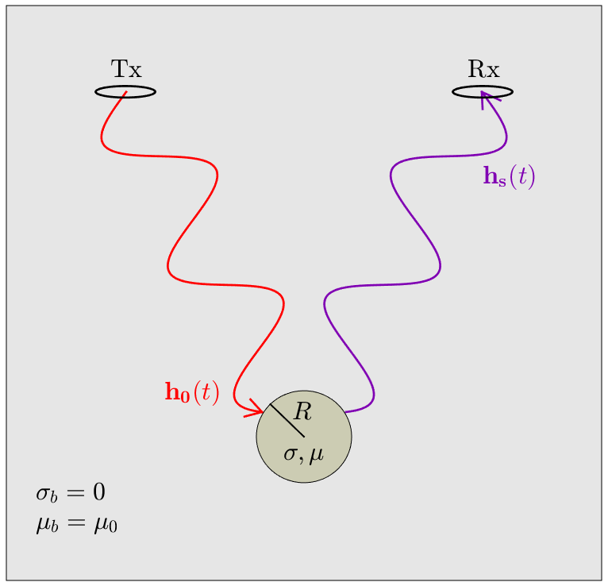

.. _SphereTEM_index:

Sphere
------

**Purpose**: Here, we examine the time-domain response from a conductive and magnetically permeable sphere in free-space.
Expressions provided in this section can be used to characterize the time-domain domain responses from compact ore bodies and unexploded ordnance items.

Our analysis is performed using expressions derived by Wait and Spies (1969); who considered the dipole response from a sphere under the influence of a uniform field.
We illustrated the problem geometry in :numref:`SphereTEMfreespace`, where :math:`h_0 (t)` represents the inducing field from a transmitter :math:`Tx` and :math:`h_s(t)` represents the sphere's response at some receiver location :math:`Rx`.

        
    fsdfsdfasd d sdf sd asd asdf asd fsdf asd fgdfgr f sfgfd

**Structure**: Our analysis of the sphere's time-domain response is presented in four parts:

1. :ref:`General Formulation<SphereTEM_general_formulation>`: Here, a general formulation for the sphere's time-domain response is presented according to Wait and Spies (1969).
These expressions characterize the sphere's dipole response under the influence of a uniform time-dependent field.

2. :ref:`Transient Response<SphereTEM_transient_response>`: In many cases, we are interested in the transient or "step-off" response from a target body.
Here, we examine the sphere's transient response and how it depends on the sphere's physical propertiess.

3. :ref:`Impulse Response<SphereTEM_impulse_response>`: The sphere's time-dependent response to an arbitrary primary field is characterized by its impulse response.
Here, the impulse response for a permeable and a non-permeable sphere are discussed.

4. :ref:`Analytic Derivation<SphereTEM_analytic_derivation>`: Here, abbrevated derivations for the sphere's step-response and impulse response are presented for a conductive and magnetically permeable sphere.
These derivations can be found in Spies (1951) and Wait and Spies (1969).

**Contents (Quick Links)**:

.. toctree::
    :maxdepth: 3
    
    general_formulation
    transient_response
    impulse_response
    analytic_derivation
    
    
    
**References**:

