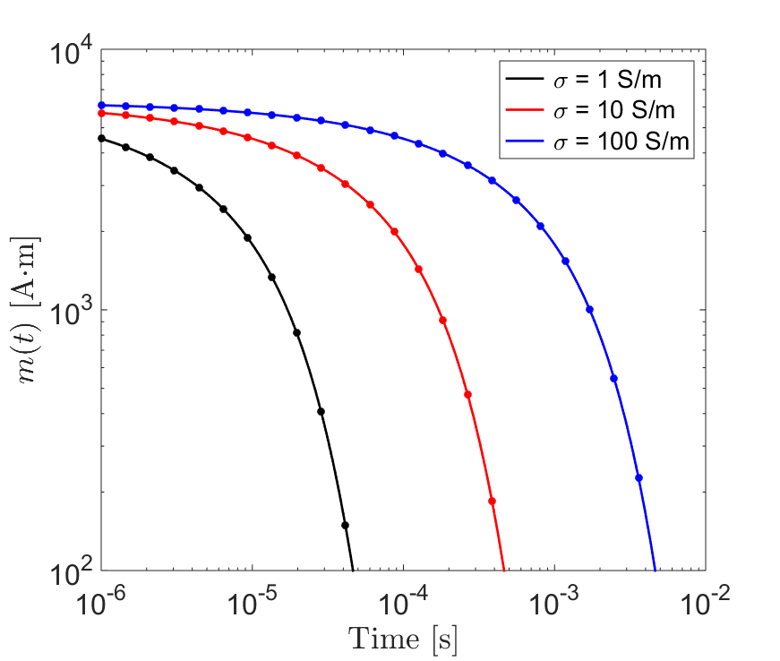
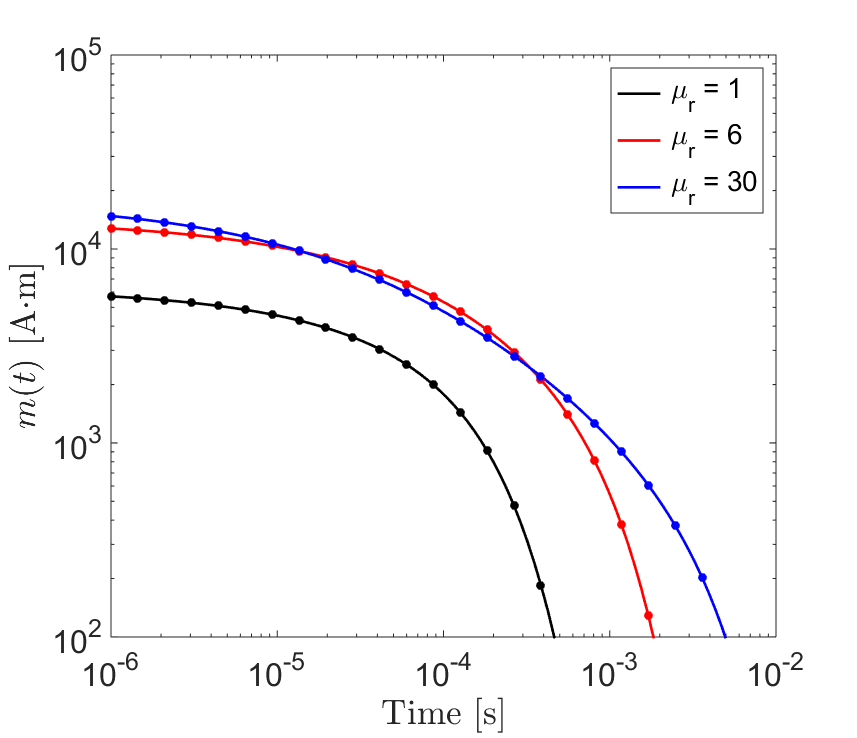
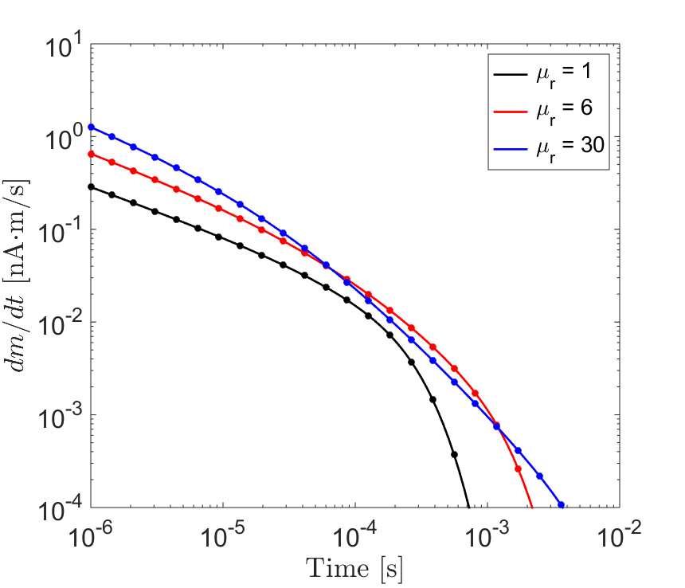

.. _SphereTEM_transient_response:

Transient Response
------------------

**Purpose**:

Introduction
============

Transient Excitation from a Conductive Sphere
=============================================

Here, we consider the transient response from a conductive and non-permeable (:math:`\mu = \mu_0`) sphere.
For a static field which has been applied since :math:`t = -\infty`, and removed at :math:`t=0`, the induced dipole moment of the sphere is given by:

.. math::
	{\bf m}(t) = 6 \pi R^3 {\bf h_0} \Bigg [ \frac{1}{3} + \frac{t}{\beta^2} - \frac{2}{\beta} \sqrt{\frac{t}{\pi}} \Bigg ( 1 + 2 \sum_{n=1}^\infty e^{-(n \beta)^2/t} \Bigg ) + 4 \sum_{n=1}^\infty n \, \textrm{erfc} \Bigg ( \frac{n \beta}{\sqrt{t}} \Bigg ) \Bigg ] u(t)

where:

.. math::
	\beta = (\mu_0 \sigma )^{1/2} R

and erfc(:math:`z`) is the complementary error function given by:

.. math::
	\textrm{erfc}(z) = \frac{2}{\sqrt{\pi}} \int_z^\infty e^{-t^2} dt

For time :math:`t>0`, the rate of decay for the induce dipole moment can be obtain by taking the derivative of Eq. ():

.. math::
	\frac{d {\bf m}}{dt} = 6\pi R^3 {\bf h_0} \Bigg [ \frac{1}{\beta^2} - \frac{1}{\beta \sqrt{\pi t}} \Bigg ( 1 + 2 \sum_{n=1}^\infty e^{-(n\beta)^2/t} \Bigg ) \Bigg ]

Therefore, the rate of decay may be obtained directly if the excitation's impulse response is known.
The unit step-off response for a sphere of radius :math:`R` = 10 m, for several conductivities, is shown in Figure ??.
Solid lines are responses predicted using Eqs. :eq:`mSineCosine` and :eq:`dmdtSineCosine`.
Circular dots are responses predicted using analytic expressions derived in this section.

Transient Excitation from a Conductive and Magnetically Permeable Sphere
========================================================================

Here, we consider the transient response from a conductive and magnetically permeable sphere.
For a static field which has been applied since :math:`t = -\infty`, and removed at :math:`t=0`, the induced dipole moment of the sphere is given by:

.. math::
	{\bf m}(t) = \frac{4\pi}{3}R^3 \, {\bf h_0} \Bigg [ \frac{3}{2} \Bigg ( \frac{2 (\mu_r - 1)}{\mu_r + 2} \big [ 1 - u(t) \big ] + 6 \mu_r \, \sum_{n=1}^\infty \frac{ e^{- \, \xi_n^2 t/\beta^2}}{(\mu_r + 2)(\mu_r - 1)+\xi_n^2} u(t) \Bigg ) \Bigg ]
	:label: mStepOffPermeable

where :math:`\mu_r = \mu/\mu_0` is the relative permeability of the sphere and:

.. math::
	\beta = \big ( \mu_0 \sigma \big )^{1/2} R
	:label: eqBetaGenDef
	
Coefficients :math:`\xi_n` within the sum are defined by:

.. math::
	\textrm{tan} \, \xi_n = \frac{(\mu_r - 1)\xi_n}{\mu_r - 1 + \xi_n^2}

From Wait and Spies (1969), coefficients :math:`\xi_n` are spaced roughly :math:`\pi` apart with:

.. math::
	n\pi \leq \xi_n \leq (n+1/2) \pi
	
	
The value of each coefficient may be found iteratively using very few iterations (< 10) according to:

.. math::
	\xi_n^{(k+1)} = n\pi + \textrm{tan}^{-1}\Bigg ( \frac{(\mu_r - 1) \xi_n^{(k)}}{\mu_r - 1 + (\xi_n^{(k)} )^2} \Bigg )

The rate of decay at time :math:`t>0` can be obtained by taking the time-derivative of Eq. :eq:`mStepOffPermeable`:

.. math::
	\frac{d {\bf m}}{dt} = - \, \frac{4\pi}{3}R^3 \, {\bf h_0} \Bigg [ 9\mu_r \, \sum_{n=1}^\infty \frac{ \xi_n^2 \, e^{- \, \xi_n^2 t/\beta^2}}{\beta^2 \big [ (\mu_r + 2)(\mu_r - 1)+\xi_n^2 \big ]} \Bigg ]
	:label: dmdtStepOffPermeable
	
The unit step-off response for a sphere of radius :math:`R` = 10 m and conductivity :math:`\sigma` = 10 S/m, for several relative permeabilities, is shown in Figure ??.
Solid lines are responses predicted using Eqs. :eq:`mSineCosine` and :eq:`dmdtSineCosine`.
Circular dots are responses predicted using analytic expressions derived in this section.

 
 